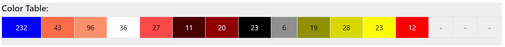
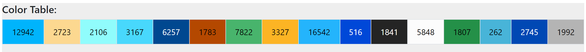
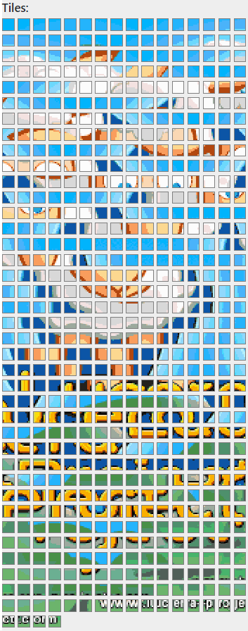

# Graphic Converter MegaDrive / Genesis

Tool to convert images to a suitable format for megadrive.

There are three main options:
* Just get the palette
* Generate sprite data
* Generate plane data
* Option to create planes with 31 colors spliting tiles in plane A/B information.

With some useful modifiers like optimize output data (eliminating duplicates), dithering the image, adding blue noise, selecting output colors, etc.

## Example (sprite):
**Input:**<br/>


**Output:**
<br/>Image converted to Genesis / MegaDrive colors:<br/>

<br/>Information about colors used:<br/>

<br/>Palette used:<br/>


```c
#define kHeroTilesH     (1 * 3)
#define kHeroTilesV     3
#define kHeroTileSizeH  24
#define kHeroTileSizeV  24
#define kHeroDataSize   (kHeroTilesH * kHeroTilesV)

extern const u16 gPalHero[16];
extern const u32 gDataHero[kHeroDataSize * 8];

//--

const u16 gPalHero[16] = {
    0x0e00, 0x046e, 0x068e, 0x0eee, 0x044e, 0x0004, 0x0008, 0x0000,
    0x0888, 0x0088, 0x00cc, 0x00ee, 0x000e, 0x0000, 0x0000, 0x0000,
};

const u32 gDataHero[kHeroDataSize * 8] = {
    0x00000000, 0x00000001, 0x00000013, 0x00000013, 0x00000122, 0x00000122, 0x00005622, 0x00004262,  // Sprite 1 (pos: 1)
    0x00002622, 0x00001222, 0x00000612, 0x00000041, 0x00000886, 0x00008338, 0x00003223, 0x00002221,
    0x00022221, 0x00011219, 0x00001115, 0x0000099a, 0x00000aaa, 0x0000066c, 0x00000ccc, 0x00000333,
    0x01122211, 0x33232222, 0x32222222, 0x22222222, 0x22222222, 0x22222222, 0x27777117, 0x13333113,
    0x13377117, 0x23377227, 0x22222222, 0x22255555, 0x12222222, 0x99666666, 0xabb99449, 0xaabbb99a,
    0xaaab9aab, 0xaa99abbb, 0x57777777, 0xa9aabbba, 0x666aaba6, 0x44c0066c, 0x44c00ccc, 0x33300333,
    0x00000000, 0x21000000, 0x22400000, 0x22100000, 0x22140000, 0x21140000, 0x77140000, 0x33140000,
    0x73440000, 0x73440000, 0x22140000, 0x51400000, 0x14800000, 0x99380000, 0x9a940000, 0xbaa10000,
    0xbba14000, 0xbbb14000, 0x75510000, 0x9bb00000, 0x6ab00000, 0x44c00000, 0x44c00000, 0x33300000,
};
```

## Example (plane):
**Input:** (12.348 colors)<br/>


**Output:** (32 colors)
<br/>Image converted to Genesis / MegaDrive colors:<br/>

<br/>Image converted to Genesis / MegaDrive colors (dithering):<br/>

<br/>Image converted to Genesis / MegaDrive colors (blue noise + dithering):<br/>

<br/>Information about colors used:<br/>

<br/>Palette used:<br/>

<br/>Tiles:<br/>


```c
#define kLuceraTilesH	40
#define kLuceraTilesV	28
#define kLuceraNumTiles	(kLuceraTilesH * kLuceraTilesV)
#define kLuceraDataSize	1012

extern const u16 gPalLucera[32];
extern const u16 gTileMapLucera[kLuceraNumTiles];
extern const u32 gDataLucera[kLuceraDataSize * 8];

//--

const u16 gPalLucera[32] = {
	0x0484, 0x0ec8, 0x0444, 0x08a6, 0x06a6, 0x0eee, 0x0ec6, 0x0ea2,
	0x08ce, 0x0ea0, 0x0ccc, 0x0ea4, 0x0ec4, 0x0a40, 0x08a8, 0x0ace,
	0x0c0c, 0x06a4, 0x00ce, 0x0eee, 0x0684, 0x04cc, 0x0482, 0x0acc,
	0x0eea, 0x00ae, 0x0022, 0x0a82, 0x048e, 0x0ca2, 0x0000, 0x004a,
};

const u16 gTileMapLuceraA[kLuceraNumTiles] = {
	0x0000, 0x0000, 0x0000, 0x0000, 0x0000, 0x0000, 0x0000, 0x0000, 0x0000, 0x0000, 0x0000, 0x0000, 0x0000, 0x0000, 0x0002, 0x0003, 0x0004, 0x0005, 0x0005, 0x0005, 0x0005, 0x0005, 0x0006, 0x0007, 0x0008, 0x0009, 0x0000, 0x0000, 0x0000, 0x0000, 0x0000, 0x0000, 0x0000, 0x0000, 0x0000, 0x0000, 0x0000, 0x0000, 0x0000, 0x0000,
	0x0000, 0x0000, 0x0000, 0x0000, 0x0000, 0x0000, 0x0000, 0x0000, 0x0000, 0x0000, 0x0000, 0x0000, 0x000a, 0x000b, 0x0005, 0x000c, 0x000d, 0x000e, 0x000f, 0x0010, 0x0011, 0x0012, 0x0013, 0x0014, 0x0015, 0x0005, 0x0016, 0x0018, 0x0000, 0x0000, 0x0000, 0x0000, 0x0000, 0x0000, 0x0000, 0x0000, 0x0000, 0x0000, 0x0000, 0x0000,
	0x0000, 0x0000, 0x0000, 0x0000, 0x0000, 0x0000, 0x0000, 0x0000, 0x0000, 0x0000, 0x001a, 0x001b, 0x0005, 0x001c, 0x001d, 0x001e, 0x001f, 0x0020, 0x0022, 0x0024, 0x0026, 0x0028, 0x002a, 0x002c, 0x002d, 0x002f, 0x0031, 0x0033, 0x0035, 0x081a, 0x0000, 0x0000, 0x0000, 0x0000, 0x0000, 0x0000, 0x0000, 0x0000, 0x0000, 0x0000,
	0x0000, 0x0000, 0x0000, 0x0000, 0x0000, 0x0000, 0x0000, 0x0000, 0x0000, 0x0036, 0x0037, 0x0038, 0x0039, 0x003a, 0x003b, 0x003c, 0x003e, 0x0040, 0x0042, 0x0044, 0x0046, 0x0048, 0x004a, 0x004c, 0x004e, 0x0050, 0x0052, 0x0054, 0x0838, 0x0056, 0x0057, 0x0000, 0x0000, 0x0000, 0x0000, 0x0000, 0x0000, 0x0000, 0x0000, 0x0000,
	0x0000, 0x0000, 0x0000, 0x0000, 0x0000, 0x0000, 0x0000, 0x0000, 0x0058, 0x0059, 0x005a, 0x005b, 0x005c, 0x005d, 0x005f, 0x0061, 0x0062, 0x0064, 0x0066, 0x0068, 0x006a, 0x006c, 0x1062, 0x006e, 0x0070, 0x0072, 0x0074, 0x0076, 0x0077, 0x0838, 0x0078, 0x0079, 0x0000, 0x0000, 0x0000, 0x0000, 0x0000, 0x0000, 0x0000, 0x0000,
	0x0000, 0x0000, 0x0000, 0x0000, 0x0000, 0x0000, 0x0000, 0x007a, 0x007b, 0x007c, 0x005b, 0x007d, 0x007e, 0x0080, 0x0082, 0x0084, 0x0086, 0x0087, 0x0089, 0x008b, 0x008d, 0x008f, 0x0091, 0x0093, 0x0095, 0x0097, 0x0099, 0x009b, 0x009d, 0x009e, 0x0838, 0x009f, 0x00a0, 0x0000, 0x0000, 0x0000, 0x0000, 0x0000, 0x0000, 0x0000,
	0x0000, 0x0000, 0x0000, 0x0000, 0x0000, 0x0000, 0x08a0, 0x00a1, 0x0005, 0x00a2, 0x00a3, 0x00a4, 0x00a6, 0x00a8, 0x00aa, 0x00ac, 0x00ae, 0x00b0, 0x00b2, 0x00b4, 0x00b6, 0x00b7, 0x00b9, 0x00bb, 0x006c, 0x00bd, 0x00bf, 0x00c0, 0x00c2, 0x00c3, 0x00c4, 0x0005, 0x00c5, 0x0000, 0x0000, 0x0000, 0x0000, 0x0000, 0x0000, 0x0000,
	0x0000, 0x0000, 0x0000, 0x0000, 0x0000, 0x0000, 0x00c6, 0x0806, 0x00c7, 0x00c8, 0x00c9, 0x00cb, 0x00cd, 0x00cf, 0x00d1, 0x00d3, 0x00d5, 0x00d7, 0x00d9, 0x00db, 0x00dd, 0x00df, 0x00e1, 0x00e3, 0x006c, 0x00e5, 0x00e7, 0x00bf, 0x00e9, 0x00eb, 0x00ed, 0x00ee, 0x0006, 0x00ef, 0x0000, 0x0000, 0x0000, 0x0000, 0x0000, 0x0000,
	0x0000, 0x0000, 0x0000, 0x0000, 0x0000, 0x0000, 0x00f0, 0x0005, 0x00f1, 0x00f2, 0x00f3, 0x00f5, 0x00f7, 0x00f9, 0x00fb, 0x00fd, 0x00ff, 0x0101, 0x0103, 0x0105, 0x0107, 0x0109, 0x010b, 0x010d, 0x010f, 0x0111, 0x0113, 0x00bf, 0x00bf, 0x0115, 0x0117, 0x0118, 0x0005, 0x0119, 0x0000, 0x0000, 0x0000, 0x0000, 0x0000, 0x0000,
	0x0000, 0x0000, 0x0000, 0x0000, 0x0000, 0x011a, 0x0005, 0x011b, 0x011c, 0x011d, 0x011f, 0x00bf, 0x00bf, 0x0121, 0x0123, 0x0125, 0x0126, 0x0128, 0x012a, 0x012c, 0x012e, 0x012f, 0x0131, 0x0133, 0x0135, 0x0137, 0x0139, 0x00bf, 0x00bf, 0x013b, 0x013d, 0x013f, 0x0140, 0x0006, 0x0141, 0x0000, 0x0000, 0x0000, 0x0000, 0x0000,
	0x0000, 0x0142, 0x0143, 0x0144, 0x0145, 0x0146, 0x0005, 0x0147, 0x0148, 0x0149, 0x014b, 0x00bf, 0x00bf, 0x014d, 0x014f, 0x0125, 0x0151, 0x0128, 0x0154, 0x0156, 0x0156, 0x0156, 0x0156, 0x0157, 0x0159, 0x015b, 0x015d, 0x00bf, 0x00bf, 0x00bf, 0x015e, 0x0160, 0x0161, 0x0005, 0x0162, 0x0000, 0x0163, 0x0164, 0x0165, 0x0000,
	0x0166, 0x0167, 0x0168, 0x0169, 0x016a, 0x016b, 0x0005, 0x016c, 0x016d, 0x016e, 0x00bf, 0x00bf, 0x00bf, 0x0170, 0x0172, 0x0125, 0x0125, 0x0174, 0x0176, 0x0156, 0x0156, 0x0156, 0x0156, 0x0178, 0x006c, 0x017a, 0x00bf, 0x00bf, 0x00bf, 0x00bf, 0x017c, 0x017e, 0x017f, 0x0005, 0x0180, 0x0181, 0x0182, 0x0183, 0x0184, 0x0185,
	0x0005, 0x0005, 0x0005, 0x0005, 0x0005, 0x0005, 0x0186, 0x0187, 0x0188, 0x018a, 0x00bf, 0x00bf, 0x00bf, 0x00bf, 0x018c, 0x018e, 0x0125, 0x018f, 0x0128, 0x0192, 0x0194, 0x0156, 0x0196, 0x0198, 0x019a, 0x019c, 0x00bf, 0x00bf, 0x00bf, 0x00bf, 0x019e, 0x01a0, 0x01a1, 0x0005, 0x0005, 0x0005, 0x0005, 0x0005, 0x0005, 0x0005,
	0x0005, 0x0005, 0x0005, 0x0005, 0x0005, 0x0005, 0x01a2, 0x01a3, 0x01a4, 0x01a6, 0x00bf, 0x00bf, 0x00bf, 0x00bf, 0x01a8, 0x01aa, 0x0125, 0x0125, 0x01ac, 0x01ae, 0x01b0, 0x01b2, 0x01b4, 0x01b6, 0x01b8, 0x01ba, 0x00bf, 0x00bf, 0x00bf, 0x00bf, 0x01bc, 0x01be, 0x01bf, 0x01c0, 0x0005, 0x0005, 0x0005, 0x0005, 0x0005, 0x0005,
	0x0005, 0x0005, 0x0005, 0x0005, 0x0005, 0x0005, 0x01c1, 0x01c2, 0x01a4, 0x01c3, 0x00bf, 0x00bf, 0x00bf, 0x00bf, 0x01c5, 0x01c7, 0x01c9, 0x0125, 0x0125, 0x01cb, 0x01cd, 0x01cf, 0x01d1, 0x01d3, 0x01d5, 0x00bf, 0x00bf, 0x00bf, 0x00bf, 0x00bf, 0x01d7, 0x01be, 0x01d9, 0x09a2, 0x0005, 0x0005, 0x0005, 0x0005, 0x0005, 0x0005,
	0x0005, 0x0005, 0x0005, 0x0005, 0x0005, 0x0005, 0x01a2, 0x01da, 0x01db, 0x01dd, 0x00bf, 0x00bf, 0x00bf, 0x00bf, 0x00bf, 0x01df, 0x01e1, 0x01e3, 0x01e5, 0x01e7, 0x01e9, 0x01eb, 0x01ed, 0x01ef, 0x01f1, 0x00bf, 0x00bf, 0x00bf, 0x00bf, 0x00bf, 0x01f2, 0x01f4, 0x01f5, 0x01f6, 0x0005, 0x0005, 0x0005, 0x0005, 0x0005, 0x0005,
	0x0005, 0x0005, 0x0005, 0x0005, 0x0005, 0x0005, 0x0005, 0x01f7, 0x01f8, 0x01f9, 0x00bf, 0x00bf, 0x00bf, 0x00bf, 0x00bf, 0x00bf, 0x01fb, 0x01fd, 0x01ff, 0x0201, 0x0203, 0x0205, 0x0207, 0x0209, 0x00bf, 0x00bf, 0x00bf, 0x00bf, 0x00bf, 0x00bf, 0x020b, 0x020d, 0x020e, 0x0005, 0x0005, 0x0005, 0x0005, 0x0005, 0x0005, 0x0005,
	0x0005, 0x0005, 0x0005, 0x0005, 0x0005, 0x0005, 0x0005, 0x020f, 0x0210, 0x0211, 0x00bf, 0x00bf, 0x00bf, 0x00bf, 0x00bf, 0x00bf, 0x0213, 0x0215, 0x0217, 0x0219, 0x021b, 0x021c, 0x021e, 0x0220, 0x00bf, 0x00bf, 0x00bf, 0x00bf, 0x00bf, 0x0222, 0x0224, 0x0226, 0x0227, 0x0005, 0x0005, 0x0005, 0x0005, 0x0005, 0x0005, 0x0005,
	0x0005, 0x0005, 0x0005, 0x0005, 0x0005, 0x0005, 0x0005, 0x0228, 0x0229, 0x022a, 0x022c, 0x00bf, 0x022e, 0x114b, 0x00bf, 0x00bf, 0x0231, 0x0233, 0x0217, 0x0235, 0x0237, 0x0128, 0x0156, 0x0220, 0x00bf, 0x00bf, 0x00bf, 0x00bf, 0x00bf, 0x023b, 0x023d, 0x023f, 0x0240, 0x0005, 0x0005, 0x0005, 0x0005, 0x0005, 0x0005, 0x0005,
	0x0005, 0x0005, 0x0005, 0x0005, 0x0005, 0x0005, 0x0005, 0x0241, 0x0242, 0x0243, 0x0244, 0x00bf, 0x0246, 0x0248, 0x024a, 0x024c, 0x024e, 0x0250, 0x0252, 0x0254, 0x0256, 0x0258, 0x025a, 0x025c, 0x025e, 0x0260, 0x0262, 0x0264, 0x0222, 0x0267, 0x0269, 0x026a, 0x187c, 0x0005, 0x0005, 0x0005, 0x0005, 0x0005, 0x0005, 0x0005,
	0x0005, 0x0005, 0x0005, 0x026b, 0x026d, 0x026f, 0x0271, 0x0273, 0x0275, 0x0277, 0x0279, 0x027b, 0x0246, 0x0248, 0x0a48, 0x027f, 0x0281, 0x0128, 0x0284, 0x0286, 0x0288, 0x028a, 0x028c, 0x028e, 0x0290, 0x0292, 0x0294, 0x0220, 0x0297, 0x0299, 0x029b, 0x029c, 0x0005, 0x0005, 0x0005, 0x0005, 0x0005, 0x0005, 0x0005, 0x0005,
	0x0005, 0x029d, 0x029f, 0x02a1, 0x0128, 0x0128, 0x0128, 0x0128, 0x0128, 0x02a4, 0x02a6, 0x02a7, 0x02a9, 0x02ab, 0x02ad, 0x02af, 0x02b1, 0x02b3, 0x02b5, 0x02b7, 0x02b9, 0x02bb, 0x02bd, 0x02bf, 0x02c1, 0x02c3, 0x02c5, 0x02c7, 0x02c9, 0x02cb, 0x02cc, 0x1838, 0x0005, 0x0005, 0x0005, 0x0005, 0x0005, 0x0005, 0x0005, 0x0005,
	0x02cd, 0x02cf, 0x0128, 0x0128, 0x0128, 0x0128, 0x0128, 0x0128, 0x0128, 0x0128, 0x02d3, 0x02d5, 0x02d6, 0x02d8, 0x02da, 0x02dc, 0x02de, 0x02e0, 0x02e2, 0x02e4, 0x02e6, 0x02e8, 0x02ea, 0x02ec, 0x02ee, 0x02f0, 0x02f2, 0x02f4, 0x02f6, 0x02f7, 0x02f8, 0x0005, 0x0005, 0x0005, 0x0005, 0x0005, 0x0005, 0x0005, 0x0005, 0x0005,
	0x02f9, 0x0128, 0x0128, 0x0128, 0x0128, 0x0128, 0x0128, 0x0128, 0x0128, 0x0128, 0x02ff, 0x0301, 0x0303, 0x0305, 0x0307, 0x0309, 0x030b, 0x030d, 0x030f, 0x0311, 0x0313, 0x0315, 0x0317, 0x0319, 0x031b, 0x031d, 0x031f, 0x0321, 0x0323, 0x0325, 0x0005, 0x0005, 0x0005, 0x0005, 0x0005, 0x0005, 0x0005, 0x0005, 0x0005, 0x0005,
	0x0128, 0x0128, 0x0128, 0x0128, 0x0128, 0x0128, 0x0128, 0x0128, 0x0128, 0x0128, 0x0128, 0x0329, 0x032b, 0x032d, 0x032f, 0x0331, 0x0333, 0x0335, 0x0337, 0x0339, 0x033b, 0x033d, 0x033f, 0x0341, 0x0343, 0x0345, 0x0347, 0x0349, 0x034b, 0x0aa1, 0x034e, 0x0aa1, 0x0b4e, 0x0352, 0x0354, 0x0005, 0x0005, 0x0005, 0x0356, 0x0358,
	0x0128, 0x0128, 0x0128, 0x0128, 0x0128, 0x0128, 0x0128, 0x0128, 0x0128, 0x0128, 0x0128, 0x035f, 0x0361, 0x0363, 0x0364, 0x0365, 0x0367, 0x0368, 0x036a, 0x036c, 0x036e, 0x0370, 0x0372, 0x0374, 0x0376, 0x0378, 0x037a, 0x037c, 0x037e, 0x0128, 0x0128, 0x0128, 0x0128, 0x0128, 0x0384, 0x0386, 0x0388, 0x038a, 0x0128, 0x0128,
	0x0128, 0x0128, 0x0128, 0x0128, 0x038e, 0x0390, 0x0392, 0x0392, 0x0392, 0x0392, 0x0394, 0x0396, 0x0398, 0x039a, 0x039a, 0x039b, 0x039c, 0x039d, 0x039e, 0x039f, 0x03a1, 0x03a3, 0x03a4, 0x03a6, 0x03a8, 0x03aa, 0x03ab, 0x03ad, 0x03af, 0x03b1, 0x03b3, 0x03b5, 0x03b7, 0x03b9, 0x03bb, 0x03bd, 0x03bf, 0x03c1, 0x03c3, 0x03b5,
	0x03c6, 0x03c6, 0x03c6, 0x03c8, 0x03ca, 0x03cc, 0x039a, 0x039a, 0x039a, 0x039a, 0x039a, 0x039a, 0x039a, 0x039a, 0x039a, 0x039a, 0x039a, 0x03ce, 0x03cf, 0x03d0, 0x03d1, 0x03d2, 0x03d3, 0x03d4, 0x03d6, 0x039a, 0x03d8, 0x03da, 0x03dc, 0x03de, 0x03e0, 0x03e2, 0x03e4, 0x03e6, 0x03e8, 0x03ea, 0x03ec, 0x03ee, 0x03f0, 0x03f2,
};

const u16 gTileMapLuceraB[kLuceraNumTiles] = {
	0x2001, 0x2001, 0x2001, 0x2001, 0x2001, 0x2001, 0x2001, 0x2001, 0x2001, 0x2001, 0x2001, 0x2001, 0x2001, 0x2001, 0x2001, 0x2001, 0x2001, 0x2001, 0x2001, 0x2001, 0x2001, 0x2001, 0x2001, 0x2001, 0x2001, 0x2001, 0x2001, 0x2001, 0x2001, 0x2001, 0x2001, 0x2001, 0x2001, 0x2001, 0x2001, 0x2001, 0x2001, 0x2001, 0x2001, 0x2001,
	0x2001, 0x2001, 0x2001, 0x2001, 0x2001, 0x2001, 0x2001, 0x2001, 0x2001, 0x2001, 0x2001, 0x2001, 0x2001, 0x2001, 0x2001, 0x2001, 0x2001, 0x2001, 0x2001, 0x2001, 0x2001, 0x2001, 0x2001, 0x2001, 0x2001, 0x2001, 0x2017, 0x2019, 0x2001, 0x2001, 0x2001, 0x2001, 0x2001, 0x2001, 0x2001, 0x2001, 0x2001, 0x2001, 0x2001, 0x2001,
	0x2001, 0x2001, 0x2001, 0x2001, 0x2001, 0x2001, 0x2001, 0x2001, 0x2001, 0x2001, 0x2001, 0x2001, 0x2001, 0x2001, 0x2001, 0x2001, 0x2001, 0x2021, 0x2023, 0x2025, 0x2027, 0x2029, 0x202b, 0x2001, 0x202e, 0x2030, 0x2032, 0x2034, 0x2001, 0x2001, 0x2001, 0x2001, 0x2001, 0x2001, 0x2001, 0x2001, 0x2001, 0x2001, 0x2001, 0x2001,
	0x2001, 0x2001, 0x2001, 0x2001, 0x2001, 0x2001, 0x2001, 0x2001, 0x2001, 0x2001, 0x2001, 0x2001, 0x2001, 0x2001, 0x2001, 0x203d, 0x203f, 0x2041, 0x2043, 0x2045, 0x2047, 0x2049, 0x204b, 0x204d, 0x204f, 0x2051, 0x2053, 0x2055, 0x2001, 0x2001, 0x2001, 0x2001, 0x2001, 0x2001, 0x2001, 0x2001, 0x2001, 0x2001, 0x2001, 0x2001,
	0x2001, 0x2001, 0x2001, 0x2001, 0x2001, 0x2001, 0x2001, 0x2001, 0x2001, 0x2001, 0x2001, 0x2001, 0x2001, 0x205e, 0x2060, 0x2001, 0x2063, 0x2065, 0x2067, 0x2069, 0x206b, 0x2001, 0x206d, 0x206f, 0x2071, 0x2073, 0x2075, 0x2001, 0x2001, 0x2001, 0x2001, 0x2001, 0x2001, 0x2001, 0x2001, 0x2001, 0x2001, 0x2001, 0x2001, 0x2001,
	0x2001, 0x2001, 0x2001, 0x2001, 0x2001, 0x2001, 0x2001, 0x2001, 0x2001, 0x2001, 0x2001, 0x2001, 0x207f, 0x2081, 0x2083, 0x2085, 0x2001, 0x2088, 0x208a, 0x208c, 0x208e, 0x2090, 0x2092, 0x2094, 0x2096, 0x2098, 0x209a, 0x209c, 0x2001, 0x2001, 0x2001, 0x2001, 0x2001, 0x2001, 0x2001, 0x2001, 0x2001, 0x2001, 0x2001, 0x2001,
	0x2001, 0x2001, 0x2001, 0x2001, 0x2001, 0x2001, 0x2001, 0x2001, 0x2001, 0x2001, 0x2001, 0x20a5, 0x20a7, 0x20a9, 0x20ab, 0x20ad, 0x20af, 0x20b1, 0x20b3, 0x20b5, 0x2001, 0x20b8, 0x20ba, 0x20bc, 0x2001, 0x20be, 0x2001, 0x20c1, 0x38c1, 0x2001, 0x2001, 0x2001, 0x2001, 0x2001, 0x2001, 0x2001, 0x2001, 0x2001, 0x2001, 0x2001,
	0x2001, 0x2001, 0x2001, 0x2001, 0x2001, 0x2001, 0x2001, 0x2001, 0x2001, 0x2001, 0x20ca, 0x20cc, 0x20ce, 0x20d0, 0x20d2, 0x20d4, 0x20d6, 0x20d8, 0x20da, 0x20dc, 0x20de, 0x20e0, 0x20e2, 0x20e4, 0x2001, 0x20e6, 0x20e8, 0x2001, 0x20ea, 0x20ec, 0x2001, 0x2001, 0x2001, 0x2001, 0x2001, 0x2001, 0x2001, 0x2001, 0x2001, 0x2001,
	0x2001, 0x2001, 0x2001, 0x2001, 0x2001, 0x2001, 0x2001, 0x2001, 0x2001, 0x2001, 0x20f4, 0x20f6, 0x20f8, 0x20fa, 0x20fc, 0x20fe, 0x2100, 0x2102, 0x2104, 0x2106, 0x2108, 0x210a, 0x210c, 0x210e, 0x2110, 0x2112, 0x2114, 0x2001, 0x2001, 0x2116, 0x2001, 0x2001, 0x2001, 0x2001, 0x2001, 0x2001, 0x2001, 0x2001, 0x2001, 0x2001,
	0x2001, 0x2001, 0x2001, 0x2001, 0x2001, 0x2001, 0x2001, 0x2001, 0x2001, 0x211e, 0x2120, 0x2001, 0x2001, 0x2122, 0x2124, 0x2001, 0x2127, 0x2129, 0x212b, 0x212d, 0x2001, 0x2130, 0x2132, 0x2134, 0x2136, 0x2138, 0x213a, 0x2001, 0x2001, 0x213c, 0x213e, 0x2001, 0x2001, 0x2001, 0x2001, 0x2001, 0x2001, 0x2001, 0x2001, 0x2001,
	0x2001, 0x2001, 0x2001, 0x2001, 0x2001, 0x2001, 0x2001, 0x2001, 0x2001, 0x214a, 0x214c, 0x2001, 0x2001, 0x214e, 0x2150, 0x2001, 0x2152, 0x2153, 0x2155, 0x2001, 0x2001, 0x2001, 0x2001, 0x2158, 0x215a, 0x215c, 0x2001, 0x2001, 0x2001, 0x2001, 0x215f, 0x2001, 0x2001, 0x2001, 0x2001, 0x2001, 0x2001, 0x2001, 0x2001, 0x2001,
	0x2001, 0x2001, 0x2001, 0x2001, 0x2001, 0x2001, 0x2001, 0x2001, 0x2001, 0x216f, 0x2001, 0x2001, 0x2001, 0x2171, 0x2173, 0x2001, 0x2001, 0x2175, 0x2177, 0x2001, 0x2001, 0x2001, 0x2001, 0x2179, 0x2001, 0x217b, 0x2001, 0x2001, 0x2001, 0x2001, 0x217d, 0x2001, 0x2001, 0x2001, 0x2001, 0x2001, 0x2001, 0x2001, 0x2001, 0x2001,
	0x2001, 0x2001, 0x2001, 0x2001, 0x2001, 0x2001, 0x2001, 0x2001, 0x2189, 0x218b, 0x2001, 0x2001, 0x2001, 0x2001, 0x218d, 0x386d, 0x2001, 0x2190, 0x2191, 0x2193, 0x2195, 0x2001, 0x2197, 0x2199, 0x219b, 0x219d, 0x2001, 0x2001, 0x2001, 0x2001, 0x219f, 0x2001, 0x2001, 0x2001, 0x2001, 0x2001, 0x2001, 0x2001, 0x2001, 0x2001,
	0x2001, 0x2001, 0x2001, 0x2001, 0x2001, 0x2001, 0x2001, 0x2001, 0x21a5, 0x21a7, 0x2001, 0x2001, 0x2001, 0x2001, 0x21a9, 0x21ab, 0x2001, 0x2001, 0x21ad, 0x21af, 0x21b1, 0x21b3, 0x21b5, 0x21b7, 0x21b9, 0x21bb, 0x2001, 0x2001, 0x2001, 0x2001, 0x21bd, 0x2001, 0x2001, 0x2001, 0x2001, 0x2001, 0x2001, 0x2001, 0x2001, 0x2001,
	0x2001, 0x2001, 0x2001, 0x2001, 0x2001, 0x2001, 0x2001, 0x2001, 0x21a5, 0x21c4, 0x2001, 0x2001, 0x2001, 0x2001, 0x21c6, 0x21c8, 0x21ca, 0x2001, 0x2001, 0x21cc, 0x21ce, 0x21d0, 0x21d2, 0x21d4, 0x21d6, 0x2001, 0x2001, 0x2001, 0x2001, 0x2001, 0x21d8, 0x2001, 0x2001, 0x2001, 0x2001, 0x2001, 0x2001, 0x2001, 0x2001, 0x2001,
	0x2001, 0x2001, 0x2001, 0x2001, 0x2001, 0x2001, 0x2001, 0x2001, 0x21dc, 0x21de, 0x2001, 0x2001, 0x2001, 0x2001, 0x2001, 0x21e0, 0x21e2, 0x21e4, 0x21e6, 0x21e8, 0x21ea, 0x21ec, 0x21ee, 0x21f0, 0x2001, 0x2001, 0x2001, 0x2001, 0x2001, 0x2001, 0x21f3, 0x2001, 0x2001, 0x2001, 0x2001, 0x2001, 0x2001, 0x2001, 0x2001, 0x2001,
	0x2001, 0x2001, 0x2001, 0x2001, 0x2001, 0x2001, 0x2001, 0x2001, 0x2001, 0x21fa, 0x2001, 0x2001, 0x2001, 0x2001, 0x2001, 0x2001, 0x21fc, 0x21fe, 0x2200, 0x2202, 0x2204, 0x2206, 0x2208, 0x220a, 0x2001, 0x2001, 0x2001, 0x2001, 0x2001, 0x2001, 0x220c, 0x2001, 0x2001, 0x2001, 0x2001, 0x2001, 0x2001, 0x2001, 0x2001, 0x2001,
	0x2001, 0x2001, 0x2001, 0x2001, 0x2001, 0x2001, 0x2001, 0x2001, 0x2001, 0x2212, 0x2001, 0x2001, 0x2001, 0x2001, 0x2001, 0x2001, 0x2214, 0x2216, 0x2218, 0x221a, 0x2001, 0x221d, 0x221f, 0x2221, 0x2001, 0x2001, 0x2001, 0x2001, 0x2001, 0x2223, 0x2225, 0x2001, 0x2001, 0x2001, 0x2001, 0x2001, 0x2001, 0x2001, 0x2001, 0x2001,
	0x2001, 0x2001, 0x2001, 0x2001, 0x2001, 0x2001, 0x2001, 0x2001, 0x2001, 0x222b, 0x222d, 0x2001, 0x222f, 0x2230, 0x2001, 0x2001, 0x2232, 0x2234, 0x2218, 0x2236, 0x2238, 0x2239, 0x2001, 0x223a, 0x2001, 0x2001, 0x2001, 0x2001, 0x2001, 0x223c, 0x223e, 0x2001, 0x2001, 0x2001, 0x2001, 0x2001, 0x2001, 0x2001, 0x2001, 0x2001,
	0x2001, 0x2001, 0x2001, 0x2001, 0x2001, 0x2001, 0x2001, 0x2001, 0x2001, 0x2001, 0x2245, 0x2001, 0x2247, 0x2249, 0x224b, 0x224d, 0x224f, 0x2251, 0x2253, 0x2255, 0x2257, 0x2259, 0x225b, 0x225d, 0x225f, 0x2261, 0x2263, 0x2265, 0x2266, 0x2268, 0x2001, 0x2001, 0x2001, 0x2001, 0x2001, 0x2001, 0x2001, 0x2001, 0x2001, 0x2001,
	0x2001, 0x2001, 0x2001, 0x226c, 0x226e, 0x2270, 0x2272, 0x2274, 0x2276, 0x2278, 0x227a, 0x227c, 0x227d, 0x2249, 0x227e, 0x2280, 0x2282, 0x2283, 0x2285, 0x2287, 0x2289, 0x228b, 0x228d, 0x228f, 0x2291, 0x2293, 0x2295, 0x2296, 0x2298, 0x229a, 0x2001, 0x2001, 0x2001, 0x2001, 0x2001, 0x2001, 0x2001, 0x2001, 0x2001, 0x2001,
	0x2001, 0x229e, 0x22a0, 0x22a2, 0x2001, 0x2001, 0x2001, 0x2001, 0x22a3, 0x22a5, 0x2001, 0x22a8, 0x22aa, 0x22ac, 0x22ae, 0x22b0, 0x22b2, 0x22b4, 0x22b6, 0x22b8, 0x22ba, 0x22bc, 0x22be, 0x22c0, 0x22c2, 0x22c4, 0x22c6, 0x22c8, 0x22ca, 0x2001, 0x2001, 0x2001, 0x2001, 0x2001, 0x2001, 0x2001, 0x2001, 0x2001, 0x2001, 0x2001,
	0x22ce, 0x22d0, 0x2001, 0x2001, 0x2001, 0x2001, 0x2001, 0x2001, 0x22d1, 0x22d2, 0x22d4, 0x31e0, 0x22d7, 0x22d9, 0x22db, 0x22dd, 0x22df, 0x22e1, 0x22e3, 0x22e5, 0x22e7, 0x22e9, 0x22eb, 0x22ed, 0x22ef, 0x22f1, 0x22f3, 0x22f5, 0x2001, 0x2001, 0x2001, 0x2001, 0x2001, 0x2001, 0x2001, 0x2001, 0x2001, 0x2001, 0x2001, 0x2001,
	0x22fa, 0x22fb, 0x22fc, 0x22fc, 0x22fc, 0x22fc, 0x22fc, 0x22fd, 0x22fe, 0x22d2, 0x2300, 0x2302, 0x2304, 0x2306, 0x2308, 0x230a, 0x230c, 0x230e, 0x2310, 0x2312, 0x2314, 0x2316, 0x2318, 0x231a, 0x231c, 0x231e, 0x2320, 0x2322, 0x2324, 0x2326, 0x2001, 0x2001, 0x2001, 0x2001, 0x2001, 0x2001, 0x2001, 0x2001, 0x2001, 0x2001,
	0x2001, 0x2327, 0x2328, 0x22d2, 0x22d2, 0x22d2, 0x22d2, 0x22d2, 0x22d2, 0x22d2, 0x22d2, 0x232a, 0x232c, 0x232e, 0x2330, 0x2332, 0x2334, 0x2336, 0x2338, 0x233a, 0x233c, 0x233e, 0x2340, 0x2342, 0x2344, 0x2346, 0x2348, 0x234a, 0x234c, 0x234d, 0x234f, 0x2350, 0x2351, 0x2353, 0x2355, 0x2001, 0x2001, 0x2001, 0x2357, 0x2359,
	0x22fc, 0x22fc, 0x235a, 0x235b, 0x235c, 0x235c, 0x235c, 0x235c, 0x235c, 0x235d, 0x235e, 0x2360, 0x2362, 0x2001, 0x2001, 0x2366, 0x2001, 0x2369, 0x236b, 0x236d, 0x236f, 0x2371, 0x2373, 0x2375, 0x2377, 0x2379, 0x237b, 0x237d, 0x237f, 0x2380, 0x2381, 0x2382, 0x2382, 0x2383, 0x2385, 0x2387, 0x2389, 0x238b, 0x2055, 0x2001,
	0x238c, 0x238c, 0x238c, 0x238d, 0x238f, 0x2391, 0x2393, 0x2393, 0x2393, 0x2393, 0x2395, 0x2397, 0x2399, 0x2001, 0x2001, 0x2001, 0x2001, 0x2001, 0x2001, 0x23a0, 0x23a2, 0x2001, 0x23a5, 0x23a7, 0x23a9, 0x3855, 0x23ac, 0x23ae, 0x23b0, 0x23b2, 0x23b4, 0x23b6, 0x23b8, 0x23ba, 0x23bc, 0x23be, 0x23c0, 0x23c2, 0x23c4, 0x23c5,
	0x23c7, 0x23c7, 0x23c7, 0x23c9, 0x23cb, 0x23cd, 0x2001, 0x2001, 0x2001, 0x2001, 0x2001, 0x2001, 0x2001, 0x2001, 0x2001, 0x2001, 0x2001, 0x2001, 0x2001, 0x2001, 0x2001, 0x2001, 0x2001, 0x23d5, 0x23d7, 0x2001, 0x23d9, 0x23db, 0x23dd, 0x23df, 0x23e1, 0x23e3, 0x23e5, 0x23e7, 0x23e9, 0x23eb, 0x23ed, 0x23ef, 0x23f1, 0x23f3,
};

const u32 gDataLucera[kLuceraDataSize * 8] = {
    0x99999999, 0x99999999, 0x99999999, 0x99999999, 0x99999999, 0x99999999, 0x99999999, 0x99999999,  // Palette: 0 - Tile 0 (0x0000)
    0x00000000, 0x00000000, 0x00000000, 0x00000000, 0x00000000, 0x00000000, 0x00000000, 0x00000000,  // Palette: 1 - TileB 1 (0x0001)
    0x99999999, 0x99999999, 0x99999999, 0x99999999, 0x99999999, 0x99999977, 0x99999777, 0x97777777,  // Palette: 0 - Tile 2 (0x0002)
    0x99999999, 0x99999999, 0x99999999, 0x99997777, 0x97777777, 0x77777777, 0x77777777, 0x77777777,  // Palette: 0 - Tile 3 (0x0003)
    0x99999999, 0x99999777, 0x77777777, 0x77777777, 0x77777777, 0x77777777, 0x77777777, 0x77777777,  // Palette: 0 - Tile 4 (0x0004)
    0x77777777, 0x77777777, 0x77777777, 0x77777777, 0x77777777, 0x77777777, 0x77777777, 0x77777777,  // Palette: 0 - Tile 5 (0x0005)
    0x77777779, 0x77777777, 0x77777777, 0x77777777, 0x77777777, 0x77777777, 0x77777777, 0x77777777,  // Palette: 0 - Tile 6 (0x0006)
    0x99999999, 0x77979999, 0x77777797, 0x77777777, 0x77777777, 0x77777777, 0x77777777, 0x77777777,  // Palette: 0 - Tile 7 (0x0007)
    0x99999999, 0x99999999, 0x99999999, 0x77799999, 0x77777799, 0x77777777, 0x77777777, 0x77777777,  // Palette: 0 - Tile 8 (0x0008)
    0x99999999, 0x99999999, 0x99999999, 0x99999999, 0x99999999, 0x99999999, 0x77799999, 0x77777799,  // Palette: 0 - Tile 9 (0x0009)
    0x99999999, 0x99999999, 0x99999999, 0x99999999, 0x99999997, 0x99999777, 0x99977777, 0x97777777,  // Palette: 0 - Tile 10 (0x000a)
    0x99999999, 0x99999777, 0x99977777, 0x99777777, 0x77777777, 0x77777777, 0x77777777, 0x77777777,  // Palette: 0 - Tile 11 (0x000b)
    0x77777777, 0x77777777, 0x77777777, 0x77777777, 0x77777777, 0x77777777, 0x77777bbb, 0x77bbbbbb,  // Palette: 0 - Tile 12 (0x000c)
    0x77777777, 0x77777777, 0x77777777, 0x7777777b, 0x7777bbbb, 0xbbbbbbbb, 0xbbbbbbbb, 0xbbbbbbbb,  // Palette: 0 - Tile 13 (0x000d)
    0x77777777, 0x77777777, 0x777bbbbb, 0xbbbbbbbb, 0xbbbbbbbb, 0xbbbbbbbb, 0xbbbbbbbb, 0xbbbbbbbb,  // Palette: 0 - Tile 14 (0x000e)
    0x77777777, 0x77bbbbbb, 0xbbbbbbbb, 0xbbbbbbbb, 0xbbbbbbbb, 0xbbbbbbbb, 0xbbbbbbbb, 0xbbbbb666,  // Palette: 0 - Tile 15 (0x000f)
    0x77b7bbbb, 0xbbbbbbbb, 0xbbbbbbbb, 0xbbbbbbbb, 0xbbbbbbbb, 0xbbbbbbbb, 0xbbbbbbbb, 0x66666666,  // Palette: 0 - Tile 16 (0x0010)
    0xbbbbb777, 0xbbbbbbbb, 0xbbbbbbbb, 0xbbbbbbbb, 0xbbbbbbbb, 0xbbbbbbbb, 0xbbbbbbbb, 0x66666666,  // Palette: 0 - Tile 17 (0x0011)
    0x77777777, 0xbbbbbbb7, 0xbbbbbbbb, 0xbbbbbbbb, 0xbbbbbbbb, 0xbbbbbbbb, 0xbbbbbbbb, 0xbbbbbbbb,  // Palette: 0 - Tile 18 (0x0012)
    0x77777777, 0x77777777, 0xbbbb7777, 0xbbbbbbbb, 0xbbbbbbbb, 0xbbbbbbbb, 0xbbbbbbbb, 0xbbbbbbbb,  // Palette: 0 - Tile 19 (0x0013)
    0x77777777, 0x77777777, 0x77777777, 0x77777777, 0xbbb77777, 0xbbbbbbb7, 0xbbbbbbbb, 0xbbbbbbbb,  // Palette: 0 - Tile 20 (0x0014)
    0x77777777, 0x77777777, 0x77777777, 0x77777777, 0x77777777, 0x77777777, 0xbb777777, 0xbbbbb777,  // Palette: 0 - Tile 21 (0x0015)
    0x99999999, 0x77799999, 0x77777999, 0x77777779, 0x77777777, 0x77777777, 0x77777777, 0x00300000,  // Palette: 0 - Tile 22 (0x0016)
    0x00000000, 0x00000000, 0x00000000, 0x00000000, 0x00000000, 0x00000000, 0x00000000, 0xdb044444,  // Palette: 1 - TileB 23 (0x0017)
    0x99999999, 0x99999999, 0x99999999, 0x99999999, 0x99999999, 0x77999999, 0x77779999, 0x00300099,  // Palette: 0 - Tile 24 (0x0018)
    0x00000000, 0x00000000, 0x00000000, 0x00000000, 0x00000000, 0x00000000, 0x00000000, 0x440bdd00,  // Palette: 1 - TileB 25 (0x0019)
    0x99999999, 0x99999999, 0x99999999, 0x99999999, 0x99999999, 0x99999999, 0x99999999, 0x99999977,  // Palette: 0 - Tile 26 (0x001a)
    0x99999999, 0x99999997, 0x99997777, 0x99977777, 0x99777777, 0x77777777, 0x77777777, 0x77777777,  // Palette: 0 - Tile 27 (0x001b)
    0x77777777, 0x77777777, 0x77777777, 0x77777777, 0x77777777, 0x777777bb, 0x7777bbbb, 0x77bbbbbb,  // Palette: 0 - Tile 28 (0x001c)
    0x77777777, 0x77777bbb, 0x777bbbbb, 0x77bbbbbb, 0xbbbbbbbb, 0xbbbbbbbb, 0xbbbbbbbb, 0xbbbbbbbb,  // Palette: 0 - Tile 29 (0x001d)
    0xbbbbbbbb, 0xbbbbbbbb, 0xbbbbbbbb, 0xbbbbbbbb, 0xbbbbbbbb, 0xbbbbb666, 0xbbb66666, 0x66666666,  // Palette: 0 - Tile 30 (0x001e)
    0xbbbbbbbb, 0xbbbbbbbb, 0xbbbbbb66, 0xbbb66666, 0x66666666, 0x66666666, 0x66666611, 0x66611111,  // Palette: 0 - Tile 31 (0x001f)
    0xbbbbbbb6, 0xbb666666, 0x66666666, 0x66666661, 0x66661005, 0x66100555, 0x10a05000, 0xa0050000,  // Palette: 0 - Tile 32 (0x0020)
    0x00000000, 0x00000000, 0x00000000, 0x00000000, 0x00000830, 0x00083000, 0x08030333, 0x03303333,  // Palette: 1 - TileB 33 (0x0021)
    0x66666666, 0x66666666, 0x66666666, 0x0aaa0111, 0x5555500a, 0x55555555, 0x05555555, 0x00555555,  // Palette: 0 - Tile 34 (0x0022)
    0x00000000, 0x00000000, 0x00000000, 0x80008000, 0x00000330, 0x00000000, 0x30000000, 0x33000000,  // Palette: 1 - TileB 35 (0x0023)
    0x66666666, 0x66666666, 0x66666666, 0x11111111, 0x01111111, 0x00000111, 0x55000000, 0x55550000,  // Palette: 0 - Tile 36 (0x0024)
    0x00000000, 0x00000000, 0x00000000, 0x00000000, 0x80000000, 0x33388000, 0x00333333, 0x00003333,  // Palette: 1 - TileB 37 (0x0025)
    0x66666666, 0x66666666, 0x66666666, 0x11111111, 0x1111111a, 0x11110a00, 0x00000000, 0x00000500,  // Palette: 0 - Tile 38 (0x0026)
    0x00000000, 0x00000000, 0x00000000, 0x00000000, 0x00000000, 0x00008033, 0x33333333, 0x33333033,  // Palette: 1 - TileB 39 (0x0027)
    0x66666666, 0x66666666, 0x66666666, 0x10aaaa00, 0x00555555, 0x50000555, 0x00000555, 0x00000055,  // Palette: 0 - Tile 40 (0x0028)
    0x00000000, 0x00000000, 0x00000000, 0x08000088, 0x33000000, 0x03333000, 0x33333000, 0x33333300,  // Palette: 1 - TileB 41 (0x0029)
    0xbbbbbbbb, 0x66666bbb, 0x66666666, 0x16666666, 0x55016666, 0x5555a166, 0x55555011, 0x55555000,  // Palette: 0 - Tile 42 (0x002a)
    0x00000000, 0x00000000, 0x00000000, 0x00000000, 0x00800000, 0x00000000, 0x00000300, 0x00000338,  // Palette: 1 - TileB 43 (0x002b)
    0xbbbbbbbb, 0xbbbbbbbb, 0x6bbbbbbb, 0x6666bbbb, 0x6666666b, 0x66666666, 0x16666666, 0x11116666,  // Palette: 0 - Tile 44 (0x002c)
    0xbbbbbbb7, 0xbbbbbbbb, 0xbbbbbbbb, 0xbbbbbbbb, 0xbbbbbbb3, 0x66bbbb30, 0x66666e00, 0x6666e008,  // Palette: 0 - Tile 45 (0x002d)
    0x00000000, 0x00000000, 0x00000000, 0x00000000, 0x00000000, 0x0000000f, 0x000000ff, 0x00000fc0,  // Palette: 1 - TileB 46 (0x002e)
    0x77770320, 0xb7be0000, 0xb0000000, 0x30000000, 0x00000000, 0x00000088, 0x00888888, 0x88888888,  // Palette: 0 - Tile 47 (0x002f)
    0x0000d00f, 0x0000ffff, 0x0dffffff, 0x0fffffff, 0xfffffffc, 0xfffccc00, 0xcc000000, 0x00000000,  // Palette: 1 - TileB 48 (0x0030)
    0x00000000, 0x00000000, 0x00000000, 0x00000000, 0x00088000, 0x88888000, 0x88880000, 0x88880000,  // Palette: 0 - Tile 49 (0x0031)
    0xffffffff, 0xffffffff, 0xffffffff, 0xfffffccc, 0xccc00ccc, 0x00000ccc, 0x0000cccc, 0x0000cccf,  // Palette: 1 - TileB 50 (0x0032)
    0x00000009, 0x00000077, 0x00000777, 0x00000777, 0x00007777, 0x00077777, 0x00077777, 0x03777777,  // Palette: 0 - Tile 51 (0x0033)
    0xffffffd0, 0xfffffb00, 0xffff4000, 0xcfffd000, 0xcffb0000, 0xcf400000, 0xffd00000, 0xf0000000,  // Palette: 1 - TileB 52 (0x0034)
    0x99999999, 0x77999999, 0x77799999, 0x77779999, 0x77777999, 0x77777779, 0x77777777, 0x77777777,  // Palette: 0 - Tile 53 (0x0035)
    0x99999999, 0x99999999, 0x99999999, 0x99999999, 0x99999999, 0x99999997, 0x99999977, 0x99997777,  // Palette: 0 - Tile 54 (0x0036)
    0x99999777, 0x99977777, 0x99777777, 0x77777777, 0x77777777, 0x77777777, 0x77777777, 0x77777777,  // Palette: 0 - Tile 55 (0x0037)
    0x77777777, 0x77777777, 0x77777777, 0x77777777, 0x77777777, 0x77777777, 0x77777777, 0x7777777b,  // Palette: 0 - Tile 56 (0x0038)
    0x77777777, 0x7777777b, 0x777777bb, 0x7777bbbb, 0x777bbbbb, 0x7bbbbbbb, 0xbbbbbbbb, 0xbbbbbbbb,  // Palette: 0 - Tile 57 (0x0039)
    0x7bbbbbbb, 0xbbbbbbbb, 0xbbbbbbbb, 0xbbbbbbbb, 0xbbbbbbb6, 0xbbbbb666, 0xbbb66666, 0xbb666666,  // Palette: 0 - Tile 58 (0x003a)
    0xbbbbbb66, 0xbbbb6666, 0xbb666666, 0x66666666, 0x66666661, 0x6666611a, 0x66611aaa, 0x6111aaaa,  // Palette: 0 - Tile 59 (0x003b)
    0x66666666, 0x66666111, 0x66611111, 0x61111111, 0x1aa000aa, 0xaaaaaaaa, 0xaaaaaaaa, 0xaaaaaaaa,  // Palette: 0 - Tile 60 (0x003c)
    0x00000000, 0x00000000, 0x00000000, 0x00000000, 0x00088800, 0x00000000, 0x00000000, 0x00000000,  // Palette: 1 - TileB 61 (0x003d)
    0x11111100, 0x11110a00, 0x110aaa00, 0x0aaaaaaa, 0xaaaaaaa0, 0xaaaaa055, 0xaaa05555, 0x05555555,  // Palette: 0 - Tile 62 (0x003e)
    0x00000083, 0x00008033, 0x00800033, 0x80000000, 0x00000003, 0x00000300, 0x00030000, 0x30000000,  // Palette: 1 - TileB 63 (0x003f)
    0x00000000, 0x00000000, 0xa0000000, 0x00000000, 0x50000aa0, 0x00000aa0, 0x000000a0, 0x50000000,  // Palette: 0 - Tile 64 (0x0040)
    0x33333333, 0x33333333, 0x03333333, 0x33333333, 0x03333003, 0x33333003, 0x33333303, 0x03333333,  // Palette: 1 - TileB 65 (0x0041)
    0x00555555, 0x00055550, 0x00050aaa, 0x000aaa00, 0x00aa0555, 0x0aa05555, 0x0aa55555, 0xaa000055,  // Palette: 0 - Tile 66 (0x0042)
    0x33000000, 0x33300003, 0x33303000, 0x33300033, 0x33003000, 0x30030000, 0x30000000, 0x00333300,  // Palette: 1 - TileB 67 (0x0043)
    0x55555550, 0x00555555, 0xaaaa0555, 0x55550055, 0x55555505, 0x55555555, 0x55555555, 0x55555555,  // Palette: 0 - Tile 68 (0x0044)
    0x00000003, 0x33000000, 0x00003000, 0x00003300, 0x00000030, 0x00000000, 0x00000000, 0x00000000,  // Palette: 1 - TileB 69 (0x0045)
    0x00550000, 0x50055550, 0x55555555, 0x55555555, 0x55555555, 0x55555555, 0x55555555, 0x55555555,  // Palette: 0 - Tile 70 (0x0046)
    0x33003333, 0x03300003, 0x00000000, 0x00000000, 0x00000000, 0x00000000, 0x00000000, 0x00000000,  // Palette: 1 - TileB 71 (0x0047)
    0x00000055, 0x00000055, 0x55000055, 0x55500055, 0x55550055, 0x55555055, 0x55555000, 0x55555505,  // Palette: 0 - Tile 72 (0x0048)
    0x33333300, 0x33333300, 0x00333300, 0x00033300, 0x00003300, 0x00000300, 0x00000333, 0x00000030,  // Palette: 1 - TileB 73 (0x0049)
    0x55555500, 0x55555550, 0x55555555, 0x55555555, 0x55555555, 0x55555555, 0x00000055, 0x55555505,  // Palette: 0 - Tile 74 (0x004a)
    0x00000033, 0x00000003, 0x00000000, 0x00000000, 0x00000000, 0x00000000, 0x33333300, 0x00000030,  // Palette: 1 - TileB 75 (0x004b)
    0x01111116, 0x00111111, 0x00011111, 0x00001111, 0x50000011, 0x5500000a, 0x55500008, 0x55550088,  // Palette: 0 - Tile 76 (0x004c)
    0x80000000, 0x38000000, 0x33800000, 0x33380000, 0x03338800, 0x00333380, 0x00033330, 0x00003300,  // Palette: 1 - TileB 77 (0x004d)
    0x66660888, 0x111e8888, 0x11088888, 0x10888888, 0xa8888888, 0x88888888, 0x88888888, 0x88888888,  // Palette: 0 - Tile 78 (0x004e)
    0x0000c000, 0x00000000, 0x00700000, 0x07000000, 0x00000000, 0x00000000, 0x00000000, 0x00000000,  // Palette: 1 - TileB 79 (0x004f)
    0x88888888, 0x88888888, 0x88888888, 0x88888888, 0x88888888, 0x88888880, 0x88888800, 0x88880000,  // Palette: 0 - Tile 80 (0x0050)
    0x00000000, 0x00000000, 0x00000000, 0x00000000, 0x00000000, 0x0000000c, 0x000000cc, 0x0000cccc,  // Palette: 1 - TileB 81 (0x0051)
    0x88800000, 0x88000000, 0x88000003, 0x800000eb, 0x000000bb, 0x00000bbb, 0x0000ebbb, 0x000e6bbb,  // Palette: 0 - Tile 82 (0x0052)
    0x000ccccf, 0x00ccccff, 0x00ccccf0, 0x0ccccf00, 0xccccff00, 0xcccff000, 0xcccf0000, 0xccf00000,  // Palette: 1 - TileB 83 (0x0053)
    0x07777777, 0xb7777777, 0xbb777777, 0xbbb77777, 0xbbbbb777, 0xbbbbbb77, 0xbbbbbbb7, 0xbbbbbbbb,  // Palette: 0 - Tile 84 (0x0054)
    0x40000000, 0x00000000, 0x00000000, 0x00000000, 0x00000000, 0x00000000, 0x00000000, 0x00000000,  // Palette: 1 - TileB 85 (0x0055)
    0x77799999, 0x77779999, 0x77777999, 0x77777797, 0x77777777, 0x77777777, 0x77777777, 0x77777777,  // Palette: 0 - Tile 86 (0x0056)
    0x99999999, 0x99999999, 0x99999999, 0x99999999, 0x79999999, 0x99999999, 0x77799999, 0x77779999,  // Palette: 0 - Tile 87 (0x0057)
    0x99999999, 0x99999999, 0x99999999, 0x99999999, 0x99999997, 0x99999977, 0x99999777, 0x99999777,  // Palette: 0 - Tile 88 (0x0058)
    0x99997777, 0x99777777, 0x97777777, 0x77777777, 0x77777777, 0x77777777, 0x77777777, 0x77777777,  // Palette: 0 - Tile 89 (0x0059)
    0x77777777, 0x77777777, 0x77777777, 0x77777777, 0x77777777, 0x77777777, 0x7777777b, 0x777777bb,  // Palette: 0 - Tile 90 (0x005a)
    0x77777bbb, 0x7777bbbb, 0x777bbbbb, 0x77bbbbbb, 0x7bbbbbbb, 0xbbbbbbbb, 0xbbbbbbbb, 0xbbbbbbb6,  // Palette: 0 - Tile 91 (0x005b)
    0xbbbbbbbb, 0xbbbbbbb6, 0xbbbbb666, 0xbbbb6666, 0xbbb66666, 0xbb666666, 0x66666661, 0x66666611,  // Palette: 0 - Tile 92 (0x005c)
    0x66666661, 0x66666611, 0x66661111, 0x66611111, 0x61111111, 0x11111111, 0x11111100, 0x11111000,  // Palette: 0 - Tile 93 (0x005d)
    0x00000000, 0x00000000, 0x00000000, 0x00000000, 0x00000000, 0x00000000, 0x00000088, 0x00000888,  // Palette: 1 - TileB 94 (0x005e)
    0x1111aaaa, 0x111aaaaa, 0x111aaaa5, 0x110aaaa5, 0x100aaa05, 0x000aaa55, 0x000aaa55, 0x011aa050,  // Palette: 0 - Tile 95 (0x005f)
    0x00000000, 0x00000000, 0x00000000, 0x00800000, 0x08800030, 0x88800000, 0x88800000, 0x80000303,  // Palette: 1 - TileB 96 (0x0060)
    0xa5555555, 0x55555555, 0x55555555, 0x55555555, 0x55555555, 0x55555555, 0x55555555, 0x55555555,  // Palette: 0 - Tile 97 (0x0061)
    0x55555555, 0x55555555, 0x55555555, 0x55555555, 0x55555555, 0x55555555, 0x55555550, 0x55555550,  // Palette: 0 - Tile 98 (0x0062)
    0x00000000, 0x00000000, 0x00000000, 0x00000000, 0x00000000, 0x00000000, 0x00000003, 0x00000007,  // Palette: 1 - TileB 99 (0x0063)
    0x550000aa, 0x5500a000, 0x550a00a0, 0x500ea000, 0x50ea0000, 0xaea00aaa, 0xe00aaaaa, 0xea0aaaaa,  // Palette: 0 - Tile 100 (0x0064)
    0x00333300, 0x00330777, 0x00307703, 0x03700333, 0x07003333, 0x00033000, 0x07300000, 0x00300000,  // Palette: 1 - TileB 101 (0x0065)
    0xa0000000, 0x00000000, 0x0a000000, 0x00000000, 0xaaaaaa00, 0xaaaaaaaa, 0xaaaaaaaa, 0xaaaaaaaa,  // Palette: 0 - Tile 102 (0x0066)
    0x07333333, 0x77333333, 0x30333333, 0x33333333, 0x00000033, 0x00000000, 0x00000000, 0x00000000,  // Palette: 1 - TileB 103 (0x0067)
    0x05555555, 0x00005555, 0x00000005, 0x00000000, 0x00000000, 0xa0000000, 0xaaa00000, 0xaaaaa000,  // Palette: 0 - Tile 104 (0x0068)
    0x30000000, 0x33330000, 0x33333330, 0x33333333, 0x33333333, 0x03333333, 0x00033333, 0x00000333,  // Palette: 1 - TileB 105 (0x0069)
    0x55555555, 0x55555555, 0x55555555, 0x05555555, 0x00555555, 0x00055555, 0x00005555, 0x00000555,  // Palette: 0 - Tile 106 (0x006a)
    0x00000000, 0x00000000, 0x00000000, 0x30000000, 0x33000000, 0x33300000, 0x33330000, 0x33333000,  // Palette: 1 - TileB 107 (0x006b)
    0x55555555, 0x55555555, 0x55555555, 0x55555555, 0x55555555, 0x55555555, 0x55555555, 0x55555555,  // Palette: 0 - Tile 108 (0x006c)
    0x00000003, 0x00000003, 0x00000000, 0x00000000, 0x00000000, 0x00000000, 0x00000000, 0x00000000,  // Palette: 1 - TileB 109 (0x006d)
    0x55555f88, 0x05555888, 0x0055f000, 0x50050000, 0x50000000, 0x55000000, 0x55500000, 0x55500000,  // Palette: 0 - Tile 110 (0x006e)
    0x00000000, 0x30000000, 0x33000ccc, 0x0330cccc, 0x033cfccf, 0x0037ffff, 0x0003ffff, 0x0003cfff,  // Palette: 1 - TileB 111 (0x006f)
    0x88888888, 0x88000000, 0x00000000, 0x00000000, 0x00000000, 0x00000000, 0x00000000, 0x00000000,  // Palette: 0 - Tile 112 (0x0070)
    0x00000000, 0x00cccccc, 0xcccccccc, 0xcccccccc, 0xffffffff, 0xffffffff, 0xffffffff, 0xffffffff,  // Palette: 1 - TileB 113 (0x0071)
    0x80000000, 0x00000000, 0x00000000, 0x00000000, 0x00000001, 0x00000e00, 0x0000e010, 0x0005ad0b,  // Palette: 0 - Tile 114 (0x0072)
    0x0ccccccc, 0xcccccccc, 0xcccccfff, 0xffffffff, 0xfffffff0, 0xfffff088, 0xfffc0b08, 0xc73000b0,  // Palette: 1 - TileB 115 (0x0073)
    0x0006666b, 0x00166666, 0x0e166666, 0xe1116666, 0x11111166, 0x11111116, 0x01111111, 0x10111111,  // Palette: 0 - Tile 116 (0x0074)
    0xcff00000, 0xff000000, 0xf0000000, 0x00000000, 0x00000000, 0x00000000, 0x80000000, 0x08000000,  // Palette: 1 - TileB 117 (0x0075)
    0xbbbbbbbb, 0xbbbbbbbb, 0x66bbbbbb, 0x666bbbbb, 0x6666bbbb, 0x666666bb, 0x1666666b, 0x11666666,  // Palette: 0 - Tile 118 (0x0076)
    0xbb777777, 0xbbb77777, 0xbbbb7777, 0xbbbbb777, 0xbbbbbb77, 0xbbbbbbb7, 0xbbbbbbbb, 0xbbbbbbbb,  // Palette: 0 - Tile 119 (0x0077)
    0x77779999, 0x77779799, 0x77777979, 0x77777779, 0x77777777, 0x77777777, 0x77777777, 0x77777777,  // Palette: 0 - Tile 120 (0x0078)
    0x99999999, 0x99999999, 0x99999999, 0x99999999, 0x99999999, 0x79999999, 0x77999999, 0x77799999,  // Palette: 0 - Tile 121 (0x0079)
    0x99999999, 0x99999999, 0x99999999, 0x99999999, 0x99999999, 0x99999999, 0x99999997, 0x99999977,  // Palette: 0 - Tile 122 (0x007a)
    0x99997777, 0x99977777, 0x99777777, 0x97777777, 0x97777777, 0x77777777, 0x77777777, 0x77777777,  // Palette: 0 - Tile 123 (0x007b)
    0x77777777, 0x77777777, 0x77777777, 0x77777777, 0x77777777, 0x77777777, 0x7777777b, 0x7777777b,  // Palette: 0 - Tile 124 (0x007c)
    0xbbbbbb66, 0xbbbbb666, 0xbbbb6666, 0xbbb66666, 0xbb666666, 0xb6666661, 0x66666611, 0x66666111,  // Palette: 0 - Tile 125 (0x007d)
    0x66661111, 0x66611111, 0x66111111, 0x61111111, 0x11111100, 0x11111000, 0x11110001, 0x11100ee0,  // Palette: 0 - Tile 126 (0x007e)
    0x00000000, 0x00000000, 0x00000000, 0x00000000, 0x00000088, 0x00000888, 0x00008880, 0x0008800f,  // Palette: 1 - TileB 127 (0x007f)
    0x11100001, 0x1100001b, 0x1000110d, 0x000160dd, 0x001b0ddd, 0x01bddddd, 0x10dddddd, 0x00000002,  // Palette: 0 - Tile 128 (0x0080)
    0x00088880, 0x00888800, 0x088800d0, 0x88800b00, 0x8800b000, 0x80000000, 0x0b000000, 0xfffffff0,  // Palette: 1 - TileB 129 (0x0081)
    0x10eaa000, 0x0deaa000, 0xdd0aa000, 0xddaa0000, 0xd0aa0000, 0xdeaa0000, 0x0aaa000a, 0xe0a000aa,  // Palette: 0 - Tile 130 (0x0082)
    0x0d000333, 0xb0000333, 0x00700333, 0x00003333, 0x04003333, 0x00003333, 0x40003330, 0x07033300,  // Palette: 1 - TileB 131 (0x0083)
    0x00555555, 0x00055555, 0x00005555, 0x00000555, 0x00000055, 0x00000005, 0xaa000005, 0xaaa00000,  // Palette: 0 - Tile 132 (0x0084)
    0x33000000, 0x33300000, 0x33330000, 0x33333000, 0x33333300, 0x33333330, 0x00333330, 0x00033333,  // Palette: 1 - TileB 133 (0x0085)
    0x5555555e, 0x5555555e, 0x5555555e, 0x5555555e, 0x5555555a, 0x55555555, 0x55555555, 0x55555555,  // Palette: 0 - Tile 134 (0x0086)
    0xe0aaaaaa, 0x0aaaaaaa, 0x0aaaaaaa, 0x0aaaaaaa, 0xeaaaaaaa, 0xeaaaaaaa, 0xaeaaaaaa, 0x5eeaaaaa,  // Palette: 0 - Tile 135 (0x0087)
    0x03000000, 0x70000000, 0x70000000, 0x70000000, 0x00000000, 0x00000000, 0x00000000, 0x00000000,  // Palette: 1 - TileB 136 (0x0088)
    0xaaaaaaaa, 0xaaaaaaaa, 0xaaaaaaaa, 0xaaa0aaaa, 0xaaaeaaaa, 0xaaae0aaa, 0xaae0eaaa, 0xae00e0aa,  // Palette: 0 - Tile 137 (0x0089)
    0x00000000, 0x00000000, 0x00000000, 0x00070000, 0x00000000, 0x00007000, 0x000c0000, 0x00cc0700,  // Palette: 1 - TileB 138 (0x008a)
    0xaaaaaaa0, 0xaaaaaaaa, 0xaaaaaaaa, 0xaaaaaaaa, 0xaaaaaaaa, 0xaaaaaaaa, 0xaaaaaaaa, 0xaaaaaaaa,  // Palette: 0 - Tile 139 (0x008b)
    0x00000003, 0x00000000, 0x00000000, 0x00000000, 0x00000000, 0x00000000, 0x00000000, 0x00000000,  // Palette: 1 - TileB 140 (0x008c)
    0x00000005, 0x00000000, 0x00000000, 0xaa000000, 0xaaaa0000, 0xaaaaaaa0, 0xaaaaaaaa, 0xaaaaaaaa,  // Palette: 0 - Tile 141 (0x008d)
    0x33333330, 0x33333333, 0x33333333, 0x00333333, 0x00003333, 0x00000003, 0x00000000, 0x00000000,  // Palette: 1 - TileB 142 (0x008e)
    0x55555555, 0x00005555, 0x00000000, 0x00000000, 0x00000000, 0x00000000, 0xaaa00000, 0xaaaaa000,  // Palette: 0 - Tile 143 (0x008f)
    0x00000000, 0x33330000, 0x33333333, 0x33333333, 0x33333333, 0x33333333, 0x00033333, 0x00000333,  // Palette: 1 - TileB 144 (0x0090)
    0x55555555, 0x55555555, 0x00555555, 0x00000055, 0x00000000, 0x00000000, 0x00aaaaaa, 0x0a0fffff,  // Palette: 0 - Tile 145 (0x0091)
    0x00000000, 0x00000000, 0x33000000, 0x33333300, 0x33333333, 0x33333333, 0x33000000, 0x30700000,  // Palette: 1 - TileB 146 (0x0092)
    0x55500000, 0x5550a000, 0x5555a000, 0x5550a555, 0x555a0555, 0x00a00555, 0xa0000f55, 0xf0000055,  // Palette: 0 - Tile 147 (0x0093)
    0x00037fff, 0x00030fff, 0x00000fc7, 0x00030000, 0x00007000, 0x3307f000, 0x07cff000, 0x0cfff700,  // Palette: 1 - TileB 148 (0x0094)
    0x00000000, 0x00000005, 0x05555005, 0x55555555, 0x55555555, 0x55555555, 0x55555555, 0x55555555,  // Palette: 0 - Tile 149 (0x0095)
    0xfffffc73, 0xfcc73330, 0x30000330, 0x00000000, 0x00000000, 0x00000000, 0x00000000, 0x00000000,  // Palette: 1 - TileB 150 (0x0096)
    0x55550ddd, 0x55550ddd, 0x555503dd, 0x55550edd, 0x55550edd, 0x555500dd, 0x55550add, 0x55550add,  // Palette: 0 - Tile 151 (0x0097)
    0x00003000, 0x00003000, 0x00003000, 0x00003000, 0x00003000, 0x00003700, 0x00003000, 0x00003000,  // Palette: 1 - TileB 152 (0x0098)
    0x01001111, 0xddb10111, 0xddd01011, 0xdddd0100, 0xdddddd30, 0xddddddd0, 0xdddddddd, 0xdddddddd,  // Palette: 0 - Tile 153 (0x0099)
    0xb0880000, 0x00008000, 0x000b0800, 0x0000b088, 0x00000008, 0x0000000b, 0x00000000, 0x00000000,  // Palette: 1 - TileB 154 (0x009a)
    0x11166666, 0x11116666, 0x11111666, 0x11111166, 0x01111116, 0x10111111, 0x01011111, 0xdd101111,  // Palette: 0 - Tile 155 (0x009b)
    0x00000000, 0x00000000, 0x00000000, 0x00000000, 0x80000000, 0x08000000, 0xb0800000, 0x00080000,  // Palette: 1 - TileB 156 (0x009c)
    0x6bbbbbbb, 0x66bbbbbb, 0x666bbbbb, 0x6666bbbb, 0x66666bbb, 0x166666bb, 0x1166666b, 0x11166666,  // Palette: 0 - Tile 157 (0x009d)
    0xbb777777, 0xbbbb7777, 0xbbbb7777, 0xbbbbb777, 0xbbbbbb77, 0xbbbbbbb7, 0xbbbbbbbb, 0xbbbbbbbb,  // Palette: 0 - Tile 158 (0x009e)
    0x77799999, 0x77779999, 0x77777999, 0x77777799, 0x77777779, 0x77777777, 0x77777777, 0x77777777,  // Palette: 0 - Tile 159 (0x009f)
    0x99999999, 0x99999999, 0x99999999, 0x99999999, 0x99999999, 0x99999999, 0x99999999, 0x79999999,  // Palette: 0 - Tile 160 (0x00a0)
    0x99999977, 0x99997777, 0x99997777, 0x99997777, 0x99977777, 0x99777777, 0x99777777, 0x97777777,  // Palette: 0 - Tile 161 (0x00a1)
    0x777777bb, 0x77777bbb, 0x7777bbbb, 0x7777bbbb, 0x777bbbbb, 0x77bbbbbb, 0x7bbbbbbb, 0x7bbbbbbb,  // Palette: 0 - Tile 162 (0x00a2)
    0xbbbbbb66, 0xbbbbb666, 0xbbbbb666, 0xbbbb6666, 0xbbb66666, 0xbb666661, 0xbb666661, 0x66666611,  // Palette: 0 - Tile 163 (0x00a3)
    0x66661111, 0x66611111, 0x6611111e, 0x61111e00, 0x11112000, 0x11100000, 0x111e0000, 0x1111e000,  // Palette: 0 - Tile 164 (0x00a4)
    0x00000000, 0x00000000, 0x00000000, 0x000000ff, 0x00000fff, 0x000fffff, 0x0000fffc, 0x00000fff,  // Palette: 1 - TileB 165 (0x00a5)
    0x111e0000, 0x1e000000, 0x00000000, 0x00000088, 0x00000088, 0x00000008, 0x00000000, 0x00000000,  // Palette: 0 - Tile 166 (0x00a6)
    0x0000ffff, 0x00ffffff, 0xfffffffc, 0xffffcc00, 0xffcccc00, 0xccccccc0, 0xcccccccc, 0xcccccccc,  // Palette: 1 - TileB 167 (0x00a7)
    0x00000000, 0x00088888, 0x88888888, 0x88888888, 0x88888888, 0x88888888, 0x88888888, 0x00888888,  // Palette: 0 - Tile 168 (0x00a8)
    0xffffffff, 0xffc00000, 0x00000000, 0x00000000, 0x00000000, 0x00000000, 0x00000000, 0xcc000000,  // Palette: 1 - TileB 169 (0x00a9)
    0x00000aaa, 0x88800000, 0x88888880, 0x88888888, 0x88888888, 0x88888888, 0x88888888, 0x88888888,  // Palette: 0 - Tile 170 (0x00aa)
    0xfffc7000, 0x000cccc7, 0x0000000c, 0x00000000, 0x00000000, 0x00000000, 0x00000000, 0x00000000,  // Palette: 1 - TileB 171 (0x00ab)
    0xaaaa0000, 0xaaaa0000, 0x00aa0000, 0x888fa000, 0x88888f00, 0x88888880, 0x88888888, 0x88888888,  // Palette: 0 - Tile 172 (0x00ac)
    0x00003333, 0x00003333, 0xc7003333, 0x00000333, 0x00000033, 0x00000007, 0x00000000, 0x00000000,  // Palette: 1 - TileB 173 (0x00ad)
    0x55555555, 0x55555555, 0x55555550, 0x05555500, 0x0550f000, 0x00000000, 0x00000000, 0x80000000,  // Palette: 0 - Tile 174 (0x00ae)
    0x00000000, 0x00000000, 0x00000003, 0x3000003f, 0x30030cff, 0xcfffffff, 0xcfffffff, 0x0cffffff,  // Palette: 1 - TileB 175 (0x00af)
    0x50ee0aaa, 0x0000eeee, 0x00000000, 0x00000000, 0x00000000, 0x00000000, 0x00000000, 0x00000000,  // Palette: 0 - Tile 176 (0x00b0)
    0x0f007000, 0xcfff0000, 0xffffcccc, 0xffffcccc, 0xfffccccc, 0xfffccccc, 0xfffccccc, 0xfffccccc,  // Palette: 1 - TileB 177 (0x00b1)
    0xee00ee0a, 0xe0000eee, 0x000088ee, 0x000088ff, 0x000088ff, 0x000088ff, 0x000888ff, 0x000888ff,  // Palette: 0 - Tile 178 (0x00b2)
    0x00cc0070, 0x0cccc000, 0xcccc0000, 0xcccc0000, 0xcccc0000, 0xcccc0000, 0xccc00000, 0xccc00000,  // Palette: 1 - TileB 179 (0x00b3)
    0xaaaaaaaa, 0xeeeeeaaa, 0xee0feaaa, 0xffff00aa, 0xfffffeaa, 0xfffff0ea, 0xffffffee, 0xfffffff0,  // Palette: 0 - Tile 180 (0x00b4)
    0x00000000, 0x00000000, 0x00700000, 0x00007700, 0x00000000, 0x00000700, 0x00000000, 0x00000007,  // Palette: 1 - TileB 181 (0x00b5)
    0xaaaaaaaa, 0xaaaaaaaa, 0xaaaaaaaa, 0xaaaaaaaa, 0xaaaaaaaa, 0xaaaaaaaa, 0xaaaaaaaa, 0xeaaaaaaa,  // Palette: 0 - Tile 182 (0x00b6)
    0xaaaaaa00, 0xaaaaa00a, 0xaaaa0a00, 0xaaaa0fff, 0xaaa0ffff, 0xaaaeffff, 0xaa00ffff, 0xae0fffff,  // Palette: 0 - Tile 183 (0x00b7)
    0x00000033, 0x00000330, 0x00007077, 0x00007000, 0x00070000, 0x00000000, 0x00770000, 0x00700000,  // Palette: 1 - TileB 184 (0x00b8)
    0xa0ffffff, 0x0fffffff, 0xffffffff, 0xffffffff, 0xffffffff, 0xffffffff, 0xffffffff, 0xffffffff,  // Palette: 0 - Tile 185 (0x00b9)
    0x07000000, 0x70000000, 0x00000000, 0x00000000, 0x00000000, 0x00000000, 0x00000000, 0x00000000,  // Palette: 1 - TileB 186 (0x00ba)
    0xf8000055, 0xff000055, 0xff000055, 0xfff00005, 0xfff00005, 0xfff00005, 0xfff80005, 0xffff0005,  // Palette: 0 - Tile 187 (0x00bb)
    0x00fffc00, 0x00ffff00, 0x00cfff00, 0x000fff30, 0x000cff70, 0x000cffc0, 0x0000ffc0, 0x0000fff0,  // Palette: 1 - TileB 188 (0x00bc)
    0x555500dd, 0x555500dd, 0x5555000d, 0x5555003d, 0x555500ed, 0x555500ad, 0x55555000, 0x5555500e,  // Palette: 0 - Tile 189 (0x00bd)
    0x00003300, 0x00003300, 0x000033b0, 0x00003300, 0x00003300, 0x00003300, 0x0000033b, 0x00000330,  // Palette: 1 - TileB 190 (0x00be)
    0xdddddddd, 0xdddddddd, 0xdddddddd, 0xdddddddd, 0xdddddddd, 0xdddddddd, 0xdddddddd, 0xdddddddd,  // Palette: 0 - Tile 191 (0x00bf)
    0xddd10111, 0xdddd1011, 0xdddddb01, 0xdddddd10, 0xddddddd1, 0xdddddddd, 0xdddddddd, 0xdddddddd,  // Palette: 0 - Tile 192 (0x00c0)
    0x00008000, 0x00000800, 0x00000080, 0x00000008, 0x00000000, 0x00000000, 0x00000000, 0x00000000,  // Palette: 1 - TileB 193 (0x00c1)
    0x11116666, 0x11116666, 0x11111666, 0x11111166, 0x01111116, 0x10111111, 0xd1011111, 0xdd101111,  // Palette: 0 - Tile 194 (0x00c2)
    0x6bbbbbbb, 0x66bbbbbb, 0x666bbbbb, 0x666bbbbb, 0x6666bbbb, 0x66666bbb, 0x166666bb, 0x166666bb,  // Palette: 0 - Tile 195 (0x00c3)
    0xbb777777, 0xbbb77777, 0xbbb77777, 0xbbbb7777, 0xbbbb7777, 0xbbbbb777, 0xbbbbbb77, 0xbbbbbbb7,  // Palette: 0 - Tile 196 (0x00c4)
    0x77999999, 0x77999999, 0x77779999, 0x77799999, 0x77777999, 0x77777999, 0x77777799, 0x77777799,  // Palette: 0 - Tile 197 (0x00c5)
    0x99999997, 0x99999997, 0x99999979, 0x99999977, 0x99999797, 0x99999977, 0x99997777, 0x99997777,  // Palette: 0 - Tile 198 (0x00c6)
    0x77777777, 0x7777777b, 0x777777bb, 0x777777bb, 0x77777bbb, 0x77777bbb, 0x77777bbb, 0x7777bbbb,  // Palette: 0 - Tile 199 (0x00c7)
    0xbbbbbbbb, 0xbbbbbbb6, 0xbbbbbbb6, 0xbbbbbb66, 0xbbbbb666, 0xbbbbb666, 0xbbbb6666, 0xbbb66666,  // Palette: 0 - Tile 200 (0x00c8)
    0x66666111, 0x66661111, 0x66661111, 0x66611111, 0x66111111, 0x66111110, 0x61111100, 0x11111100,  // Palette: 0 - Tile 201 (0x00c9)
    0x00000000, 0x00000000, 0x00000000, 0x00000000, 0x00000000, 0x00000008, 0x00000088, 0x00000088,  // Palette: 1 - TileB 202 (0x00ca)
    0x11100e00, 0x11001100, 0x10001bdd, 0x0001bddd, 0x001bdddd, 0x0160dddd, 0x010ddddd, 0x1bdddddd,  // Palette: 0 - Tile 203 (0x00cb)
    0x000880ff, 0x0088004f, 0x08880000, 0x88800000, 0x88000000, 0x800b0000, 0x80d00000, 0x00000000,  // Palette: 1 - TileB 204 (0x00cc)
    0x00000000, 0x00000000, 0x00000000, 0xd2000000, 0xdd200000, 0xdddd0000, 0xddddde00, 0xdddddeee,  // Palette: 0 - Tile 205 (0x00cd)
    0xfccccccc, 0xfffccccc, 0xffffcccc, 0x00fffccc, 0x000ffffc, 0x0000ffff, 0x000000ff, 0x00000000,  // Palette: 1 - TileB 206 (0x00ce)
    0x00088888, 0x00000888, 0x00000000, 0x00000000, 0x00000000, 0x00000000, 0x00000000, 0x00000000,  // Palette: 0 - Tile 207 (0x00cf)
    0xccc00000, 0xccccc000, 0xcccccccc, 0xcccccccc, 0xcccccccc, 0xfccccccc, 0xfffccccc, 0xffffffcc,  // Palette: 1 - TileB 208 (0x00d0)
    0x88888888, 0x88888888, 0x88888888, 0x00000000, 0x00000000, 0x00000000, 0x00000000, 0x00000000,  // Palette: 0 - Tile 209 (0x00d1)
    0x00000000, 0x00000000, 0x00000000, 0xcccccccc, 0xcccccccc, 0xcccccccc, 0xcccccccf, 0xcccfffff,  // Palette: 1 - TileB 210 (0x00d2)
    0x88888888, 0x88888800, 0x88800000, 0x00000000, 0x00000000, 0x00000000, 0x00000000, 0x00000000,  // Palette: 0 - Tile 211 (0x00d3)
    0x00000000, 0x000000cc, 0x000ccccf, 0xcccccfff, 0xccccffff, 0xccffffff, 0xffffffff, 0xfffffffc,  // Palette: 1 - TileB 212 (0x00d4)
    0x00000000, 0x00000000, 0x00000000, 0x00000000, 0x00000000, 0x00000000, 0x00ea0000, 0x0aaaa000,  // Palette: 0 - Tile 213 (0x00d5)
    0xcfffffff, 0xffffffff, 0xffffffff, 0xffffffff, 0xffffffff, 0xffffffff, 0xff007fff, 0x70000cff,  // Palette: 1 - TileB 214 (0x00d6)
    0x00000000, 0x00000000, 0x00000000, 0x00000000, 0x00000000, 0x00000000, 0x00000005, 0x00000005,  // Palette: 0 - Tile 215 (0x00d7)
    0xffcccccc, 0xffcccccc, 0xffcccccc, 0xffcccccc, 0xffcccccf, 0xffccccf7, 0xffccccf0, 0xfccccf70,  // Palette: 1 - TileB 216 (0x00d8)
    0x00000000, 0x000000f0, 0x00055555, 0x00555555, 0x05555555, 0x55555555, 0x55555555, 0x55555555,  // Palette: 0 - Tile 217 (0x00d9)
    0xcccccccc, 0xcccfc707, 0xcf700000, 0xf3000000, 0x30000000, 0x00000000, 0x00000000, 0x00000000,  // Palette: 1 - TileB 218 (0x00da)
    0x08ffffff, 0x0000ffff, 0x55f00fff, 0x555500ff, 0x5555500f, 0x5555500f, 0x55555500, 0x55555500,  // Palette: 0 - Tile 219 (0x00db)
    0xc0000000, 0x7cc70000, 0x000cc000, 0x0000cc00, 0x00000cc0, 0x000003f0, 0x0000007c, 0x0000003f,  // Palette: 1 - TileB 220 (0x00dc)
    0x0eeeeeee, 0xfff0000f, 0xffffffff, 0xffffffff, 0xffffffff, 0xffffffff, 0xffffffff, 0xffffffff,  // Palette: 0 - Tile 221 (0x00dd)
    0x70000000, 0x00077770, 0x00000000, 0x00000000, 0x00000000, 0x00000000, 0x00000000, 0x00000000,  // Palette: 1 - TileB 222 (0x00de)
    0xe0fffff0, 0xffff0000, 0xfff00f55, 0xff005555, 0xf0055555, 0xf0055555, 0x00555555, 0x00555555,  // Palette: 0 - Tile 223 (0x00df)
    0x0700000c, 0x00007cc7, 0x000cc000, 0x00cc0000, 0x0cc00000, 0x0f300000, 0xcc000000, 0xc3000000,  // Palette: 1 - TileB 224 (0x00e0)
    0x0000ffff, 0x0f00008f, 0x55555000, 0x55555500, 0x55555550, 0x55555555, 0x55555555, 0x55555555,  // Palette: 0 - Tile 225 (0x00e1)
    0xccc70000, 0x707cfc00, 0x000007fc, 0x0000003f, 0x00000003, 0x00000000, 0x00000000, 0x00000000,  // Palette: 1 - TileB 226 (0x00e2)
    0xffff0005, 0xffff0000, 0xffff800f, 0x0ffff000, 0x08fff000, 0x00fff000, 0x508ff000, 0x500ff000,  // Palette: 0 - Tile 227 (0x00e3)
    0x0000cff0, 0x0000cff3, 0x00000ff0, 0xc0000ff7, 0xf0000cf7, 0x7c000cfc, 0x0c000cfc, 0x07c00cfc,  // Palette: 1 - TileB 228 (0x00e4)
    0x55555500, 0x55555550, 0x55555550, 0x55555555, 0x55555555, 0x55555555, 0x55555555, 0x55555555,  // Palette: 0 - Tile 229 (0x00e5)
    0x00000033, 0x00000003, 0x00000003, 0x00000000, 0x00000000, 0x00000000, 0x00000000, 0x00000000,  // Palette: 1 - TileB 230 (0x00e6)
    0xdddddddd, 0xeddddddd, 0xaddddddd, 0x00dddddd, 0x0edddddd, 0x5edddddd, 0x5adddddd, 0x5adddddd,  // Palette: 0 - Tile 231 (0x00e7)
    0x00000000, 0x00000000, 0x00000000, 0x3b000000, 0x30000000, 0x00000000, 0x00000000, 0x00000000,  // Palette: 1 - TileB 232 (0x00e8)
    0xdd000111, 0xddd00011, 0xdddd3011, 0xddddd101, 0xdddddd10, 0xdddddd00, 0xddddddde, 0xdddddddd,  // Palette: 0 - Tile 233 (0x00e9)
    0x00b88000, 0x000b8800, 0x00000800, 0x00000080, 0x00000008, 0x000000b8, 0x00000000, 0x00000000,  // Palette: 1 - TileB 234 (0x00ea)
    0x1166666b, 0x11166666, 0x11116666, 0x11116666, 0x11111666, 0x11111166, 0x01111166, 0x10111116,  // Palette: 0 - Tile 235 (0x00eb)
    0x00000000, 0x00000000, 0x00000000, 0x00000000, 0x00000000, 0x00000000, 0x80000000, 0x08000000,  // Palette: 1 - TileB 236 (0x00ec)
    0xbbbbbbb7, 0xbbbbbbbb, 0x6bbbbbbb, 0x66bbbbbb, 0x66bbbbbb, 0x666bbbbb, 0x666bbbbb, 0x6666bbbb,  // Palette: 0 - Tile 237 (0x00ed)
    0x77777777, 0x77777777, 0x77777777, 0xb7777777, 0xbb777777, 0xbbb77777, 0xbbb77777, 0xbbb77777,  // Palette: 0 - Tile 238 (0x00ee)
    0x99999999, 0x99999999, 0x99999999, 0x79999999, 0x77999999, 0x77999999, 0x77799999, 0x77799999,  // Palette: 0 - Tile 239 (0x00ef)
    0x99977777, 0x99977777, 0x99777777, 0x99777777, 0x97777777, 0x97777777, 0x97777777, 0x77777777,  // Palette: 0 - Tile 240 (0x00f0)
    0x7777bbbb, 0x777bbbbb, 0x77bbbbbb, 0x77bbbbbb, 0x77bbbbbb, 0x7bbbbbbb, 0xbbbbbbb6, 0xbbbbbbb6,  // Palette: 0 - Tile 241 (0x00f1)
    0xbbb66666, 0xbb666661, 0xbb666661, 0xb6666611, 0x66666111, 0x66666111, 0x66661111, 0x66661111,  // Palette: 0 - Tile 242 (0x00f2)
    0x11111001, 0x11110006, 0x1111001b, 0x11100160, 0x1100010d, 0x11001bdd, 0x100060dd, 0x1001bddd,  // Palette: 0 - Tile 243 (0x00f3)
    0x00000880, 0x00008880, 0x00008800, 0x0008800b, 0x008880d0, 0x00880000, 0x08880d00, 0x08800000,  // Palette: 1 - TileB 244 (0x00f4)
    0xb0dddddd, 0x0ddddddd, 0xdddddddd, 0xdddddddd, 0xdddddddd, 0xdddddddd, 0xdddddddd, 0xdddddddd,  // Palette: 0 - Tile 245 (0x00f5)
    0x0b000000, 0xd0000000, 0x00000000, 0x00000000, 0x00000000, 0x00000000, 0x00000000, 0x00000000,  // Palette: 1 - TileB 246 (0x00f6)
    0xddddd000, 0xdddddde0, 0xddddddde, 0xdddddddd, 0xdddddddd, 0xdddddddd, 0xdddddddd, 0xdddddddd,  // Palette: 0 - Tile 247 (0x00f7)
    0x00000477, 0x00000007, 0x00000000, 0x00000000, 0x00000000, 0x00000000, 0x00000000, 0x00000000,  // Palette: 1 - TileB 248 (0x00f8)
    0xee000000, 0x000ae000, 0x00000000, 0xe0000000, 0x3e000000, 0xdeee0000, 0xddeeeea0, 0xddeeeeea,  // Palette: 0 - Tile 249 (0x00f9)
    0x00ffffff, 0x77300fff, 0x77733337, 0x07773333, 0x00777333, 0x00007733, 0x00000003, 0x00000000,  // Palette: 1 - TileB 250 (0x00fa)
    0x00000000, 0x00000000, 0x0ee0ee00, 0xaaaaaaaa, 0x0aaaaaaa, 0x0aaaaaaa, 0x00aaaaaa, 0x00aaaaaa,  // Palette: 0 - Tile 251 (0x00fb)
    0xffffffff, 0xffffffff, 0x700c0077, 0x00000000, 0x30000000, 0x30000000, 0x33000000, 0x33000000,  // Palette: 1 - TileB 252 (0x00fc)
    0x00000eaa, 0x00e0aaaa, 0xaaaaaaaa, 0xaaaaaaaa, 0xaaaaaaaa, 0xaaaaaaaa, 0xaaaaaaaa, 0xaaaaaaaa,  // Palette: 0 - Tile 253 (0x00fd)
    0xfffff000, 0xff070000, 0x00000000, 0x00000000, 0x00000000, 0x00000000, 0x00000000, 0x00000000,  // Palette: 1 - TileB 254 (0x00fe)
    0xaaaaa000, 0xaaaaa000, 0xaaaaaa00, 0xaaaaaa00, 0xaaaaaa00, 0xaaaaaa00, 0xaaaaaa00, 0xaaaaaa00,  // Palette: 0 - Tile 255 (0x00ff)
    0x000007ff, 0x000007ff, 0x000000ff, 0x000000ff, 0x000000ff, 0x000000ff, 0x000000ff, 0x000000ff,  // Palette: 1 - TileB 256 (0x0100)
    0x00000005, 0x00000055, 0x00000055, 0x00000055, 0x00000055, 0x00000005, 0x00000005, 0x00000005,  // Palette: 0 - Tile 257 (0x0101)
    0xfccccf30, 0xfccccf00, 0xfccccf00, 0xfccccf00, 0xfccccf00, 0xfccccf30, 0xfccccc70, 0xfcccccf0,  // Palette: 1 - TileB 258 (0x0102)
    0x55555555, 0x55555555, 0x55555555, 0x55555555, 0x55555555, 0x555555b0, 0x55555100, 0x55555000,  // Palette: 0 - Tile 259 (0x0103)
    0x00000000, 0x00000000, 0x00000000, 0x00000000, 0x00000000, 0x0000000d, 0x000000dd, 0x00000ddd,  // Palette: 1 - TileB 260 (0x0104)
    0x55555550, 0x55555550, 0x55555550, 0x55555550, 0xa5555550, 0x00155550, 0x00da55f0, 0x00db5500,  // Palette: 0 - Tile 261 (0x0105)
    0x0000000c, 0x0000000c, 0x00000007, 0x0000000c, 0x0000000c, 0xdd00000f, 0xdd00000c, 0xdd0000cc,  // Palette: 1 - TileB 262 (0x0106)
    0x8fffffff, 0x0ffffff0, 0x0ffffff0, 0x0ffffff0, 0x0ffffff0, 0x8fffffff, 0xffffffff, 0xffffffff,  // Palette: 0 - Tile 263 (0x0107)
    0x00000000, 0xc0000007, 0xc000000c, 0xc000000c, 0x70000007, 0x00000000, 0x00000000, 0x00000000,  // Palette: 1 - TileB 264 (0x0108)
    0x05555555, 0x05555555, 0x05555555, 0x05555555, 0x05555555, 0x05555555, 0x0f555555, 0x00555551,  // Palette: 0 - Tile 265 (0x0109)
    0xc0000000, 0xc0000000, 0xc0000000, 0xc0000000, 0xc0000000, 0xf0000000, 0xc0000000, 0xcc000000,  // Palette: 1 - TileB 266 (0x010a)
    0x55555555, 0x55555555, 0x55555555, 0x55555555, 0x55a05555, 0x000db555, 0x0000db55, 0x00000d55,  // Palette: 0 - Tile 267 (0x010b)
    0x00000000, 0x00000000, 0x00000000, 0x00000000, 0x00030000, 0x8dd00000, 0xdddd0000, 0xddddd000,  // Palette: 1 - TileB 268 (0x010c)
    0x500ff800, 0x5508f800, 0x5508ff00, 0x5508ff00, 0x550fff00, 0x500ff800, 0x500f8800, 0x50888800,  // Palette: 0 - Tile 269 (0x010d)
    0x03f000ff, 0x00f000ff, 0x00c000ff, 0x00f000ff, 0x00f000ff, 0x03c000ff, 0x07c000ff, 0x0f0000ff,  // Palette: 1 - TileB 270 (0x010e)
    0x55555555, 0x55555555, 0x55555555, 0x05555555, 0x05555555, 0x05555555, 0x05555555, 0xf5555555,  // Palette: 0 - Tile 271 (0x010f)
    0x00000000, 0x00000000, 0x00000000, 0x30000000, 0x30000000, 0x30000000, 0x30000000, 0x00000000,  // Palette: 1 - TileB 272 (0x0110)
    0x55555555, 0x50000555, 0x00000055, 0x0000005a, 0x0000000a, 0x500005aa, 0x555555aa, 0x555555aa,  // Palette: 0 - Tile 273 (0x0111)
    0x00000000, 0x03333000, 0x33333300, 0x33333300, 0x33333330, 0x03333000, 0x00000000, 0x00000000,  // Palette: 1 - TileB 274 (0x0112)
    0x5adddddd, 0x0edddddd, 0xaedddddd, 0xaddddddd, 0xaddddddd, 0x3ddddddd, 0xdddddddd, 0xdddddddd,  // Palette: 0 - Tile 275 (0x0113)
    0x00000000, 0x30000000, 0x00000000, 0x00000000, 0x00000000, 0x00000000, 0x00000000, 0x00000000,  // Palette: 1 - TileB 276 (0x0114)
    0xd0111111, 0xde011111, 0xdd101111, 0xdd001111, 0xddd10111, 0xdddd0111, 0xdddd1011, 0xddddd001,  // Palette: 0 - Tile 277 (0x0115)
    0x08000000, 0x00800000, 0x00080000, 0x00b80000, 0x00008000, 0x00008000, 0x00000800, 0x00000880,  // Palette: 1 - TileB 278 (0x0116)
    0x66666bbb, 0x66666bbb, 0x166666bb, 0x1666666b, 0x1166666b, 0x11166666, 0x11166666, 0x11116666,  // Palette: 0 - Tile 279 (0x0117)
    0xbbbb7777, 0xbbbb7777, 0xbbbbb777, 0xbbbbbb77, 0xbbbbbb77, 0xbbbbbbb7, 0xbbbbbbb7, 0xbbbbbbb7,  // Palette: 0 - Tile 280 (0x0118)
    0x77779999, 0x77779999, 0x77777999, 0x77777999, 0x77777799, 0x77777799, 0x77777779, 0x77777779,  // Palette: 0 - Tile 281 (0x0119)
    0x99999999, 0x99999999, 0x99999997, 0x99999997, 0x99999977, 0x99999977, 0x99999777, 0x99999777,  // Palette: 0 - Tile 282 (0x011a)
    0x7777777b, 0x7777777b, 0x7777777b, 0x777777bb, 0x777777bb, 0x77777bbb, 0x77777bbb, 0x77777bbb,  // Palette: 0 - Tile 283 (0x011b)
    0xbbbbbb66, 0xbbbbbb66, 0xbbbbbb66, 0xbbbbb666, 0xbbbbb666, 0xbbbb6666, 0xbbbb6666, 0xbbb66666,  // Palette: 0 - Tile 284 (0x011c)
    0x66611111, 0x66611111, 0x66111110, 0x66111110, 0x61111100, 0x61111100, 0x61111100, 0x11111001,  // Palette: 0 - Tile 285 (0x011d)
    0x00000000, 0x00000000, 0x00000008, 0x00000008, 0x00000088, 0x00000088, 0x00000088, 0x00000880,  // Palette: 1 - TileB 286 (0x011e)
    0x00160ddd, 0x001bdddd, 0x01b0dddd, 0x01bddddd, 0x160ddddd, 0x1bdddddd, 0x60dddddd, 0xb0dddddd,  // Palette: 0 - Tile 287 (0x011f)
    0x8800d000, 0x88000000, 0x800b0000, 0x80000000, 0x00d00000, 0x00000000, 0x0d000000, 0x0b000000,  // Palette: 1 - TileB 288 (0x0120)
    0xdd0eeee0, 0xdddeeeee, 0xdddeeeee, 0xdddeeee0, 0xdddeeee0, 0xdddeeeea, 0xdddeeeea, 0xdddeeee0,  // Palette: 0 - Tile 289 (0x0121)
    0x00400007, 0x00000000, 0x00000000, 0x00000007, 0x00000007, 0x00000000, 0x00000000, 0x00000003,  // Palette: 1 - TileB 290 (0x0122)
    0x00aaaaaa, 0x00aaaaaa, 0x00aaaaaa, 0x00aaaaaa, 0x00aaaaaa, 0x00aaaaaa, 0x00aaaaaa, 0x00aaaaaa,  // Palette: 0 - Tile 291 (0x0123)
    0x33000000, 0x33000000, 0x33000000, 0x33000000, 0x33000000, 0x33000000, 0x33000000, 0x33000000,  // Palette: 1 - TileB 292 (0x0124)
    0xaaaaaaaa, 0xaaaaaaaa, 0xaaaaaaaa, 0xaaaaaaaa, 0xaaaaaaaa, 0xaaaaaaaa, 0xaaaaaaaa, 0xaaaaaaaa,  // Palette: 0 - Tile 293 (0x0125)
    0xaaaaaa00, 0xaaaaaa00, 0xaaaaaae0, 0xaaaaaae0, 0xaaaaaae0, 0xaaaaaa00, 0xaaaaaa00, 0xaaaaaa00,  // Palette: 0 - Tile 294 (0x0126)
    0x000000cf, 0x000000cf, 0x0000000f, 0x0000000f, 0x0000000f, 0x0000007f, 0x0000007f, 0x0000007f,  // Palette: 1 - TileB 295 (0x0127)
    0x00000000, 0x00000000, 0x00000000, 0x00000000, 0x00000000, 0x00000000, 0x00000000, 0x00000000,  // Palette: 0 - Tile 296 (0x0128)
    0xfcccccc7, 0xfccccccf, 0xfccccccc, 0xfccccccc, 0xfccccccc, 0xfccccccc, 0xfccccccc, 0xfccccccc,  // Palette: 1 - TileB 297 (0x0129)
    0x55555000, 0xf5555000, 0x005550d0, 0x00005500, 0x00000000, 0x00880000, 0x00888888, 0x00088888,  // Palette: 0 - Tile 298 (0x012a)
    0x00000ddd, 0x00000ddd, 0xf700080d, 0xccc3008d, 0xcccffc7c, 0xcc00cccc, 0xcc000000, 0xccc00000,  // Palette: 1 - TileB 299 (0x012b)
    0x00db5f0f, 0x00d10008, 0x0dda0088, 0xd0e00888, 0x00088888, 0x08888888, 0x88888888, 0x88888888,  // Palette: 0 - Tile 300 (0x012c)
    0xdd0000f0, 0xdd003fc0, 0xd000fc00, 0x0d0fc000, 0xcfc00000, 0xc0000000, 0x00000000, 0x00000000,  // Palette: 1 - TileB 301 (0x012d)
    0xffffffff, 0x8fffffff, 0x888fffff, 0x888888ff, 0x88888888, 0x88888888, 0x88888888, 0x88888888,  // Palette: 0 - Tile 302 (0x012e)
    0xf0f55551, 0xf0005551, 0xff000555, 0xfff00055, 0x88888000, 0x88888880, 0x88888888, 0x88888888,  // Palette: 0 - Tile 303 (0x012f)
    0x0c000000, 0x0cf30000, 0x00cf3000, 0x000cf700, 0x00000cfc, 0x00000007, 0x00000000, 0x00000000,  // Palette: 1 - TileB 304 (0x0130)
    0x00000d55, 0x0000005f, 0x0000d100, 0x5bd0e000, 0x00000088, 0x00088888, 0x88888888, 0x88888888,  // Palette: 0 - Tile 305 (0x0131)
    0xddddd000, 0xdddddd00, 0xdddd007f, 0x000d0cc7, 0xc7ccfc00, 0xccc00000, 0x00000000, 0x00000000,  // Palette: 1 - TileB 306 (0x0132)
    0x00888800, 0x08888800, 0x08888800, 0x88888800, 0x88888800, 0x88888800, 0x88888000, 0x88888000,  // Palette: 0 - Tile 307 (0x0133)
    0x7c0000ff, 0xf00000ff, 0xc00000ff, 0x000000ff, 0x000000ff, 0x000000ff, 0x00000cff, 0x00000cff,  // Palette: 1 - TileB 308 (0x0134)
    0xf5555555, 0xf5555555, 0xf5555555, 0xf5555555, 0xf5555555, 0x05555555, 0x55555555, 0x55555555,  // Palette: 0 - Tile 309 (0x0135)
    0x00000000, 0x00000000, 0x00000000, 0x00000000, 0x00000000, 0x30000000, 0x00000000, 0x00000000,  // Palette: 1 - TileB 310 (0x0136)
    0x555555aa, 0x555555aa, 0x5555550a, 0x5555555a, 0x5555555a, 0x55555555, 0x55555555, 0x55555555,  // Palette: 0 - Tile 311 (0x0137)
    0x00000000, 0x00000000, 0x00000030, 0x00000000, 0x00000000, 0x00000000, 0x00000000, 0x00000000,  // Palette: 1 - TileB 312 (0x0138)
    0xdddddddd, 0xdddddddd, 0x0ddddddd, 0xeddddddd, 0xaddddddd, 0xa0dddddd, 0x03dddddd, 0x5edddddd,  // Palette: 0 - Tile 313 (0x0139)
    0x00000000, 0x00000000, 0xb0000000, 0x00000000, 0x00000000, 0x0b000000, 0x30000000, 0x00000000,  // Palette: 1 - TileB 314 (0x013a)
    0xddddde01, 0xdddddd00, 0xdddddde0, 0xddddddd0, 0xdddddd0e, 0xdddddddd, 0xddddddd0, 0xdddddddd,  // Palette: 0 - Tile 315 (0x013b)
    0x00000080, 0x00000088, 0x00000008, 0x00000008, 0x000000a0, 0x00000000, 0x0000000a, 0x00000000,  // Palette: 1 - TileB 316 (0x013c)
    0x11116666, 0x11111666, 0x11111666, 0x11111666, 0x01111166, 0x01111166, 0x10111116, 0x00111116,  // Palette: 0 - Tile 317 (0x013d)
    0x00000000, 0x00000000, 0x00000000, 0x00000000, 0x80000000, 0x80000000, 0x08000000, 0xb8000000,  // Palette: 1 - TileB 318 (0x013e)
    0x6bbbbbbb, 0x6bbbbbbb, 0x66bbbbbb, 0x66bbbbbb, 0x666bbbbb, 0x666bbbbb, 0x6666bbbb, 0x6666bbbb,  // Palette: 0 - Tile 319 (0x013f)
    0x77777777, 0x77777777, 0xb7777777, 0xb7777777, 0xb7777777, 0xbb777777, 0xbb777777, 0xbbb77777,  // Palette: 0 - Tile 320 (0x0140)
    0x99999999, 0x99999999, 0x99999999, 0x79999999, 0x79999999, 0x77999999, 0x77999999, 0x77999999,  // Palette: 0 - Tile 321 (0x0141)
    0x99999999, 0x99999999, 0x99999999, 0x99999999, 0x99999999, 0x99999999, 0x99999999, 0x99979977,  // Palette: 0 - Tile 322 (0x0142)
    0x99999999, 0x99999999, 0x99999999, 0x99999999, 0x99999999, 0x99999999, 0x99999999, 0x99799799,  // Palette: 0 - Tile 323 (0x0143)
    0x99999999, 0x99999999, 0x99999999, 0x99999999, 0x99999999, 0x99999999, 0x99999999, 0x99979999,  // Palette: 0 - Tile 324 (0x0144)
    0x99999999, 0x99999999, 0x99999999, 0x99999999, 0x99999999, 0x99999999, 0x99999999, 0x99979979,  // Palette: 0 - Tile 325 (0x0145)
    0x99999777, 0x99999777, 0x99979777, 0x99997777, 0x99777777, 0x99977777, 0x99977777, 0x99777777,  // Palette: 0 - Tile 326 (0x0146)
    0x7777bbbb, 0x7777bbbb, 0x7777bbbb, 0x777bbbbb, 0x777bbbbb, 0x777bbbbb, 0x777bbbbb, 0x77bbbbbb,  // Palette: 0 - Tile 327 (0x0147)
    0xbbb66666, 0xbbb66666, 0xbb666661, 0xbb666661, 0xbb666661, 0xbb666611, 0xb6666611, 0xb6666611,  // Palette: 0 - Tile 328 (0x0148)
    0x11111006, 0x1111001b, 0x1111001b, 0x111100b0, 0x111001b0, 0x111001bd, 0x11100b0d, 0x11001b0d,  // Palette: 0 - Tile 329 (0x0149)
    0x00000880, 0x00008800, 0x00008800, 0x0000880d, 0x0008800b, 0x00088000, 0x000880d0, 0x008800b0,  // Palette: 1 - TileB 330 (0x014a)
    0x0ddddddd, 0x0ddddddd, 0xdddddddd, 0xdddddddd, 0xdddddddd, 0xdddddddd, 0xdddddddd, 0xdddddddd,  // Palette: 0 - Tile 331 (0x014b)
    0xd0000000, 0xb0000000, 0x00000000, 0x00000000, 0x00000000, 0x00000000, 0x00000000, 0x00000000,  // Palette: 1 - TileB 332 (0x014c)
    0xdddeeee0, 0xdddeee00, 0xdddeeea0, 0xdddeeea0, 0xdddeee00, 0xdddee000, 0xdddee000, 0xdddeea00,  // Palette: 0 - Tile 333 (0x014d)
    0x00000003, 0x00000073, 0x00000003, 0x00000003, 0x00000033, 0x00000733, 0x00000733, 0x00000033,  // Palette: 1 - TileB 334 (0x014e)
    0x00aaaaaa, 0x00aaaaaa, 0x00aaaaaa, 0x00aaaaaa, 0x00aaaaaa, 0x0aaaaaaa, 0x0aaaaaaa, 0x0aaaaaaa,  // Palette: 0 - Tile 335 (0x014f)
    0x33000000, 0x33000000, 0x33000000, 0x33000000, 0x33000000, 0x30000000, 0x30000000, 0x30000000,  // Palette: 1 - TileB 336 (0x0150)
    0xaaaaaa00, 0xaaaaaaa0, 0xaaaaaaa0, 0xaaaaaaa0, 0xaaaaaaa0, 0xaaaaaaae, 0xaaaaaaa0, 0xaaaaaaaa,  // Palette: 0 - Tile 337 (0x0151)
    0x0000007f, 0x0000000f, 0x0000000f, 0x0000000f, 0x0000000f, 0x00000000, 0x00000007, 0x00000000,  // Palette: 1 - TileB 338 (0x0152)
    0xfccccccc, 0xffcccccc, 0xffcccccc, 0xffcccccc, 0xffcccccc, 0xffcccccc, 0xfffccccc, 0xfffccccc,  // Palette: 1 - TileB 339 (0x0153)
    0x00088888, 0x00088888, 0x00088888, 0x00088888, 0x00008888, 0x00008888, 0x00008888, 0x00000888,  // Palette: 0 - Tile 340 (0x0154)
    0xccc00000, 0xccc00000, 0xccc00000, 0xccc00000, 0xcccc0000, 0xcccc0000, 0xcccc0000, 0xccccc000,  // Palette: 1 - TileB 341 (0x0155)
    0x88888888, 0x88888888, 0x88888888, 0x88888888, 0x88888888, 0x88888888, 0x88888888, 0x88888888,  // Palette: 0 - Tile 342 (0x0156)
    0x88888000, 0x88888000, 0x88888000, 0x88888000, 0x88888000, 0x88880005, 0x88880005, 0x88880005,  // Palette: 0 - Tile 343 (0x0157)
    0x00000cff, 0x00000cfc, 0x00000ffc, 0x00000ff7, 0x00000ff3, 0x0000cff0, 0x0000cff0, 0x0000ff70,  // Palette: 1 - TileB 344 (0x0158)
    0x55555555, 0x55555555, 0x55555555, 0x55555550, 0x55555550, 0x55555555, 0x55555555, 0x55555555,  // Palette: 0 - Tile 345 (0x0159)
    0x00000000, 0x00000000, 0x00000000, 0x00000003, 0x00000003, 0x00000000, 0x00000000, 0x00000000,  // Palette: 1 - TileB 346 (0x015a)
    0x55555555, 0x00005555, 0x00000555, 0x00000555, 0x00000055, 0x0000005a, 0x000000a3, 0x55050aed,  // Palette: 0 - Tile 347 (0x015b)
    0x00000000, 0x33330000, 0x33333000, 0x33333000, 0x33333300, 0x33333300, 0x33333300, 0x00303000,  // Palette: 1 - TileB 348 (0x015c)
    0x5edddddd, 0x5edddddd, 0x53dddddd, 0x5ddddddd, 0xeddddddd, 0xdddddddd, 0xdddddddd, 0xdddddddd,  // Palette: 0 - Tile 349 (0x015d)
    0xd0011116, 0x0e011111, 0xdd011111, 0xd0101111, 0xd0e01111, 0xddd01111, 0xdd010111, 0xdd0e0111,  // Palette: 0 - Tile 350 (0x015e)
    0x08800000, 0xa0800000, 0x00800000, 0x0a080000, 0x0a080000, 0x00080000, 0x00a08000, 0x00a08000,  // Palette: 1 - TileB 351 (0x015f)
    0x6666bbbb, 0x66666bbb, 0x66666bbb, 0x66666bbb, 0x166666bb, 0x166666bb, 0x166666bb, 0x1166666b,  // Palette: 0 - Tile 352 (0x0160)
    0xbbb77777, 0xbbb77777, 0xbbbb7777, 0xbbbb7777, 0xbbbb7777, 0xbbbbb777, 0xbbbbb777, 0xbbbbb777,  // Palette: 0 - Tile 353 (0x0161)
    0x77799999, 0x77999999, 0x77799999, 0x77799999, 0x77779999, 0x77797999, 0x77777999, 0x77777999,  // Palette: 0 - Tile 354 (0x0162)
    0x99999999, 0x99999999, 0x99999999, 0x99999999, 0x99999999, 0x99999999, 0x99999999, 0x99797799,  // Palette: 0 - Tile 355 (0x0163)
    0x99999999, 0x99999999, 0x99999999, 0x99999999, 0x99999999, 0x99999999, 0x99999999, 0x99999799,  // Palette: 0 - Tile 356 (0x0164)
    0x99999999, 0x99999999, 0x99999999, 0x99999999, 0x99999999, 0x99999999, 0x99999999, 0x97999999,  // Palette: 0 - Tile 357 (0x0165)
    0x99779999, 0x99779977, 0x97979779, 0x77977997, 0x99797779, 0x97777977, 0x77777777, 0x77777777,  // Palette: 0 - Tile 358 (0x0166)
    0x77997799, 0x97997799, 0x97779979, 0x99779979, 0x79997797, 0x79977779, 0x77797797, 0x77777777,  // Palette: 0 - Tile 359 (0x0167)
    0x79999999, 0x99979997, 0x79997779, 0x99779799, 0x77797997, 0x77977779, 0x99779777, 0x77777777,  // Palette: 0 - Tile 360 (0x0168)
    0x97997997, 0x97997977, 0x99999779, 0x77997799, 0x77777977, 0x77779777, 0x77777779, 0x77777777,  // Palette: 0 - Tile 361 (0x0169)
    0x99979999, 0x99999997, 0x97999999, 0x77977997, 0x99777799, 0x77797797, 0x77777777, 0x77777777,  // Palette: 0 - Tile 362 (0x016a)
    0x99777777, 0x99777777, 0x77777777, 0x77777777, 0x79777777, 0x77777777, 0x77777777, 0x77777777,  // Palette: 0 - Tile 363 (0x016b)
    0x77bbbbbb, 0x7bbbbbbb, 0x7bbbbbbb, 0x7bbbbbbb, 0x7bbbbbb6, 0x7bbbbbb6, 0xbbbbbbb6, 0xbbbbbbb6,  // Palette: 0 - Tile 364 (0x016c)
    0xb6666111, 0x66666111, 0x66666111, 0x66666111, 0x66661111, 0x66661111, 0x66661111, 0x66661111,  // Palette: 0 - Tile 365 (0x016d)
    0x11001bdd, 0x110060dd, 0x1001b0dd, 0x1001bddd, 0x10010ddd, 0x100b0ddd, 0x100b0ddd, 0x001b0ddd,  // Palette: 0 - Tile 366 (0x016e)
    0x00880000, 0x00880d00, 0x08800b00, 0x08800000, 0x0880d000, 0x0880d000, 0x0880b000, 0x8800b000,  // Palette: 1 - TileB 367 (0x016f)
    0xdddeea00, 0xdddee000, 0xdddeee00, 0xdddeeea0, 0xddddeeea, 0xdddddeee, 0xddddddee, 0xddddddd3,  // Palette: 0 - Tile 368 (0x0170)
    0x00000033, 0x00000733, 0x00000033, 0x00000003, 0x00000000, 0x00000000, 0x00000000, 0x00000000,  // Palette: 1 - TileB 369 (0x0171)
    0x00aaaaaa, 0x00aaaaaa, 0x000aaaaa, 0x0000aaaa, 0x00000aaa, 0x00000aaa, 0xeea000aa, 0xeee000aa,  // Palette: 0 - Tile 370 (0x0172)
    0x33000000, 0x33000000, 0x33300000, 0x33330000, 0x33333000, 0x73333000, 0x00033300, 0x00073300,  // Palette: 1 - TileB 371 (0x0173)
    0x00000000, 0xe0000000, 0xa0000000, 0xa0000000, 0xa0000000, 0xaa000000, 0xaae00000, 0xaaa00000,  // Palette: 0 - Tile 372 (0x0174)
    0xfffccccc, 0x0ffccccc, 0x0fffcccc, 0x0fffcccc, 0x07ffcccc, 0x00fffccc, 0x000ffccc, 0x000fffcc,  // Palette: 1 - TileB 373 (0x0175)
    0x00000888, 0x00000888, 0x00000088, 0x00000088, 0x00000008, 0x00000008, 0x00000000, 0x00000000,  // Palette: 0 - Tile 374 (0x0176)
    0xccccc000, 0xccccc000, 0xcccccc00, 0xcccccc00, 0xccccccc0, 0xccccccc0, 0xcccccccc, 0xcccccccc,  // Palette: 1 - TileB 375 (0x0177)
    0x888800f5, 0x88800055, 0x88800055, 0x88800f55, 0x88000555, 0x88000555, 0x88000555, 0x80005555,  // Palette: 0 - Tile 376 (0x0178)
    0x0000ff00, 0x000cff00, 0x000cfc00, 0x000ff000, 0x00cff000, 0x00cfc000, 0x00ff3000, 0x0cfc0000,  // Palette: 1 - TileB 377 (0x0179)
    0x5550aadd, 0x555aaedd, 0x555aa3dd, 0x555aa0dd, 0x555aa3dd, 0x555a0edd, 0x555000dd, 0x555500dd,  // Palette: 0 - Tile 378 (0x017a)
    0x00030000, 0x00000000, 0x00000000, 0x00000b00, 0x00000000, 0x00007000, 0x00037700, 0x00007700,  // Palette: 1 - TileB 379 (0x017b)
    0xdd020111, 0xdddd0011, 0xddd01011, 0xddd03011, 0xddd02011, 0xdddd2001, 0xdddd0101, 0xdddd0e01,  // Palette: 0 - Tile 380 (0x017c)
    0x00a08000, 0x00008800, 0x000a0800, 0x000a0800, 0x000a0800, 0x00000880, 0x0000a080, 0x0000a080,  // Palette: 1 - TileB 381 (0x017d)
    0x1166666b, 0x1166666b, 0x1166666b, 0x1116666b, 0x11166666, 0x11166666, 0x11166666, 0x11116666,  // Palette: 0 - Tile 382 (0x017e)
    0xbbbbbb77, 0xbbbbbb77, 0xbbbbbb77, 0xbbbbbb77, 0xbbbbbbb7, 0xbbbbbbb7, 0xbbbbbbb7, 0x6bbbbbb7,  // Palette: 0 - Tile 383 (0x017f)
    0x77777799, 0x77777799, 0x77777797, 0x77777777, 0x77777797, 0x77777777, 0x77777777, 0x77777777,  // Palette: 0 - Tile 384 (0x0180)
    0x99999999, 0x99979799, 0x77797797, 0x79997997, 0x79779779, 0x99777977, 0x77977779, 0x77777777,  // Palette: 0 - Tile 385 (0x0181)
    0x99979999, 0x99979977, 0x97797799, 0x97799999, 0x77999799, 0x97797797, 0x77777777, 0x77777777,  // Palette: 0 - Tile 386 (0x0182)
    0x99799979, 0x79977997, 0x77979799, 0x77797977, 0x77799779, 0x77797799, 0x79797777, 0x77777777,  // Palette: 0 - Tile 387 (0x0183)
    0x99979979, 0x99997999, 0x77979779, 0x77997779, 0x99779977, 0x97977777, 0x77977777, 0x77777777,  // Palette: 0 - Tile 388 (0x0184)
    0x99999997, 0x97999799, 0x79797797, 0x99977977, 0x79977779, 0x79977777, 0x77777977, 0x77777777,  // Palette: 0 - Tile 389 (0x0185)
    0x77777777, 0x77777777, 0x77777777, 0x77777777, 0x77777777, 0x7777777b, 0x7777777b, 0x7777777b,  // Palette: 0 - Tile 390 (0x0186)
    0xbbbbbb66, 0xbbbbbbb6, 0xbbbbbb66, 0xbbbbbb66, 0xbbbbbb66, 0xbbbbbb66, 0xbbbbbb66, 0xbbbbbb66,  // Palette: 0 - Tile 391 (0x0187)
    0x66661111, 0x66611111, 0x66611111, 0x66611111, 0x66611111, 0x66611111, 0x66611110, 0x66611110,  // Palette: 0 - Tile 392 (0x0188)
    0x00000000, 0x00000000, 0x00000000, 0x00000000, 0x00000000, 0x00000000, 0x00000008, 0x00000008,  // Palette: 1 - TileB 393 (0x0189)
    0x0010dddd, 0x0010dddd, 0x00b0dddd, 0x00b0dddd, 0x00b0dddd, 0x0100dddd, 0x010ddddd, 0x010ddddd,  // Palette: 0 - Tile 394 (0x018a)
    0x880d0000, 0x880d0000, 0x880d0000, 0x880d0000, 0x880b0000, 0x80db0000, 0x80d00000, 0x80d00000,  // Palette: 1 - TileB 395 (0x018b)
    0xeeee000a, 0xdeeeea0a, 0xdeeeea0a, 0xd3eeea00, 0xddeeea00, 0xddeeea00, 0xddeeea00, 0xddeeea00,  // Palette: 0 - Tile 396 (0x018c)
    0x00007330, 0x00000030, 0x00000030, 0x00000033, 0x00000033, 0x00000033, 0x00000033, 0x00000033,  // Palette: 1 - TileB 397 (0x018d)
    0xaaaaaaaa, 0xaaaaaaaa, 0xaaaaaaaa, 0xaaaaaaaa, 0xaaaaaaaa, 0xaaaaaaaa, 0x0aaaaaaa, 0x0aaaaaaa,  // Palette: 0 - Tile 398 (0x018e)
    0xaaa00000, 0xaaaa0000, 0xaaaa0000, 0xaaaaae00, 0xaaaaaa00, 0xaaaaaaa0, 0xaaaaaaa0, 0xaaaaaaaa,  // Palette: 0 - Tile 399 (0x018f)
    0x0007fffc, 0x0000fffc, 0x00007fff, 0x000000ff, 0x000000ff, 0x0000000f, 0x00000007, 0x00000000,  // Palette: 1 - TileB 400 (0x0190)
    0xcccccccc, 0xcccccccc, 0xcccccccc, 0xcccccccc, 0xfccccccc, 0xffcccccc, 0xfffccccc, 0x7fffcccc,  // Palette: 1 - TileB 401 (0x0191)
    0x08888888, 0x08888888, 0x00888888, 0x00088888, 0x00008888, 0x00000888, 0x00000088, 0x00000008,  // Palette: 0 - Tile 402 (0x0192)
    0xc0000000, 0xc0000000, 0xcc000000, 0xccc00000, 0xcccc0000, 0xccccc000, 0xcccccc00, 0xccccccc0,  // Palette: 1 - TileB 403 (0x0193)
    0x88888888, 0x88888888, 0x88888888, 0x88888888, 0x88888888, 0x88888888, 0x88888888, 0x08888888,  // Palette: 0 - Tile 404 (0x0194)
    0x00000000, 0x00000000, 0x00000000, 0x00000000, 0x00000000, 0x00000000, 0x00000000, 0xc0000000,  // Palette: 1 - TileB 405 (0x0195)
    0x88888888, 0x88888888, 0x88888880, 0x88888880, 0x88888800, 0x88888000, 0x88880000, 0x88880000,  // Palette: 0 - Tile 406 (0x0196)
    0x00000000, 0x00000000, 0x0000000c, 0x0000000f, 0x000000cf, 0x00000cff, 0x0000cfff, 0x0000fff3,  // Palette: 1 - TileB 407 (0x0197)
    0x80005555, 0x00055555, 0x00055555, 0x00555555, 0x00555555, 0x05555555, 0x55555555, 0x55555555,  // Palette: 0 - Tile 408 (0x0198)
    0x0ff30000, 0xcfc00000, 0xff300000, 0xfc000000, 0xf3000000, 0x70000000, 0x00000000, 0x00000000,  // Palette: 1 - TileB 409 (0x0199)
    0x55555555, 0x55555555, 0x55555555, 0x55555555, 0x55555000, 0x55550000, 0x55550000, 0x55550000,  // Palette: 0 - Tile 410 (0x019a)
    0x00000000, 0x00000000, 0x00000000, 0x00000000, 0x00000333, 0x00003333, 0x00003333, 0x00003333,  // Palette: 1 - TileB 411 (0x019b)
    0x5555000d, 0x5555a0ed, 0x5555a0ed, 0x5555a0ed, 0x5555a0ed, 0x055500ed, 0x0055003d, 0x0055a00d,  // Palette: 0 - Tile 412 (0x019c)
    0x000077b0, 0x00000700, 0x00000700, 0x00000700, 0x00000700, 0x30003700, 0x33003700, 0x330007b0,  // Palette: 1 - TileB 413 (0x019d)
    0xdddd0301, 0xdddd0201, 0xddddd201, 0xddddd210, 0xddddd010, 0xddddd0e0, 0xddddd030, 0xddddd000,  // Palette: 0 - Tile 414 (0x019e)
    0x0000a080, 0x0000a080, 0x00000080, 0x00000008, 0x00000a08, 0x00000a08, 0x00000a08, 0x00000a48,  // Palette: 1 - TileB 415 (0x019f)
    0x11116666, 0x11116666, 0x11116666, 0x11116666, 0x11116666, 0x11116666, 0x11111666, 0x11111666,  // Palette: 0 - Tile 416 (0x01a0)
    0x6bbbbbb7, 0x6bbbbbb7, 0x6bbbbbbb, 0x6bbbbbbb, 0x6bbbbbbb, 0x66bbbbbb, 0x66bbbbbb, 0x66bbbbbb,  // Palette: 0 - Tile 417 (0x01a1)
    0x7777777b, 0x7777777b, 0x7777777b, 0x7777777b, 0x7777777b, 0x7777777b, 0x7777777b, 0x7777777b,  // Palette: 0 - Tile 418 (0x01a2)
    0xbbbbbb66, 0xbbbbb666, 0xbbbbb666, 0xbbbbb666, 0xbbbbb666, 0xbbbbb666, 0xbbbbb666, 0xbbbbb666,  // Palette: 0 - Tile 419 (0x01a3)
    0x66111110, 0x66111110, 0x66111110, 0x66111110, 0x66111110, 0x66111110, 0x66111110, 0x66111110,  // Palette: 0 - Tile 420 (0x01a4)
    0x00000008, 0x00000008, 0x00000008, 0x00000008, 0x00000008, 0x00000008, 0x00000008, 0x00000008,  // Palette: 1 - TileB 421 (0x01a5)
    0x060ddddd, 0x0b0ddddd, 0x0b0ddddd, 0x0b0ddddd, 0x0b0ddddd, 0x0b0ddddd, 0x0b0ddddd, 0x0b0ddddd,  // Palette: 0 - Tile 422 (0x01a6)
    0x80d00000, 0x80d00000, 0x80d00000, 0x80d00000, 0x80b00000, 0x80b00000, 0x80b00000, 0x80b00000,  // Palette: 1 - TileB 423 (0x01a7)
    0xddeeea00, 0xdd3eea00, 0xdd3eea00, 0xddeeea00, 0xdd3eea00, 0xdd3eea00, 0xdd0ee000, 0xdd0eee00,  // Palette: 0 - Tile 424 (0x01a8)
    0x00000033, 0x00000033, 0x00000033, 0x00000033, 0x00000033, 0x00000033, 0x00400733, 0x00400033,  // Palette: 1 - TileB 425 (0x01a9)
    0xaaaaaaaa, 0xaaaaaaaa, 0x0aaaaaaa, 0x0aaaaaaa, 0x0aaaaaaa, 0x0aaaaaaa, 0x00aaaaaa, 0x000aaaaa,  // Palette: 0 - Tile 426 (0x01aa)
    0x00000000, 0x00000000, 0x30000000, 0x30000000, 0x30000000, 0x30000000, 0x33000000, 0x33300000,  // Palette: 1 - TileB 427 (0x01ab)
    0xa0000000, 0xaa000000, 0xaaa00000, 0xaaaa0000, 0xaaaaaa00, 0xaaaaaaa0, 0xaaaaaaaa, 0xaaaaaaaa,  // Palette: 0 - Tile 428 (0x01ac)
    0x07fffccc, 0x007fffcc, 0x0007fffc, 0x00007fff, 0x000000ff, 0x00000007, 0x00000000, 0x00000000,  // Palette: 1 - TileB 429 (0x01ad)
    0x00000000, 0x00000000, 0x00000000, 0x00000000, 0x00000000, 0x00000000, 0xae000000, 0xaaae0000,  // Palette: 0 - Tile 430 (0x01ae)
    0xcccccccf, 0xcccccccf, 0xcccccccc, 0xcccccccc, 0xffcccccc, 0xffffcccc, 0x00ffffcc, 0x0000ffff,  // Palette: 1 - TileB 431 (0x01af)
    0x00888880, 0x00088800, 0x00000000, 0x00000000, 0x00000008, 0x00000008, 0x00000008, 0x00000000,  // Palette: 0 - Tile 432 (0x01b0)
    0xfc00000c, 0xfff000cf, 0xffffccff, 0xccffffff, 0xcccffff0, 0xccccffc0, 0xccccfff0, 0xccccfffc,  // Palette: 1 - TileB 433 (0x01b1)
    0x00088888, 0x00088888, 0x00888888, 0x08888880, 0x88888000, 0x88800000, 0x80000000, 0x00000aaa,  // Palette: 0 - Tile 434 (0x01b2)
    0xffc00000, 0xffc00000, 0xfc000000, 0xc000000c, 0x00000cff, 0x000cffff, 0x0cffff73, 0xfffc7000,  // Palette: 1 - TileB 435 (0x01b3)
    0x880000a5, 0x80000055, 0x00000055, 0x000a0000, 0x0e000000, 0xa0000000, 0x00000000, 0xaaaaaaa0,  // Palette: 0 - Tile 436 (0x01b4)
    0x00cfff00, 0x0cfff700, 0xcfff7300, 0xfff03333, 0xf0333333, 0x03333333, 0x33333333, 0x00000003,  // Palette: 1 - TileB 437 (0x01b5)
    0x55555555, 0x55555555, 0x55555555, 0x05555555, 0x00555555, 0x00555555, 0x00055555, 0x00055555,  // Palette: 0 - Tile 438 (0x01b6)
    0x00000000, 0x00000000, 0x00000000, 0x30000000, 0x33000000, 0x33000000, 0x33300000, 0x33300000,  // Palette: 1 - TileB 439 (0x01b7)
    0x55500000, 0x55500000, 0x55550000, 0x55550000, 0x55550000, 0x555555a0, 0x5555a0ee, 0x555aeeee,  // Palette: 0 - Tile 440 (0x01b8)
    0x00033333, 0x00033333, 0x00003333, 0x00003333, 0x00003333, 0x00000007, 0x00000700, 0x00000000,  // Palette: 1 - TileB 441 (0x01b9)
    0x0005a0dd, 0x00050edd, 0x005a00dd, 0x00a0eddd, 0xa0000ddd, 0x0003dddd, 0x00eddddd, 0xe0dddddd,  // Palette: 0 - Tile 442 (0x01ba)
    0x33300700, 0x33307000, 0x33007b00, 0x33070000, 0x0777b000, 0x77700000, 0x77000000, 0x0b000000,  // Palette: 1 - TileB 443 (0x01bb)
    0xddddd000, 0xddddd020, 0xddddd020, 0xddddd020, 0xdddddd20, 0xdddddd00, 0xdddddd00, 0xdddddd00,  // Palette: 0 - Tile 444 (0x01bc)
    0x00000a48, 0x00000a08, 0x00000a08, 0x00000a08, 0x00000008, 0x000000a8, 0x000000a8, 0x000000a8,  // Palette: 1 - TileB 445 (0x01bd)
    0x11111666, 0x11111666, 0x11111666, 0x11111666, 0x11111666, 0x11111666, 0x11111666, 0x11111666,  // Palette: 0 - Tile 446 (0x01be)
    0x66bbbbbb, 0x66bbbbbb, 0x66bbbbbb, 0x66bbbbbb, 0x66bbbbbb, 0x66cbbbbb, 0x66cbbbbb, 0x66cbbbbb,  // Palette: 0 - Tile 447 (0x01bf)
    0x77777777, 0x77777777, 0x77777777, 0xb7777777, 0xb7777777, 0xb7777777, 0xb7777777, 0xb7777777,  // Palette: 0 - Tile 448 (0x01c0)
    0x7777777b, 0x7777777b, 0x777777bb, 0x7777777b, 0x7777777b, 0x7777777b, 0x7777777b, 0x7777777b,  // Palette: 0 - Tile 449 (0x01c1)
    0xbbbbb666, 0xbbbbc666, 0xbbbbc666, 0xbbbbb666, 0xbbbbb666, 0xbbbbb666, 0xbbbbb666, 0xbbbbb666,  // Palette: 0 - Tile 450 (0x01c2)
    0x0b0ddddd, 0x0b0ddddd, 0x0b0ddddd, 0x0b0ddddd, 0x0b0ddddd, 0x0b0ddddd, 0x0b0ddddd, 0x0b0ddddd,  // Palette: 0 - Tile 451 (0x01c3)
    0x80b00000, 0x80b00000, 0x80b00000, 0x80b00000, 0x80b00000, 0x80b00000, 0x80b00000, 0x80b00000,  // Palette: 1 - TileB 452 (0x01c4)
    0xdddeeea0, 0xddd3eeea, 0xddddeeee, 0xdddd0eee, 0xddddd0ee, 0xddddddd3, 0xdddddddd, 0xdddddddd,  // Palette: 0 - Tile 453 (0x01c5)
    0x00000003, 0x00000000, 0x00000000, 0x00004000, 0x00000400, 0x00000000, 0x00000000, 0x00000000,  // Palette: 1 - TileB 454 (0x01c6)
    0x0000aaaa, 0x000000aa, 0xea000000, 0xeeeaa000, 0xeeeeee00, 0xeeeeeeee, 0xd3eeeeee, 0xdddeeeee,  // Palette: 0 - Tile 455 (0x01c7)
    0x33330000, 0x33333300, 0x00333333, 0x00000333, 0x00000073, 0x00000000, 0x00000000, 0x00000000,  // Palette: 1 - TileB 456 (0x01c8)
    0xaaaaaaaa, 0xaaaaaaaa, 0xaaaaaaaa, 0x0aaaaaaa, 0x00aaaaaa, 0x000aaaaa, 0xa000aaaa, 0xe0000aaa,  // Palette: 0 - Tile 457 (0x01c9)
    0x00000000, 0x00000000, 0x00000000, 0x30000000, 0x33000000, 0x33300000, 0x03330000, 0x03333000,  // Palette: 1 - TileB 458 (0x01ca)
    0xaaaaa000, 0xaaaaaaaa, 0xaaaaaaaa, 0xaaaaaaaa, 0xaaaaaaaa, 0xaaaaaaaa, 0xaaaaaaaa, 0xaaaaaaaa,  // Palette: 0 - Tile 459 (0x01cb)
    0x000007cf, 0x00000000, 0x00000000, 0x00000000, 0x00000000, 0x00000000, 0x00000000, 0x00000000,  // Palette: 1 - TileB 460 (0x01cc)
    0x00000000, 0xaaaaaaaa, 0xaaaaaaaa, 0xaaaaaaaa, 0xaaaaaaaa, 0xaaaaaaaa, 0xaaaaaaaa, 0xaaaaaaaa,  // Palette: 0 - Tile 461 (0x01cd)
    0xffffffff, 0x00000000, 0x00000000, 0x00000000, 0x00000000, 0x00000000, 0x00000000, 0x00000000,  // Palette: 1 - TileB 462 (0x01ce)
    0xe0aaaaaa, 0xaaaaaaaa, 0xaaaaaaaa, 0xaaaaaaaa, 0xaaaaaaaa, 0xaaaaaaaa, 0xaaaaaaaa, 0xaaaaaaaa,  // Palette: 0 - Tile 463 (0x01cf)
    0x07000000, 0x00000000, 0x00000000, 0x00000000, 0x00000000, 0x00000000, 0x00000000, 0x00000000,  // Palette: 1 - TileB 464 (0x01d0)
    0xaaaaaaa0, 0xaaaaaaaa, 0xaaaaaaaa, 0xaaaaaaaa, 0xaaaaaaaa, 0xaaaaaaaa, 0xaaaaaaa0, 0xaaaaaaa0,  // Palette: 0 - Tile 465 (0x01d1)
    0x00000003, 0x00000000, 0x00000000, 0x00000000, 0x00000000, 0x00000000, 0x00000003, 0x00000003,  // Palette: 1 - TileB 466 (0x01d2)
    0x00055555, 0x00055555, 0x00055555, 0x00005550, 0x00055550, 0x0005550e, 0x0005550e, 0x00055aee,  // Palette: 0 - Tile 467 (0x01d3)
    0x33300000, 0x33300000, 0x33300000, 0x33330003, 0x33300007, 0x33300030, 0x33300070, 0x33300000,  // Palette: 1 - TileB 468 (0x01d4)
    0x550eeeee, 0x50eeee0d, 0xaeeee0dd, 0xeeee3ddd, 0xeeeedddd, 0xeeeddddd, 0xee3ddddd, 0xeedddddd,  // Palette: 0 - Tile 469 (0x01d5)
    0x00700000, 0x070000b0, 0x00000b00, 0x00000000, 0x00000000, 0x00000000, 0x00000000, 0x00000000,  // Palette: 1 - TileB 470 (0x01d6)
    0xdddddd00, 0xddddd000, 0xddddd000, 0xddddd020, 0xddddd020, 0xddddd020, 0xddddd020, 0xddddd020,  // Palette: 0 - Tile 471 (0x01d7)
    0x000000a8, 0x00000aa8, 0x00000aa8, 0x00000a08, 0x00000a08, 0x00000a08, 0x00000a08, 0x00000a08,  // Palette: 1 - TileB 472 (0x01d8)
    0x66cbbbbb, 0x66cbbbbb, 0x66cbbbbb, 0x66cbbbbb, 0x66cbbbbb, 0x66bbbbbb, 0x66cbbbbb, 0x66cbbbbb,  // Palette: 0 - Tile 473 (0x01d9)
    0xbbbbb666, 0xbbbbb666, 0xbbbbbc66, 0xbbbbbc66, 0xbbbbbc66, 0xbbbbbc66, 0xbbbbbc66, 0xbbbbbc66,  // Palette: 0 - Tile 474 (0x01da)
    0x66611110, 0x66611110, 0x66611110, 0x66611111, 0x66611111, 0x66611111, 0x66611111, 0x66611111,  // Palette: 0 - Tile 475 (0x01db)
    0x00000008, 0x00000008, 0x00000008, 0x00000000, 0x00000000, 0x00000000, 0x00000000, 0x00000000,  // Palette: 1 - TileB 476 (0x01dc)
    0x060ddddd, 0x010ddddd, 0x010ddddd, 0x010ddddd, 0x000ddddd, 0x000ddddd, 0x00bddddd, 0x0060dddd,  // Palette: 0 - Tile 477 (0x01dd)
    0x80b00000, 0x80b00000, 0x80b00000, 0x80b00000, 0x88d00000, 0x88d00000, 0x88000000, 0x880b0000,  // Palette: 1 - TileB 478 (0x01de)
    0xdddd3eee, 0xddddd3ee, 0xddddddee, 0xddddddde, 0xddddddd0, 0xdddddddd, 0xdddddddd, 0xdddddddd,  // Palette: 0 - Tile 479 (0x01df)
    0x00000000, 0x00000000, 0x00000000, 0x00000000, 0x00000004, 0x00000000, 0x00000000, 0x00000000,  // Palette: 1 - TileB 480 (0x01e0)
    0xea000aaa, 0xee00000a, 0xeea00000, 0xeee00000, 0xeeee0000, 0xeeee0000, 0xdeeeeeaa, 0xd0eeeeee,  // Palette: 0 - Tile 481 (0x01e1)
    0x00333000, 0x00333330, 0x00033333, 0x00033333, 0x00003333, 0x00007333, 0x00000000, 0x04000000,  // Palette: 1 - TileB 482 (0x01e2)
    0xaaaaaaaa, 0xaaaaaaaa, 0x00000000, 0x00000000, 0x00a0eeee, 0x00eeeeee, 0xeeeeeeee, 0xeeeeeeee,  // Palette: 0 - Tile 483 (0x01e3)
    0x00000000, 0x00000000, 0x33333333, 0x33333333, 0x33070000, 0x37000000, 0x00000000, 0x00000000,  // Palette: 1 - TileB 484 (0x01e4)
    0xaaaaaaaa, 0xaaaaaaaa, 0x0000aaaa, 0x00000000, 0xe0a00000, 0xeeee0a00, 0xeeeeeeea, 0xeeeeeeee,  // Palette: 0 - Tile 485 (0x01e5)
    0x00000000, 0x00000000, 0x33330000, 0x33333333, 0x07033333, 0x00007033, 0x00000000, 0x00000000,  // Palette: 1 - TileB 486 (0x01e6)
    0xaaaaaaaa, 0xaaaaaaaa, 0xaaaaaaaa, 0xaaaaaaaa, 0x00aaaaaa, 0x00000aaa, 0x00000000, 0xea000000,  // Palette: 0 - Tile 487 (0x01e7)
    0x00000000, 0x00000000, 0x00000000, 0x00000000, 0x33000000, 0x33333000, 0x33333333, 0x00333333,  // Palette: 1 - TileB 488 (0x01e8)
    0xaaaaaaaa, 0xaaaaaaaa, 0xaaaaaaaa, 0xaaaaaaaa, 0xaaaaaa00, 0xaaaa0000, 0x00000000, 0x0000000a,  // Palette: 0 - Tile 489 (0x01e9)
    0x00000000, 0x00000000, 0x00000000, 0x00000000, 0x00000033, 0x00003333, 0x33333333, 0x33333330,  // Palette: 1 - TileB 490 (0x01ea)
    0xaaaaaaaa, 0xaaaaaaaa, 0xaaaaa000, 0x00000000, 0x0000aaaa, 0x00aeeeee, 0x0eeeeeee, 0xeeeeeeee,  // Palette: 0 - Tile 491 (0x01eb)
    0x00000000, 0x00000000, 0x00000333, 0x33333333, 0x33330000, 0x33000000, 0x30000000, 0x00000000,  // Palette: 1 - TileB 492 (0x01ec)
    0xaaaaaaa0, 0xaaaaaa00, 0x00000000, 0x00000000, 0xa0000000, 0xeee0aa00, 0xeeeeeeee, 0xeeeeeeee,  // Palette: 0 - Tile 493 (0x01ed)
    0x00000003, 0x00000033, 0x33333333, 0x33333333, 0x03333333, 0x00070033, 0x00000000, 0x00000000,  // Palette: 1 - TileB 494 (0x01ee)
    0x000550ee, 0x0005aeee, 0x0005eeee, 0x005aeeee, 0x05aeeee0, 0xa0eeee0d, 0xeeeee0dd, 0xeeee0ddd,  // Palette: 0 - Tile 495 (0x01ef)
    0x33300700, 0x33300000, 0x33300000, 0x33000000, 0x3000000b, 0x07000040, 0x00000400, 0x0000f000,  // Palette: 1 - TileB 496 (0x01f0)
    0xe3dddddd, 0xeddddddd, 0x3ddddddd, 0xdddddddd, 0xdddddddd, 0xdddddddd, 0xdddddddd, 0xdddddddd,  // Palette: 0 - Tile 497 (0x01f1)
    0xddddd000, 0xddddd030, 0xddddd0e0, 0xddddd010, 0xdddd0010, 0xdddd0200, 0xdddd0201, 0xdddd0301,  // Palette: 0 - Tile 498 (0x01f2)
    0x00000a48, 0x00000a08, 0x00000e08, 0x00000a08, 0x0000aa08, 0x0000a088, 0x0000a080, 0x0000a080,  // Palette: 1 - TileB 499 (0x01f3)
    0x11111666, 0x11111666, 0x11111666, 0x11116666, 0x11116666, 0x11116666, 0x11116666, 0x11116666,  // Palette: 0 - Tile 500 (0x01f4)
    0x66bbbbbb, 0x66bbbbbb, 0x66cbbbbb, 0x66bbbbbb, 0x66bbbbbb, 0x6cbbbbbb, 0x6cbbbbbb, 0x6cbbbbbb,  // Palette: 0 - Tile 501 (0x01f5)
    0xb7777777, 0xb7777777, 0x77777777, 0xb7777777, 0x77777777, 0x77777777, 0x77777777, 0x77777777,  // Palette: 0 - Tile 502 (0x01f6)
    0xbbbbbb66, 0xbbbbbbc6, 0xbbbbbbc6, 0xbbbbbbc6, 0xbbbbbbc6, 0xbbbbbbb6, 0x7bbbbbbc, 0x7bbbbbbc,  // Palette: 0 - Tile 503 (0x01f7)
    0x66661111, 0x66661111, 0x66661111, 0x66661111, 0x66661111, 0x66666111, 0x66666111, 0x66666111,  // Palette: 0 - Tile 504 (0x01f8)
    0x0010dddd, 0x1010dddd, 0x1000dddd, 0x100bdddd, 0x1006dddd, 0x1001dddd, 0x11000ddd, 0x1100bddd,  // Palette: 0 - Tile 505 (0x01f9)
    0x880b0000, 0x080b0000, 0x088d0000, 0x08800000, 0x08800000, 0x08800000, 0x0088b000, 0x00880000,  // Palette: 1 - TileB 506 (0x01fa)
    0xddd0eeee, 0xdddd200e, 0xdddd2000, 0xdddd2000, 0xdddd2000, 0xdddd2000, 0xdddd2000, 0xdddd2000,  // Palette: 0 - Tile 507 (0x01fb)
    0x00040000, 0x00000f40, 0x00000fff, 0x00000ffc, 0x00000ffc, 0x00000ffc, 0x00000ffc, 0x00000ffc,  // Palette: 1 - TileB 508 (0x01fc)
    0xeeeeeeee, 0xe0000000, 0x00000000, 0x00000000, 0x00000000, 0x00000008, 0x00000088, 0x00000888,  // Palette: 0 - Tile 509 (0x01fd)
    0x00000000, 0x0ccccccc, 0xcccccccc, 0xcccccccc, 0xcccccccc, 0xccccccc0, 0xcccccc00, 0xccccc000,  // Palette: 1 - TileB 510 (0x01fe)
    0xeeeeeeee, 0x0000eeee, 0x0000000e, 0x00000000, 0x00000000, 0x88800000, 0x88880000, 0x88888000,  // Palette: 0 - Tile 511 (0x01ff)
    0x00000000, 0xcccc0000, 0xccccccc0, 0xcccccccf, 0xcccccccf, 0x000ccccf, 0x0000cccf, 0x00000ccf,  // Palette: 1 - TileB 512 (0x0200)
    0xeeea0000, 0xeeeeeaa0, 0xeeeeeeee, 0x00eeeeee, 0x002d0eee, 0x002ddddd, 0x002ddddd, 0x00dddddd,  // Palette: 0 - Tile 513 (0x0201)
    0x00003333, 0x00000003, 0x00000000, 0xff000000, 0xff004000, 0xff000000, 0xff000000, 0xff000000,  // Palette: 1 - TileB 514 (0x0202)
    0x00000aee, 0x000aeeee, 0xeeeeeeee, 0xeeeeeeee, 0xeeeeee00, 0xd0ddddd0, 0xddddddd0, 0xddddddd0,  // Palette: 0 - Tile 515 (0x0203)
    0x33333000, 0x33300000, 0x00000000, 0x00000000, 0x0000004f, 0x0b00000f, 0x0000000f, 0x0000000f,  // Palette: 1 - TileB 516 (0x0204)
    0xeeeeeeee, 0xeeeee000, 0xee000000, 0x20000000, 0x00000000, 0x00000000, 0x00000000, 0x00000000,  // Palette: 0 - Tile 517 (0x0205)
    0x00000000, 0x00000ccc, 0x00cccccc, 0x0fcccccc, 0xffcccccc, 0xffcccccc, 0xffcccccc, 0xffcccccc,  // Palette: 1 - TileB 518 (0x0206)
    0xeeeeeeee, 0x00000000, 0x00000000, 0x00000000, 0x00000000, 0x08800000, 0x88888000, 0x88888800,  // Palette: 0 - Tile 519 (0x0207)
    0x00000000, 0xcccccccc, 0xcccccccc, 0xcccccccc, 0xcccccccc, 0xc00ccccc, 0x00000ccc, 0x000000cc,  // Palette: 1 - TileB 520 (0x0208)
    0xe0000ddd, 0x00000ddd, 0x00000ddd, 0x00000ddd, 0x00000ddd, 0x00000ddd, 0x00000ddd, 0x00000ddd,  // Palette: 0 - Tile 521 (0x0209)
    0x0cfff000, 0xccfff000, 0xccfff000, 0xccfff000, 0xccfff000, 0xccfff000, 0xccfff000, 0xccfff000,  // Palette: 1 - TileB 522 (0x020a)
    0xdddd0e01, 0xdddd0101, 0xddd00001, 0xddd02011, 0xddd03011, 0xddd01011, 0xdd000011, 0xdd020111,  // Palette: 0 - Tile 523 (0x020b)
    0x0000e080, 0x0000a080, 0x000aa880, 0x000a0800, 0x000a0800, 0x000e0800, 0x00aa8800, 0x00a08000,  // Palette: 1 - TileB 524 (0x020c)
    0x11116666, 0x11116666, 0x11166666, 0x11166666, 0x11166666, 0x11166666, 0x11666666, 0x1166666c,  // Palette: 0 - Tile 525 (0x020d)
    0x6cbbbbbb, 0x6cbbbbbb, 0x6bbbbbb7, 0xcbbbbbb7, 0xcbbbbbb7, 0xcbbbbbb7, 0xbbbbbbb7, 0xbbbbbb77,  // Palette: 0 - Tile 526 (0x020e)
    0x7bbbbbbc, 0x7bbbbbbb, 0x77bbbbbb, 0x77bbbbbb, 0x77bbbbbb, 0x77bbbbbb, 0x77bbbbbb, 0x777bbbbb,  // Palette: 0 - Tile 527 (0x020f)
    0x66666111, 0x66666611, 0xc6666611, 0xc6666611, 0xc6666661, 0xcc666661, 0xbc666661, 0xbc666666,  // Palette: 0 - Tile 528 (0x0210)
    0x11001ddd, 0x11000ddd, 0x111000dd, 0x111006dd, 0x111001dd, 0x1111000d, 0x1111001d, 0x1111100d,  // Palette: 0 - Tile 529 (0x0211)
    0x00880000, 0x00888000, 0x00088d00, 0x00088000, 0x00088000, 0x000088d0, 0x00008800, 0x00000880,  // Palette: 1 - TileB 530 (0x0212)
    0xdddd2000, 0xdddd2000, 0xdddd2000, 0xdddd2000, 0xdddd2000, 0xdddd2000, 0xdddd2000, 0xdddd2000,  // Palette: 0 - Tile 531 (0x0213)
    0x00000ffc, 0x00000ffc, 0x00000ffc, 0x00000ffc, 0x00000ffc, 0x00000ffc, 0x00000ffc, 0x00000ffc,  // Palette: 1 - TileB 532 (0x0214)
    0x00000888, 0x00000888, 0x00000888, 0x00000888, 0x00000888, 0x00000888, 0x00000888, 0x00000888,  // Palette: 0 - Tile 533 (0x0215)
    0xccccc000, 0xccccc000, 0xccccc000, 0xccccc000, 0xccccc000, 0xccccc000, 0xccccc000, 0xccccc000,  // Palette: 1 - TileB 534 (0x0216)
    0x88888800, 0x88888800, 0x88888800, 0x88888800, 0x88888800, 0x88888800, 0x88888800, 0x88888800,  // Palette: 0 - Tile 535 (0x0217)
    0x000000cf, 0x000000cf, 0x000000cf, 0x000000cf, 0x000000cf, 0x000000cf, 0x000000cf, 0x000000cf,  // Palette: 1 - TileB 536 (0x0218)
    0x00dddddd, 0x00dddddd, 0x00dddddd, 0x00dddddd, 0x00dddddd, 0x02dddddd, 0x02dddddd, 0x02dddddd,  // Palette: 0 - Tile 537 (0x0219)
    0xff000000, 0xff000000, 0xff000000, 0xff000000, 0xff000000, 0xf0000000, 0xf0000000, 0xf0000000,  // Palette: 1 - TileB 538 (0x021a)
    0xddddddd2, 0xddddddd2, 0xddddddd2, 0xddddddd2, 0xddddddd2, 0xddddddd2, 0xdddddddd, 0xdddddddd,  // Palette: 0 - Tile 539 (0x021b)
    0x00000008, 0x00000000, 0x00000000, 0x00000000, 0x00000000, 0x00000000, 0x00000000, 0x00000000,  // Palette: 0 - Tile 540 (0x021c)
    0xffccccc0, 0xffcccccc, 0xffcccccc, 0xffcccccc, 0xffcccccc, 0xffcccccc, 0xffcccccc, 0xfffccccc,  // Palette: 1 - TileB 541 (0x021d)
    0x88888880, 0x88888880, 0x88888888, 0x88888888, 0x88888888, 0x88888888, 0x88888888, 0x88888888,  // Palette: 0 - Tile 542 (0x021e)
    0x0000000c, 0x0000000c, 0x00000000, 0x00000000, 0x00000000, 0x00000000, 0x00000000, 0x00000000,  // Palette: 1 - TileB 543 (0x021f)
    0x00000ddd, 0x00000ddd, 0x00000ddd, 0x00000ddd, 0x00000ddd, 0x00000ddd, 0x00000ddd, 0x00000ddd,  // Palette: 0 - Tile 544 (0x0220)
    0xccfff000, 0xccfff000, 0xccfff000, 0xccfff000, 0xccfff000, 0xccfff000, 0xccfff000, 0xccfff000,  // Palette: 1 - TileB 545 (0x0221)
    0xdddddddd, 0xdddddddd, 0xdddddddd, 0xdddddddd, 0xdddddddd, 0xdddddddd, 0xdddddddd, 0xddddddd0,  // Palette: 0 - Tile 546 (0x0222)
    0x00000000, 0x00000000, 0x00000000, 0x00000000, 0x00000000, 0x00000000, 0x00000000, 0x0000000a,  // Palette: 1 - TileB 547 (0x0223)
    0xdd0e0111, 0xd0010111, 0xd0200111, 0xd0301111, 0x00101111, 0x02001111, 0x0e011111, 0x00011111,  // Palette: 0 - Tile 548 (0x0224)
    0x00e08000, 0x0aa08000, 0x0a088000, 0x0e080000, 0xaa080000, 0xa0880000, 0xe0800000, 0xa8800000,  // Palette: 1 - TileB 549 (0x0225)
    0x1166666c, 0x1166666c, 0x1666666b, 0x166666cb, 0x166666cb, 0x666666cb, 0x66666ccb, 0x66666cbb,  // Palette: 0 - Tile 550 (0x0226)
    0xbbbbbb77, 0xbbbbbb77, 0xbbbbbb77, 0xbbbbb777, 0xbbbbb777, 0xbbbbb777, 0xbbbbb777, 0xbbbbb777,  // Palette: 0 - Tile 551 (0x0227)
    0x777bbbbb, 0x777bbbbb, 0x7777bbbb, 0x7777bbbb, 0x77777bbb, 0x77777bbb, 0x77777bbb, 0x777777bb,  // Palette: 0 - Tile 552 (0x0228)
    0xbbc66666, 0xbbc66666, 0xbbc66666, 0xbbcc6666, 0xbbbc6666, 0xbbbc6666, 0xbbbbc666, 0xbbbbc666,  // Palette: 0 - Tile 553 (0x0229)
    0x1111100b, 0x11111001, 0x61111100, 0x61111100, 0x66111110, 0x66111110, 0x66611111, 0x66611111,  // Palette: 0 - Tile 554 (0x022a)
    0x00000880, 0x00000880, 0x00000088, 0x00000088, 0x00000008, 0x00000008, 0x00000000, 0x00000000,  // Palette: 1 - TileB 555 (0x022b)
    0xdddddddd, 0xdddddddd, 0x0ddddddd, 0x1ddddddd, 0x00dddddd, 0x01dddddd, 0x00dddddd, 0x001ddddd,  // Palette: 0 - Tile 556 (0x022c)
    0x00000000, 0x00000000, 0xd0000000, 0x00000000, 0x8b000000, 0x80000000, 0x88000000, 0x88000000,  // Palette: 1 - TileB 557 (0x022d)
    0xdddddddd, 0xdddddddd, 0xdddddddd, 0xdddddddd, 0xdd00440d, 0xdd080000, 0xd0000000, 0xd0000000,  // Palette: 0 - Tile 558 (0x022e)
    0x00000000, 0x00000000, 0x00000000, 0x00000000, 0x00aa00a0, 0x00a0552a, 0x0a55229f, 0x0a52229f,  // Palette: 1 - TileB 559 (0x022f)
    0x00000000, 0x00000000, 0x00000000, 0x00000000, 0x00000000, 0x00000000, 0xa0000000, 0xa0000000,  // Palette: 1 - TileB 560 (0x0230)
    0xdddd2000, 0xdddd2000, 0xdddd2000, 0xdddd2000, 0xdddd2000, 0xdddd2000, 0xdddd0000, 0xdddd0000,  // Palette: 0 - Tile 561 (0x0231)
    0x00000ffc, 0x00000ffc, 0x00000ffc, 0x00000ffc, 0x00000ffc, 0x00000ffc, 0x0000affc, 0x0000affc,  // Palette: 1 - TileB 562 (0x0232)
    0x00000888, 0x00000888, 0x00000888, 0x00000888, 0x00000888, 0x00000888, 0x00000888, 0x00008888,  // Palette: 0 - Tile 563 (0x0233)
    0xccccc000, 0xccccc000, 0xccccc000, 0xccccc000, 0xccccc000, 0xccccc000, 0xccccc000, 0xcccc0000,  // Palette: 1 - TileB 564 (0x0234)
    0x02dddddd, 0x02dddddd, 0x02dddddd, 0x02dddddd, 0x0ddddddd, 0x0ddddddd, 0x0ddddddd, 0x00000000,  // Palette: 0 - Tile 565 (0x0235)
    0xf0000000, 0xf0000000, 0xf0000000, 0xf0000000, 0xf0000000, 0xf0000000, 0xf0000000, 0xfaaaaaaa,  // Palette: 1 - TileB 566 (0x0236)
    0xdddddddd, 0xdddddddd, 0xdddddddd, 0xdddddddd, 0xdddddddd, 0xdddddddd, 0xdddddddd, 0x00000000,  // Palette: 0 - Tile 567 (0x0237)
    0x00000000, 0x00000000, 0x00000000, 0x00000000, 0x00000000, 0x00000000, 0x00000000, 0xaaaaaaaa,  // Palette: 1 - TileB 568 (0x0238)
    0xfffccccc, 0xfffccccc, 0xfffccccc, 0xaffccccc, 0xaffccccc, 0xaffccccc, 0xaffccccc, 0xaffccccc,  // Palette: 1 - TileB 569 (0x0239)
    0xccfff000, 0xcccff000, 0xcccff000, 0xcccff000, 0xcccff000, 0xcccff000, 0xcccff000, 0xcccff000,  // Palette: 1 - TileB 570 (0x023a)
    0xddddddd0, 0xdddddd00, 0xdddddd02, 0xdddddd0e, 0xddddd020, 0xddddd0e0, 0xdddd0000, 0xdddd0301,  // Palette: 0 - Tile 571 (0x023b)
    0x0000000e, 0x000000ae, 0x000000a0, 0x000000e0, 0x00000a08, 0x00000e08, 0x0000aa88, 0x0000e080,  // Palette: 1 - TileB 572 (0x023c)
    0x00011116, 0x10111116, 0x00111116, 0x01111166, 0x01111166, 0x11111666, 0x11111666, 0x11116666,  // Palette: 0 - Tile 573 (0x023d)
    0x48800000, 0x08000000, 0x88000000, 0x80000000, 0x80000000, 0x00000000, 0x00000000, 0x00000000,  // Palette: 1 - TileB 574 (0x023e)
    0x66666cbb, 0x66666bbb, 0x6666cbbb, 0x6666bbbb, 0x666ccbbb, 0x666cbbbb, 0x66ccbbbb, 0x66cbbbbb,  // Palette: 0 - Tile 575 (0x023f)
    0xbbbb7777, 0xbbbb7777, 0xbbb77777, 0xbbb77777, 0xbbb77777, 0xbb777777, 0xbb777777, 0xbb777777,  // Palette: 0 - Tile 576 (0x0240)
    0x777777bb, 0x7777777b, 0x7777777b, 0x7777777b, 0x77777777, 0x77777777, 0x77777777, 0x77777777,  // Palette: 0 - Tile 577 (0x0241)
    0xbbbbbc66, 0xbbbbbc66, 0xbbbbbcc6, 0xbbbbbbc6, 0xbbbbbbcc, 0xbbbbbbbc, 0x7bbbbbbc, 0x7bbbbbbb,  // Palette: 0 - Tile 578 (0x0242)
    0x66661111, 0x66661111, 0x66661111, 0x66666111, 0x66666111, 0x66666611, 0xc6666611, 0xc6666661,  // Palette: 0 - Tile 579 (0x0243)
    0x0000dddd, 0x1001dddd, 0x11000ddd, 0x11001ddd, 0x111000dd, 0x111000dd, 0x1111001d, 0x11111000,  // Palette: 0 - Tile 580 (0x0244)
    0x888b0000, 0x08800000, 0x0088b000, 0x00880000, 0x00088d00, 0x00088800, 0x00008800, 0x0000088b,  // Palette: 1 - TileB 581 (0x0245)
    0xd0000000, 0xd0000000, 0xd0000000, 0xd0000000, 0xd0000000, 0xd0000000, 0xd0000000, 0xd0000000,  // Palette: 0 - Tile 582 (0x0246)
    0x0a52929f, 0x0a52929f, 0x0a52929f, 0x0a52929f, 0x0a52929f, 0x0a52929f, 0x0a52929f, 0x0a52929f,  // Palette: 1 - TileB 583 (0x0247)
    0x0ddddddd, 0x0ddddddd, 0x0ddddddd, 0x0ddddddd, 0x0ddddddd, 0x0ddddddd, 0x0ddddddd, 0x0ddddddd,  // Palette: 0 - Tile 584 (0x0248)
    0xa0000000, 0xa0000000, 0xa0000000, 0xa0000000, 0xa0000000, 0xa0000000, 0xa0000000, 0xa0000000,  // Palette: 1 - TileB 585 (0x0249)
    0xdddddddd, 0xdddddddd, 0xdddddddd, 0xddddddd0, 0xdddddd00, 0xdddddd00, 0xdddddd00, 0xdddddd00,  // Palette: 0 - Tile 586 (0x024a)
    0x00000000, 0x00000000, 0x00000000, 0x0000000a, 0x000000ae, 0x000000ae, 0x000000ae, 0x000000ae,  // Palette: 1 - TileB 587 (0x024b)
    0xdddddddd, 0xd00000dd, 0x04800000, 0x00000000, 0x00000000, 0x00000000, 0x00000000, 0x0000000d,  // Palette: 0 - Tile 588 (0x024c)
    0x00000000, 0x0aeeaa00, 0xa0059aaa, 0x05222faa, 0x52929fea, 0x52929fea, 0x52929fea, 0x52929fa0,  // Palette: 1 - TileB 589 (0x024d)
    0xdddd0000, 0xddd00000, 0x00000000, 0x00000000, 0x00000000, 0x00000000, 0x00000000, 0x00000000,  // Palette: 0 - Tile 590 (0x024e)
    0x0000affc, 0x000aaffc, 0xaaaaaffc, 0xaaaaafff, 0xaaaaaffa, 0xaaaaaffa, 0xaaaaaffa, 0xaaaaaafe,  // Palette: 1 - TileB 591 (0x024f)
    0x00008888, 0x00002088, 0x04800288, 0x00000008, 0x00000028, 0x00000028, 0x00000020, 0x00000002,  // Palette: 0 - Tile 592 (0x0250)
    0xcccc0000, 0xcfaa0c00, 0xf0059000, 0x05229fc0, 0x52299f00, 0x52229f00, 0x52229f0c, 0x52229fa0,  // Palette: 1 - TileB 593 (0x0251)
    0x88888800, 0x88888000, 0x88802040, 0x88200800, 0x82280000, 0x22800000, 0x00000000, 0x00000000,  // Palette: 0 - Tile 594 (0x0252)
    0x000000ff, 0x00000cfa, 0x000c0a05, 0x000a5052, 0x00005299, 0x00052999, 0xa5529999, 0x552999ff,  // Palette: 1 - TileB 595 (0x0253)
    0x00000000, 0x00000000, 0x88800000, 0x00000000, 0x00000000, 0x00000000, 0x00000000, 0x00000000,  // Palette: 0 - Tile 596 (0x0254)
    0xfaaaaaaa, 0xeeeeaaaa, 0x000550ea, 0x22222250, 0x22222222, 0x99222222, 0x9f999999, 0xaaaaf992,  // Palette: 1 - TileB 597 (0x0255)
    0x00000000, 0x00000000, 0x00000000, 0x00000002, 0x00000008, 0x00000480, 0x00000800, 0x00000000,  // Palette: 0 - Tile 598 (0x0256)
    0xaaaaaaaa, 0xaaaaaaaa, 0xaaaaaaaa, 0xaaaaaaa0, 0x9aaaaa00, 0x29aaa002, 0x29aa0029, 0x9faa5299,  // Palette: 1 - TileB 599 (0x0257)
    0x00000000, 0x00000002, 0x02008880, 0x08000000, 0x00000000, 0x00000000, 0x00000000, 0x00000000,  // Palette: 0 - Tile 600 (0x0258)
    0xaffccccc, 0xaaaaeee0, 0xe0550005, 0x50522222, 0x52992222, 0x99999922, 0x9999ff99, 0x99faaaaf,  // Palette: 1 - TileB 601 (0x0259)
    0x88888888, 0x20888888, 0x02208880, 0x00002880, 0x00000280, 0x00000020, 0x00000002, 0x00000000,  // Palette: 0 - Tile 602 (0x025a)
    0x00000000, 0x0c000000, 0x500c000c, 0x255a000c, 0x2222f00c, 0x22222f0c, 0x922229a0, 0x999992fa,  // Palette: 1 - TileB 603 (0x025b)
    0x000000dd, 0x00022000, 0x00080000, 0x00000000, 0x00000000, 0x00000000, 0x20000000, 0x20000000,  // Palette: 0 - Tile 604 (0x025c)
    0xcccffa00, 0xcfa00eaa, 0xca5055aa, 0xa5522255, 0xe2299222, 0xe2999992, 0x0f999992, 0x0af29999,  // Palette: 1 - TileB 605 (0x025d)
    0xdddddddd, 0x0000000d, 0x00088000, 0x00000000, 0x00000000, 0x00000000, 0x00000000, 0x00000000,  // Palette: 0 - Tile 606 (0x025e)
    0x00000000, 0xaaeeeaa0, 0x055005aa, 0x522222fa, 0x222229fe, 0x22229faa, 0x299ffaea, 0xffaaeeae,  // Palette: 1 - TileB 607 (0x025f)
    0xdddddddd, 0xdddddd00, 0xddd00200, 0x00000800, 0x00080000, 0x00800000, 0x28000000, 0x00000000,  // Palette: 0 - Tile 608 (0x0260)
    0x00000000, 0x000000aa, 0x000aa055, 0xaaaa5052, 0xaa005299, 0xa0022999, 0x00299999, 0x529999fa,  // Palette: 1 - TileB 609 (0x0261)
    0xdddddddd, 0x00000ddd, 0x8880000d, 0x00000002, 0x00000000, 0x00000000, 0x00000000, 0x00000000,  // Palette: 0 - Tile 610 (0x0262)
    0x00000000, 0xeeeaa000, 0x000550a0, 0x22222250, 0x92222222, 0x99922222, 0xff999222, 0xaaaff922,  // Palette: 1 - TileB 611 (0x0263)
    0xdddddddd, 0xdddddddd, 0xdddddddd, 0x0ddddddd, 0x00dddddd, 0x000ddddd, 0x000ddddd, 0x0000dddd,  // Palette: 0 - Tile 612 (0x0264)
    0x00000000, 0x00000000, 0x00000000, 0xa0000000, 0x9a000000, 0x29a00000, 0x22f00000, 0x229a0000,  // Palette: 1 - TileB 613 (0x0265)
    0x00000000, 0x00000000, 0x00000000, 0x00000000, 0x00000000, 0x00000000, 0x00000000, 0x0000000e,  // Palette: 1 - TileB 614 (0x0266)
    0xddd00001, 0xddd0e011, 0xdd020011, 0xd0010111, 0xd0200111, 0x00101111, 0x0e011111, 0x20011111,  // Palette: 0 - Tile 615 (0x0267)
    0x000aa880, 0x000e0800, 0x00a08800, 0x0ae08000, 0x0e088000, 0xaa080000, 0xe0800000, 0x08800000,  // Palette: 1 - TileB 616 (0x0268)
    0x11116666, 0x11166666, 0x11166666, 0x11166666, 0x11666666, 0x1666666c, 0x1666666c, 0x666666cc,  // Palette: 0 - Tile 617 (0x0269)
    0x66cbbbbb, 0x6cbbbbbb, 0x6cbbbbbb, 0xcbbbbbbb, 0xcbbbbbb7, 0xbbbbbbb7, 0xbbbbbb77, 0xbbbbbb77,  // Palette: 0 - Tile 618 (0x026a)
    0x77777777, 0x77777777, 0x77777777, 0x77777777, 0x77777777, 0x77777777, 0x77777000, 0x77700000,  // Palette: 0 - Tile 619 (0x026b)
    0x00000000, 0x00000000, 0x00000000, 0x00000000, 0x00000000, 0x00000000, 0x00000db0, 0x000b4000,  // Palette: 1 - TileB 620 (0x026c)
    0x77777777, 0x77777777, 0x77777777, 0x77777770, 0x77700000, 0x00000000, 0x00000000, 0x00000000,  // Palette: 0 - Tile 621 (0x026d)
    0x00000000, 0x00000000, 0x00000000, 0x0000000b, 0x000db400, 0xd4000000, 0x00000000, 0x00000000,  // Palette: 1 - TileB 622 (0x026e)
    0x77777777, 0x77777777, 0x77700000, 0x00000000, 0x00000000, 0x00000000, 0x00000000, 0x00000000,  // Palette: 0 - Tile 623 (0x026f)
    0x00000000, 0x00000000, 0x000dbb44, 0xb4000000, 0x00000000, 0x00000000, 0x00000000, 0x00000000,  // Palette: 1 - TileB 624 (0x0270)
    0x77777777, 0x70000000, 0x00000000, 0x00000000, 0x00000000, 0x00000000, 0x00000000, 0x00000000,  // Palette: 0 - Tile 625 (0x0271)
    0x00000000, 0x0ddbbbb4, 0x00000000, 0x00000000, 0x00000000, 0x00000000, 0x00000000, 0x00000000,  // Palette: 1 - TileB 626 (0x0272)
    0x77777777, 0x00000000, 0x00000000, 0x00000000, 0x00000000, 0x00000000, 0x00000000, 0x00000000,  // Palette: 0 - Tile 627 (0x0273)
    0x00000000, 0x44404000, 0x00000000, 0x00000000, 0x00000000, 0x00000000, 0x00000000, 0x00000000,  // Palette: 1 - TileB 628 (0x0274)
    0x77bbbbbb, 0x00000033, 0x00000000, 0x00000000, 0x00000000, 0x00000000, 0x00000000, 0x00000000,  // Palette: 0 - Tile 629 (0x0275)
    0x00000000, 0x04444400, 0x00444444, 0x00444444, 0x00044444, 0x00044444, 0x00044444, 0x00044444,  // Palette: 1 - TileB 630 (0x0276)
    0xbc666666, 0x333b6666, 0x4444333e, 0x04443333, 0x00444333, 0x00444433, 0x00044433, 0x00044443,  // Palette: 0 - Tile 631 (0x0277)
    0x00000000, 0x00000000, 0x00000000, 0x40000000, 0x44000000, 0x44000000, 0x44400000, 0x44400000,  // Palette: 1 - TileB 632 (0x0278)
    0x11111001, 0x61111100, 0xee111110, 0xeeeeee10, 0xeeeeeee0, 0x3eeeeee0, 0x33eeeeee, 0x33eeeeee,  // Palette: 0 - Tile 633 (0x0279)
    0x00000880, 0x00000088, 0x00000008, 0x00000008, 0x00000007, 0x00000007, 0x00000000, 0x00000000,  // Palette: 1 - TileB 634 (0x027a)
    0xdddddddd, 0xbddddddd, 0x00dddddd, 0x00dddddd, 0x0aeddddd, 0x00a0dddd, 0x000a0ddd, 0xe000a2dd,  // Palette: 0 - Tile 635 (0x027b)
    0x00000000, 0x00000000, 0x8b000000, 0x88000000, 0x70000000, 0x77040000, 0x77704000, 0x07770000,  // Palette: 1 - TileB 636 (0x027c)
    0x0a52999f, 0x0a52999f, 0x0a52999f, 0x0a52999f, 0x0a52999f, 0x0a52999f, 0x0a52999f, 0x0a52999f,  // Palette: 1 - TileB 637 (0x027d)
    0x0000000e, 0x0000000e, 0x0000000e, 0x0000000e, 0x0000000e, 0x0000000a, 0x0000000a, 0x0000000a,  // Palette: 1 - TileB 638 (0x027e)
    0x0000000d, 0x0000000d, 0x0000000d, 0x0000000d, 0x0000000d, 0x0000000d, 0x0000000d, 0x00000000,  // Palette: 0 - Tile 639 (0x027f)
    0x52999fa0, 0x52999fa0, 0x52999fa0, 0x52999fa0, 0x52999fa0, 0x52999fa0, 0xf29999e0, 0xf29999fa,  // Palette: 1 - TileB 640 (0x0280)
    0xddddd000, 0xdddddd00, 0xdddddd00, 0xdddddd00, 0xddddddd0, 0xddddddd0, 0xddddddd0, 0xdddddd04,  // Palette: 0 - Tile 641 (0x0281)
    0x00000aae, 0x000000ae, 0x000000ae, 0x000000ae, 0x0000000e, 0x0000000e, 0x0000000a, 0x000000a0,  // Palette: 1 - TileB 642 (0x0282)
    0x52229faa, 0x52229fa0, 0x52229fa5, 0x52299fe5, 0x52999fe2, 0x52999ae2, 0x5299fae9, 0x5999faa9,  // Palette: 1 - TileB 643 (0x0283)
    0x00000000, 0x00000000, 0x00000000, 0x000000dd, 0x000000dd, 0x000000dd, 0x000000dd, 0x0000000d,  // Palette: 0 - Tile 644 (0x0284)
    0x52999fae, 0x5999faea, 0x2999feaa, 0x2999fa00, 0x2999aa00, 0x9999fa00, 0x9992fa00, 0x29929aa0,  // Palette: 1 - TileB 645 (0x0285)
    0x00000000, 0x00000000, 0xdd000000, 0xddddd000, 0xdddddddd, 0xdddddddd, 0xdddddddd, 0xddddd002,  // Palette: 0 - Tile 646 (0x0286)
    0xeeeeef99, 0xaaaaaeaa, 0x00aaaaae, 0x00000aaa, 0x00000000, 0x00000000, 0x00000000, 0x00000ae0,  // Palette: 1 - TileB 647 (0x0287)
    0x00000000, 0x00000000, 0x00000000, 0x00200000, 0xd0200000, 0xd0200000, 0xd0000000, 0x00000000,  // Palette: 0 - Tile 648 (0x0288)
    0xfae05299, 0xaee52999, 0xaaa52999, 0xaa022999, 0x0a022999, 0x0a029999, 0x0aa29999, 0xaae29999,  // Palette: 1 - TileB 649 (0x0289)
    0x00000000, 0x00000000, 0x00888888, 0x00000000, 0x00000000, 0x00000000, 0x00000000, 0x00000000,  // Palette: 0 - Tile 650 (0x028a)
    0xffeeaaaa, 0x9aeeeeee, 0x22000000, 0x99999999, 0x99999999, 0x99999999, 0x9fffffff, 0x9aaaaaaa,  // Palette: 1 - TileB 651 (0x028b)
    0x00000000, 0x00000000, 0x80000000, 0x00000000, 0x00000000, 0x00000000, 0x00000000, 0x00000000,  // Palette: 0 - Tile 652 (0x028c)
    0xa999999a, 0xe029999f, 0x0529999f, 0x9999999f, 0x9999999f, 0x9999999f, 0xfffffffa, 0xaaaaaaea,  // Palette: 1 - TileB 653 (0x028d)
    0x20000000, 0x02000000, 0x00000000, 0x00000000, 0x00000000, 0x00000000, 0x00000000, 0x00000000,  // Palette: 0 - Tile 654 (0x028e)
    0x0e52999f, 0xa052999a, 0xe02999fa, 0xa52999fe, 0xa52999fa, 0xe52999fa, 0xe52999fa, 0xe52999fa,  // Palette: 1 - TileB 655 (0x028f)
    0x00000000, 0x000dd000, 0x0ddddd00, 0xddddd000, 0xddddd020, 0xddddd020, 0xdddddd00, 0xdddddd00,  // Palette: 0 - Tile 656 (0x0290)
    0xaeeaaaa0, 0xeaa00ae5, 0xa00000e5, 0x00000aa5, 0x00000a02, 0x00000a02, 0x000000e2, 0x000000e2,  // Palette: 1 - TileB 657 (0x0291)
    0x00000000, 0x0000000d, 0x000000dd, 0x00000ddd, 0x00000ddd, 0x00000ddd, 0x000000dd, 0x000000dd,  // Palette: 0 - Tile 658 (0x0292)
    0x52999fae, 0x2999faa0, 0x2999fa00, 0x299fa000, 0x299fa000, 0x2999a000, 0x9999fa00, 0x92999a00,  // Palette: 1 - TileB 659 (0x0293)
    0x00000000, 0xdddd0000, 0xddddd000, 0xddddd000, 0xdddddd00, 0xdddddd00, 0xddddd000, 0xddddd000,  // Palette: 0 - Tile 660 (0x0294)
    0xaaaeaf99, 0x0000aa99, 0x00000af9, 0x00000aa2, 0x000000e2, 0x000000e5, 0x00000a05, 0x00000a52,  // Palette: 1 - TileB 661 (0x0295)
    0x222fa000, 0x2229e000, 0x9229a000, 0x9229a000, 0x9229f000, 0x9229a000, 0x922fa000, 0x929fe000,  // Palette: 1 - TileB 662 (0x0296)
    0xdddddd00, 0xddddd003, 0xddddd020, 0xdddd0010, 0xddd00e01, 0xdd003001, 0xdd020011, 0xd0200111,  // Palette: 0 - Tile 663 (0x0297)
    0x000000aa, 0x00000ae0, 0x00000e08, 0x0000aa08, 0x000ae080, 0x00ae0880, 0x00e08800, 0x0e088000,  // Palette: 1 - TileB 664 (0x0298)
    0x10111116, 0x01111116, 0x01111166, 0x11111166, 0x11111666, 0x11116666, 0x11166666, 0x11166666,  // Palette: 0 - Tile 665 (0x0299)
    0x08000000, 0x80000000, 0x80000000, 0x00000000, 0x00000000, 0x00000000, 0x00000000, 0x00000000,  // Palette: 1 - TileB 666 (0x029a)
    0x66666ccb, 0x66666cbb, 0x6666ccbb, 0x6666cbbb, 0x666ccbbb, 0x66ccbbbb, 0x66cbbbbb, 0x6cbbbbbb,  // Palette: 0 - Tile 667 (0x029b)
    0xbbbbbb77, 0xbbbbb777, 0xbbbb7777, 0xbbbb7777, 0xbbb77777, 0xbbb77777, 0xbb777777, 0xbb777777,  // Palette: 0 - Tile 668 (0x029c)
    0x77777777, 0x77777777, 0x77777777, 0x77777777, 0x77777777, 0x77777777, 0x77777770, 0x77777000,  // Palette: 0 - Tile 669 (0x029d)
    0x00000000, 0x00000000, 0x00000000, 0x00000000, 0x00000000, 0x00000000, 0x00000004, 0x00000d40,  // Palette: 1 - TileB 670 (0x029e)
    0x77777777, 0x77777770, 0x77777000, 0x77700000, 0x70000000, 0x00000000, 0x00000000, 0x00000000,  // Palette: 0 - Tile 671 (0x029f)
    0x00000000, 0x0000000b, 0x00000b00, 0x000d4000, 0x0d400000, 0xb0000000, 0x00000000, 0x00000000,  // Palette: 1 - TileB 672 (0x02a0)
    0x70000000, 0x00000000, 0x00000000, 0x00000000, 0x00000000, 0x00000000, 0x00000000, 0x00000000,  // Palette: 0 - Tile 673 (0x02a1)
    0x0b000000, 0x00000000, 0x00000000, 0x00000000, 0x00000000, 0x00000000, 0x00000000, 0x00000000,  // Palette: 1 - TileB 674 (0x02a2)
    0x00004444, 0x00004444, 0x00004444, 0x00000444, 0x00000444, 0x00000444, 0x00000044, 0x00000044,  // Palette: 1 - TileB 675 (0x02a3)
    0x00004443, 0x00004444, 0x00004444, 0x00000444, 0x00000044, 0x00000044, 0x00000004, 0x00000004,  // Palette: 0 - Tile 676 (0x02a4)
    0x44440000, 0x44440000, 0x44440000, 0x44444000, 0x44444400, 0x44444400, 0x44444440, 0x44444440,  // Palette: 1 - TileB 677 (0x02a5)
    0x333eeeee, 0x3333eeee, 0x4333eeee, 0x43333eee, 0x443333ee, 0x4443333e, 0x44433333, 0x44443333,  // Palette: 0 - Tile 678 (0x02a6)
    0xe000a02d, 0xee000aed, 0xeee000ae, 0xeeee0000, 0xeeeee000, 0xeeeeee0e, 0xeeeeee0e, 0xeeeeeeee,  // Palette: 0 - Tile 679 (0x02a7)
    0x07770700, 0x00777000, 0x00077700, 0x00007777, 0x00000777, 0x00000070, 0x00000070, 0x00000000,  // Palette: 1 - TileB 680 (0x02a8)
    0xd0000000, 0xd0000000, 0xd0000000, 0x00000000, 0xe0000000, 0xe0000000, 0xe2000000, 0xee200000,  // Palette: 0 - Tile 681 (0x02a9)
    0x0a52999f, 0x0e529999, 0x0e522992, 0x4e522999, 0x0a522999, 0x0a929999, 0x00afffff, 0x000affff,  // Palette: 1 - TileB 682 (0x02aa)
    0x0ddddddd, 0x00000000, 0x08888888, 0x00000000, 0x00000000, 0x00000000, 0x00000000, 0x00000000,  // Palette: 0 - Tile 683 (0x02ab)
    0xa0000000, 0xeeeeeeee, 0x50000000, 0x99999999, 0x99999999, 0x99999999, 0xffffffff, 0xffffffff,  // Palette: 1 - TileB 684 (0x02ac)
    0xdddddddd, 0x0000000d, 0x88888000, 0x00000000, 0x00000000, 0x00000000, 0x00000000, 0x00000000,  // Palette: 0 - Tile 685 (0x02ad)
    0x00000000, 0xeeeeeaa0, 0x0000059a, 0x9999929f, 0x9999999f, 0x999999ff, 0xffffffaa, 0xfaaaaaea,  // Palette: 1 - TileB 686 (0x02ae)
    0x00000000, 0x00000000, 0x00000000, 0x00000000, 0x0d000000, 0x0dd00000, 0xdddd0000, 0xdddddd00,  // Palette: 0 - Tile 687 (0x02af)
    0xa299992f, 0xa9999992, 0xaa999999, 0xaaf99999, 0xa0af9999, 0xa00aaf99, 0x0000aeaf, 0x000000ae,  // Palette: 1 - TileB 688 (0x02b0)
    0x0dddd008, 0x40000080, 0x00888000, 0x00000000, 0x00000000, 0x00000000, 0x00000000, 0x00000000,  // Palette: 0 - Tile 689 (0x02b1)
    0xa0000a00, 0x0aeea502, 0x25000529, 0x99999999, 0x99999999, 0x9999999f, 0xffffffaa, 0xeaaaaeea,  // Palette: 1 - TileB 690 (0x02b2)
    0x00000000, 0x000000d0, 0x000000d0, 0x0000000d, 0x0000000d, 0x0000000d, 0x000000dd, 0x000000dd,  // Palette: 0 - Tile 691 (0x02b3)
    0x2999feaf, 0x9999aa0e, 0x99999a0a, 0x99999fa0, 0x99999fe0, 0x9999ffa0, 0xaffffa00, 0xaaaaea00,  // Palette: 1 - TileB 692 (0x02b4)
    0x00000000, 0x00000004, 0x00000000, 0x00000000, 0xd0000000, 0xd0000000, 0xddd00000, 0xdddd0000,  // Palette: 0 - Tile 693 (0x02b5)
    0x299922aa, 0x99999220, 0xa9999992, 0xaf999999, 0x0af99999, 0x0aaaf999, 0x000aaaff, 0x0000aaea,  // Palette: 1 - TileB 694 (0x02b6)
    0xdddd0088, 0x00020800, 0x08880000, 0x00000000, 0x00000000, 0x00000000, 0x00000000, 0x00000000,  // Palette: 0 - Tile 695 (0x02b7)
    0x0000a000, 0xaee05029, 0x50005299, 0x99999999, 0x9999999f, 0x999999fa, 0xfffffaae, 0xaaaaeea5,  // Palette: 1 - TileB 696 (0x02b8)
    0x00000000, 0x00000000, 0x00000000, 0x00000000, 0x000d0000, 0x00ddd000, 0x020ddd00, 0x8000dddd,  // Palette: 0 - Tile 697 (0x02b9)
    0x5fa99999, 0x29ef9999, 0x9faaf999, 0xffeaa999, 0xfaa0aaf9, 0xea000aef, 0xa0e000ae, 0x055f0000,  // Palette: 1 - TileB 698 (0x02ba)
    0x00000000, 0x00020000, 0x00008888, 0x00000000, 0x00000000, 0x00000000, 0x00000000, 0x00000000,  // Palette: 0 - Tile 699 (0x02bb)
    0x9feaaaaa, 0x9250eeee, 0x99250000, 0x99999999, 0x99999999, 0xf9999999, 0xafffffff, 0xaeeaaaaa,  // Palette: 1 - TileB 700 (0x02bc)
    0x000000dd, 0x00dddddd, 0x000ddddd, 0x000ddddd, 0x0000dddd, 0x0000dddd, 0x000ddddd, 0x000ddddd,  // Palette: 0 - Tile 701 (0x02bd)
    0xaaaaaa00, 0xaa000000, 0x59a00000, 0x22f00000, 0x99fa0000, 0x9faa0000, 0xfae00000, 0xaea00000,  // Palette: 1 - TileB 702 (0x02be)
    0x00000000, 0x00000000, 0x00000000, 0x00000000, 0x00000000, 0x00000000, 0xd000000d, 0xd000000d,  // Palette: 0 - Tile 703 (0x02bf)
    0xe52999fa, 0xa52999fa, 0xa52999fa, 0xa52999fa, 0xa52999fa, 0xa9999faa, 0x0afffae0, 0x0aeaaea0,  // Palette: 1 - TileB 704 (0x02c0)
    0xdddddd00, 0xdddddd00, 0xddddddd0, 0xdddddddd, 0xdddddddd, 0xdddddddd, 0xdddddddd, 0xdddddddd,  // Palette: 0 - Tile 705 (0x02c1)
    0x000000a9, 0x000000aa, 0x0000000a, 0x00000000, 0x00000000, 0x00000000, 0x00000000, 0x00000000,  // Palette: 1 - TileB 706 (0x02c2)
    0x0000000d, 0x00000000, 0x00000000, 0x00000000, 0x00000000, 0xd0000000, 0xddd00000, 0xdddd0000,  // Palette: 0 - Tile 707 (0x02c3)
    0x229999a0, 0x29299220, 0xf9929922, 0xe9992999, 0xaef99299, 0x0aeff999, 0x000aaaff, 0x0000aaea,  // Palette: 1 - TileB 708 (0x02c4)
    0xdddd0000, 0x00000000, 0x08880000, 0x00000000, 0x00000000, 0x00000000, 0x00000000, 0x00000000,  // Palette: 0 - Tile 709 (0x02c5)
    0x0000a552, 0xaee05529, 0x50002299, 0x99999999, 0x99999999, 0x99999ff9, 0xfffffaaf, 0xaaaaeeae,  // Palette: 1 - TileB 710 (0x02c6)
    0x00000ddd, 0x0000ddd0, 0x00000d00, 0x0000000e, 0x000000e0, 0x00000200, 0x00000e01, 0x00000111,  // Palette: 0 - Tile 711 (0x02c7)
    0x929aa000, 0x929a000a, 0x9229a0ae, 0x9222fae0, 0x9229fe08, 0x922ff088, 0xf9ffe080, 0xaaae4000,  // Palette: 1 - TileB 712 (0x02c8)
    0x00101111, 0x01011111, 0xe0111111, 0x00111111, 0x01111116, 0x11111166, 0x11111666, 0x11116666,  // Palette: 0 - Tile 713 (0x02c9)
    0xaa080000, 0xa0800000, 0x08000000, 0x88000000, 0x80000000, 0x00000000, 0x00000000, 0x00000000,  // Palette: 1 - TileB 714 (0x02ca)
    0x11666666, 0x16666666, 0x1666666c, 0x666666cc, 0x66666ccb, 0x66666cbb, 0x6666cbbb, 0x666cbbbb,  // Palette: 0 - Tile 715 (0x02cb)
    0xccbbbbbb, 0xcbbbbbbb, 0xcbbbbbb7, 0xbbbbbbb7, 0xbbbbbb77, 0xbbbbbb77, 0xbbbbb777, 0xbbbb7777,  // Palette: 0 - Tile 716 (0x02cc)
    0x77777777, 0x77777777, 0x77777777, 0x77777777, 0x77777777, 0x77777770, 0x77777700, 0x77777000,  // Palette: 0 - Tile 717 (0x02cd)
    0x00000000, 0x00000000, 0x00000000, 0x00000000, 0x00000000, 0x00000004, 0x00000040, 0x00000b00,  // Palette: 1 - TileB 718 (0x02ce)
    0x77770000, 0x77700000, 0x77000000, 0x70000000, 0x00000000, 0x00000000, 0x00000000, 0x00000000,  // Palette: 0 - Tile 719 (0x02cf)
    0x0000b000, 0x000b0000, 0x00400000, 0x04000000, 0x40000000, 0x00000000, 0x00000000, 0x00000000,  // Palette: 1 - TileB 720 (0x02d0)
    0x00000044, 0x00000444, 0x00000044, 0x00000044, 0x00000044, 0x00000044, 0x00000044, 0x00004444,  // Palette: 1 - TileB 721 (0x02d1)
    0x44444444, 0x44444444, 0x44444444, 0x44444444, 0x44444444, 0x44444444, 0x44444444, 0x44444444,  // Palette: 1 - TileB 722 (0x02d2)
    0x44444333, 0x44444333, 0x04444433, 0x00444443, 0x00444443, 0x00044444, 0x00044444, 0x00004444,  // Palette: 0 - Tile 723 (0x02d3)
    0x00000000, 0x00000000, 0x40000000, 0x44000000, 0x44000000, 0x44400000, 0x44400000, 0x44440000,  // Palette: 1 - TileB 724 (0x02d4)
    0x3eeeeeee, 0x33eeeeee, 0x333eeee3, 0x3333eee0, 0x33333e32, 0x33333332, 0x43333332, 0x43333332,  // Palette: 0 - Tile 725 (0x02d5)
    0xe2044444, 0x20800000, 0x00000000, 0x20000000, 0x20000000, 0x20000000, 0x20000000, 0x20000000,  // Palette: 0 - Tile 726 (0x02d6)
    0x00000000, 0x05055555, 0xa5299999, 0x02299999, 0x02999999, 0x02999ffa, 0x02999fee, 0x02999fa4,  // Palette: 1 - TileB 727 (0x02d7)
    0x44444444, 0x00000000, 0x00000000, 0x00000000, 0x00000000, 0x00000000, 0x00000000, 0x3eeeee20,  // Palette: 0 - Tile 728 (0x02d8)
    0x00000000, 0x55555555, 0x99999999, 0x99999999, 0x99999999, 0xaaaaaaaa, 0xeeeeeeee, 0x0000000a,  // Palette: 1 - TileB 729 (0x02d9)
    0x400000dd, 0x000020dd, 0x0000000d, 0x00000000, 0x00000000, 0x00000000, 0x00000000, 0x00000000,  // Palette: 0 - Tile 730 (0x02da)
    0x0faaaa00, 0x55550a00, 0x999229a0, 0x9999929a, 0x9999999f, 0xff999999, 0xeaf99999, 0xaaa99999,  // Palette: 1 - TileB 731 (0x02db)
    0xdddddddd, 0xdddddddd, 0xdddddddd, 0xdddddddd, 0xdddddddd, 0x0dd0220d, 0x0d008000, 0x00000000,  // Palette: 0 - Tile 732 (0x02dc)
    0x00000000, 0x00000000, 0x00000000, 0x00000000, 0x00000000, 0xa00a00a0, 0xf0a5055a, 0xfe559925,  // Palette: 1 - TileB 733 (0x02dd)
    0xd0000ddd, 0xdddddddd, 0xdddddddd, 0xdddddddd, 0xdddddddd, 0xdd0000dd, 0x0000880d, 0x00000000,  // Palette: 0 - Tile 734 (0x02de)
    0x0aaaa000, 0x00000000, 0x00000000, 0x00000000, 0x00000000, 0x00aaee00, 0xa0550090, 0x5552999f,  // Palette: 1 - TileB 735 (0x02df)
    0xd000dddd, 0xdddddddd, 0xdddddddd, 0xdddddddd, 0xdddddddd, 0xddddddd0, 0xddddd000, 0xddd02880,  // Palette: 0 - Tile 736 (0x02e0)
    0x0aaa0000, 0x00000000, 0x00000000, 0x00000000, 0x00000000, 0x0000000a, 0x00000a05, 0x000a0005,  // Palette: 1 - TileB 737 (0x02e1)
    0xdddddddd, 0xdddddddd, 0xdddddddd, 0xdddddddd, 0xdddddddd, 0x00000ddd, 0x08880020, 0x00000000,  // Palette: 0 - Tile 738 (0x02e2)
    0x00000000, 0x00000000, 0x00000000, 0x00000000, 0x00000000, 0xaeeea000, 0x5000550a, 0x29992255,  // Palette: 1 - TileB 739 (0x02e3)
    0x0000d040, 0xddddd000, 0xddddd000, 0xdddddd00, 0xdddddd00, 0xddddddd0, 0xdddddd00, 0x0ddddd08,  // Palette: 0 - Tile 740 (0x02e4)
    0xaaaa0a05, 0x00000a52, 0x00000a99, 0x000000af, 0x000000aa, 0x0000000a, 0x000000a0, 0xa00000a0,  // Palette: 1 - TileB 741 (0x02e5)
    0x00000ddd, 0x00000ddd, 0x00000ddd, 0x00000ddd, 0x0000dddd, 0x000ddddd, 0x8800dddd, 0x0000dddd,  // Palette: 0 - Tile 742 (0x02e6)
    0x2999a000, 0x999fa000, 0x999fa000, 0xfffaa000, 0xaaaa0000, 0xeea00000, 0x005a0000, 0x299f0000,  // Palette: 1 - TileB 743 (0x02e7)
    0xddd00000, 0xdddddddd, 0xdddddddd, 0xdddddddd, 0xdddddddd, 0xddddd000, 0xddd04088, 0xd0480000,  // Palette: 0 - Tile 744 (0x02e8)
    0x000aaaaa, 0x00000000, 0x00000000, 0x00000000, 0x00000000, 0x00000aee, 0x000a0500, 0x0a005229,  // Palette: 1 - TileB 745 (0x02e9)
    0x0ddddddd, 0xdddddddd, 0xdddddddd, 0xdddddddd, 0xdddddddd, 0x000ddddd, 0x80000ddd, 0x0000000d,  // Palette: 0 - Tile 746 (0x02ea)
    0xa0000000, 0x00000000, 0x00000000, 0x00000000, 0x00000000, 0xeaa00000, 0x0550a000, 0x992250a0,  // Palette: 1 - TileB 747 (0x02eb)
    0xddd00ddd, 0xdddddddd, 0xdddddddd, 0xdddddddd, 0xdddddddd, 0xdddddddd, 0xdddddddd, 0xddddddd0,  // Palette: 0 - Tile 748 (0x02ec)
    0x000aa000, 0x00000000, 0x00000000, 0x00000000, 0x00000000, 0x00000000, 0x00000000, 0x0000000a,  // Palette: 1 - TileB 749 (0x02ed)
    0xdddddddd, 0xdddddddd, 0xdddddddd, 0xdddddddd, 0xdddddddd, 0xddd00000, 0xd0408880, 0x08000000,  // Palette: 0 - Tile 750 (0x02ee)
    0x00000000, 0x00000000, 0x00000000, 0x00000000, 0x00000000, 0x000aeeea, 0x0a050005, 0x50529999,  // Palette: 1 - TileB 751 (0x02ef)
    0xddddddd0, 0xdddddddd, 0xdddddddd, 0xdddddddd, 0xdddddddd, 0xddddddd0, 0x000ddd00, 0x00000d40,  // Palette: 0 - Tile 752 (0x02f0)
    0x0000000a, 0x00000000, 0x00000000, 0x00000000, 0x00000000, 0x0000000a, 0x50a000a5, 0x2550a005,  // Palette: 1 - TileB 753 (0x02f1)
    0x00002420, 0xdd008000, 0xdd000000, 0xdd200000, 0xdd200000, 0x00200000, 0x88000000, 0x00000000,  // Palette: 0 - Tile 754 (0x02f2)
    0xaaaa000a, 0x00a5055f, 0x00a52999, 0x0002999f, 0x0002999f, 0xee059999, 0x00529992, 0x29999999,  // Palette: 1 - TileB 755 (0x02f3)
    0x002e1111, 0x0eee0111, 0x0e00eeee, 0x0e00eeee, 0x0eeeeeee, 0x0000023e, 0x08888004, 0x00000002,  // Palette: 0 - Tile 756 (0x02f4)
    0xee000000, 0xe0007000, 0xa0770000, 0xa0770000, 0xa0000000, 0xfeeee000, 0x200005a0, 0x999222f0,  // Palette: 1 - TileB 757 (0x02f5)
    0x11166666, 0x11666666, 0x16666666, 0xee66666c, 0xee3666cc, 0xe3333ccb, 0x333343bb, 0x3333443b,  // Palette: 0 - Tile 758 (0x02f6)
    0x66ccbbbb, 0x6ccbbbbb, 0xccbbbbbb, 0xcbbbbbbb, 0xbbbbbbbb, 0xbbbbbbb7, 0xbbbbbb77, 0xbbbbb777,  // Palette: 0 - Tile 759 (0x02f7)
    0xbbb77777, 0xbb777777, 0xbb777777, 0xb7777777, 0x77777777, 0x77777777, 0x77777777, 0x77777777,  // Palette: 0 - Tile 760 (0x02f8)
    0x77770000, 0x77700000, 0x77000000, 0x77000000, 0x70000000, 0x00000000, 0x00000000, 0x00000000,  // Palette: 0 - Tile 761 (0x02f9)
    0x0000b000, 0x000d0000, 0x00d40000, 0x00400000, 0x0b000000, 0xd4444444, 0x00000444, 0x00000000,  // Palette: 1 - TileB 762 (0x02fa)
    0x00000000, 0x00000000, 0x00000000, 0x00000000, 0x00000000, 0x44444444, 0x44444444, 0x04444444,  // Palette: 1 - TileB 763 (0x02fb)
    0x00000000, 0x00000000, 0x00000000, 0x00000000, 0x00000000, 0x44444444, 0x44444444, 0x44444444,  // Palette: 1 - TileB 764 (0x02fc)
    0x00000000, 0x00000000, 0x00000000, 0x00000000, 0x00000044, 0x44444444, 0x44444444, 0x44444444,  // Palette: 1 - TileB 765 (0x02fd)
    0x00000444, 0x00004444, 0x00044444, 0x00444444, 0x44444444, 0x44444444, 0x44444444, 0x44444444,  // Palette: 1 - TileB 766 (0x02fe)
    0x00000444, 0x00000444, 0x00000444, 0x00000044, 0x00000044, 0x00000004, 0x00000004, 0x00000000,  // Palette: 0 - Tile 767 (0x02ff)
    0x44444000, 0x44444000, 0x44444000, 0x44444400, 0x44444400, 0x44444440, 0x44444440, 0x44444444,  // Palette: 1 - TileB 768 (0x0300)
    0x44433342, 0x44433302, 0x44443302, 0x44444402, 0x44444402, 0x44444402, 0x44444402, 0x44444402,  // Palette: 0 - Tile 769 (0x0301)
    0x00000000, 0x00000040, 0x00000040, 0x00000040, 0x00000040, 0x00000040, 0x00000040, 0x00000040,  // Palette: 1 - TileB 770 (0x0302)
    0x20000003, 0x20000003, 0x20000003, 0x20000003, 0x20000003, 0x20000000, 0x20000008, 0x20000000,  // Palette: 0 - Tile 771 (0x0303)
    0x02999fa0, 0x02999fa0, 0x02999fa0, 0x02999fa0, 0x02999fa0, 0x029999fe, 0x02999920, 0x02999999,  // Palette: 1 - TileB 772 (0x0304)
    0xeeeeee0e, 0xee000000, 0xeeeee000, 0xeeeeee00, 0xeeeeeeee, 0x00000000, 0x88888888, 0x00000000,  // Palette: 0 - Tile 773 (0x0305)
    0x00000070, 0x00777777, 0x00000777, 0x00000077, 0x00000000, 0xeeeeeeee, 0x00000000, 0x99999999,  // Palette: 1 - TileB 774 (0x0306)
    0x20000000, 0x02000000, 0x0e220000, 0xee200000, 0xe2200000, 0x00800000, 0x80000000, 0x00000000,  // Palette: 0 - Tile 775 (0x0307)
    0x0aaf9999, 0x70af2999, 0x70002999, 0x00055999, 0x00052999, 0xa005999f, 0x052999ff, 0x999999fa,  // Palette: 1 - TileB 776 (0x0308)
    0x00000000, 0x00000000, 0x00000000, 0x00000000, 0x00000000, 0x00200000, 0x02000000, 0x22000000,  // Palette: 0 - Tile 777 (0x0309)
    0xfa599999, 0xfa999999, 0xfaf99999, 0xfeaf9999, 0xfea52999, 0xaa05999f, 0xe005999f, 0x0052999f,  // Palette: 1 - TileB 778 (0x030a)
    0x00000000, 0x00000000, 0x00000000, 0x00000000, 0x00000dd0, 0x00ddddd0, 0x0dddddd2, 0x0dd00dd0,  // Palette: 0 - Tile 779 (0x030b)
    0x9999999f, 0x999999fa, 0x999fffae, 0x9ffaaeea, 0xfaeaa00a, 0xae00000e, 0xa0000000, 0xe00dd000,  // Palette: 1 - TileB 780 (0x030c)
    0x0d008000, 0x00000000, 0x04000000, 0x00000000, 0x00000000, 0x0000000d, 0x000000dd, 0x000000d0,  // Palette: 0 - Tile 781 (0x030d)
    0xa0a50599, 0xaa552999, 0xa0529999, 0xa52999ff, 0x55999fae, 0x52999fe0, 0x5999fa00, 0x2999fe0d,  // Palette: 1 - TileB 782 (0x030e)
    0x00000000, 0x00000000, 0x00000000, 0x00000000, 0x00000000, 0xddddd000, 0xdddddd00, 0x0000dd00,  // Palette: 0 - Tile 783 (0x030f)
    0x99999992, 0x99999999, 0xfff99999, 0xaaaaff99, 0xaaaaea99, 0x00000af9, 0x000000a9, 0xdddd00af,  // Palette: 1 - TileB 784 (0x0310)
    0x00ddd040, 0x000dd000, 0x0000d000, 0x00000000, 0x00000000, 0x00000000, 0x00000000, 0x00000000,  // Palette: 0 - Tile 785 (0x0311)
    0x2f000a05, 0x99f00af2, 0x999a0af2, 0x999faaf2, 0x9999aaf2, 0x9999faf2, 0x9999fef2, 0x9999faf2,  // Palette: 1 - TileB 786 (0x0312)
    0x00000ddd, 0x00000dd0, 0x00000d00, 0x00000d40, 0x00000000, 0x00000000, 0x00000000, 0x00000000,  // Palette: 0 - Tile 787 (0x0313)
    0x999fe000, 0x999fe00a, 0x999fe0a5, 0x999fe005, 0x999fee52, 0x999fe059, 0x999fe529, 0x999fe529,  // Palette: 1 - TileB 788 (0x0314)
    0x00000000, 0x80000000, 0x00000000, 0x00000000, 0x00000000, 0x00000000, 0x00000888, 0x00000000,  // Palette: 0 - Tile 789 (0x0315)
    0xa5529999, 0x05999999, 0x599999ff, 0x9999faaa, 0x999faeaa, 0x999feeee, 0x99995000, 0x99999999,  // Palette: 1 - TileB 790 (0x0316)
    0x00000000, 0x00000000, 0x00000000, 0x00000000, 0x00000000, 0x00000000, 0x88880000, 0x00000000,  // Palette: 0 - Tile 791 (0x0317)
    0x9999225a, 0x99999929, 0xf9999999, 0xaaf99999, 0xaaef9999, 0xeeea9999, 0x00005999, 0x99999999,  // Palette: 1 - TileB 792 (0x0318)
    0xdddddd28, 0x0dddd280, 0x0ddd0000, 0x00d00000, 0x00000000, 0x00000000, 0x00000000, 0x00000000,  // Palette: 0 - Tile 793 (0x0319)
    0x00000000, 0xa0000005, 0xf000a559, 0x9a0a5599, 0x9faa5299, 0x9fa05999, 0x99f52999, 0x99f59999,  // Palette: 1 - TileB 794 (0x031a)
    0x00000000, 0x00000000, 0x00000000, 0x00000000, 0x00000000, 0x000dd002, 0x00d0230e, 0x002eaa00,  // Palette: 0 - Tile 795 (0x031b)
    0x52999999, 0x99999999, 0x9999fff9, 0x99faaaaa, 0x9faeaaae, 0xfaa00aa0, 0xfe0a0070, 0xae000077,  // Palette: 1 - TileB 796 (0x031c)
    0x00000000, 0x00000000, 0x00000000, 0x00000000, 0x00000000, 0x2000000e, 0xe0202eee, 0xeeeeeeee,  // Palette: 0 - Tile 797 (0x031d)
    0x99929a52, 0x99999999, 0x99999faf, 0xf9999fee, 0xeffffaa4, 0x0eaaae40, 0x040a0000, 0x00000000,  // Palette: 1 - TileB 798 (0x031e)
    0x00000000, 0x00000000, 0x00000000, 0x00000000, 0x20000000, 0x32200000, 0x32200000, 0x32200000,  // Palette: 0 - Tile 799 (0x031f)
    0x99999999, 0x99999999, 0xff999999, 0xaaf9999f, 0x0af2999f, 0x0002999f, 0x0002999f, 0x0002999f,  // Palette: 1 - TileB 800 (0x0320)
    0x00000000, 0x00000000, 0x00000002, 0x00000024, 0x00222044, 0x00004444, 0x00333344, 0x00333444,  // Palette: 0 - Tile 801 (0x0321)
    0x999229fe, 0x99999ffa, 0xfffffae0, 0xaaaaae00, 0xaa000400, 0xa4440000, 0xa4000000, 0xa4000000,  // Palette: 1 - TileB 802 (0x0322)
    0x33344444, 0x33444440, 0x34444440, 0x44444400, 0x44444000, 0x44440000, 0x44440000, 0x44400000,  // Palette: 0 - Tile 803 (0x0323)
    0x00000000, 0x00000004, 0x00000004, 0x00000044, 0x00000444, 0x00004444, 0x00004444, 0x00044444,  // Palette: 1 - TileB 804 (0x0324)
    0xbbbb7777, 0x0bb77777, 0x00b77777, 0x00077777, 0x00007777, 0x00000777, 0x00000077, 0x00000077,  // Palette: 0 - Tile 805 (0x0325)
    0x00000000, 0x40000000, 0x44000000, 0x44400000, 0x44440000, 0x4444b000, 0x44444d00, 0x44444400,  // Palette: 1 - TileB 806 (0x0326)
    0x00004444, 0x00000044, 0x00000000, 0x00000000, 0x00000000, 0x00000000, 0x00000000, 0x00000000,  // Palette: 1 - TileB 807 (0x0327)
    0x44444444, 0x44444444, 0x44444444, 0x04444444, 0x00444444, 0x00044444, 0x00004444, 0x00000444,  // Palette: 1 - TileB 808 (0x0328)
    0x44444402, 0x04444402, 0x00444402, 0x00444402, 0x00044402, 0x00444402, 0x00444002, 0x00044002,  // Palette: 0 - Tile 809 (0x0329)
    0x00000040, 0x40000040, 0x44000040, 0x44000040, 0x44400040, 0x44000040, 0x44000440, 0x44400440,  // Palette: 1 - TileB 810 (0x032a)
    0x20000000, 0x20000000, 0x20000000, 0x20000000, 0x20000000, 0x20000002, 0x20000000, 0x20000000,  // Palette: 0 - Tile 811 (0x032b)
    0x02999999, 0x02999999, 0x029999ff, 0x02999faa, 0x02999faa, 0x02999fa0, 0x02999fa0, 0x02999fa4,  // Palette: 1 - TileB 812 (0x032c)
    0x00000000, 0x00000000, 0x00000000, 0x00000000, 0x00000002, 0x00000000, 0x44444433, 0x44444433,  // Palette: 0 - Tile 813 (0x032d)
    0x99999999, 0x99999999, 0xffffffff, 0xaaaaaaaa, 0xaaaaaaa0, 0x44444444, 0x00000000, 0x00000000,  // Palette: 1 - TileB 814 (0x032e)
    0x00000002, 0x00000023, 0x000002ee, 0x00000eee, 0x22033eee, 0x4333eeee, 0x333333e3, 0x33333333,  // Palette: 0 - Tile 815 (0x032f)
    0x99999fa0, 0x999fae00, 0xffaae000, 0xaeea4000, 0x00400000, 0x00000000, 0x00000000, 0x00000000,  // Palette: 1 - TileB 816 (0x0330)
    0xe0000000, 0xe0000000, 0x30000000, 0x30000000, 0x30000000, 0x30000000, 0x00000000, 0x00000000,  // Palette: 0 - Tile 817 (0x0331)
    0x0a59999f, 0x0a59999f, 0x0a59999f, 0x0a59999f, 0x0a59999f, 0x0a59999f, 0x4a59999f, 0x4a59999f,  // Palette: 1 - TileB 818 (0x0332)
    0x0ddddd04, 0x2e2ddd00, 0x2aa00200, 0x200a0e00, 0x20000ee0, 0x20000ee2, 0x2ee00ee0, 0x2eeeeeee,  // Palette: 0 - Tile 819 (0x0333)
    0xe00000a0, 0x000000af, 0x000740ef, 0x0770704a, 0x0777700a, 0x07777000, 0x00077004, 0x00000000,  // Palette: 1 - TileB 820 (0x0334)
    0x00000000, 0x00000000, 0x000000d0, 0x0000000d, 0x00000000, 0x00000000, 0x00000000, 0x20000000,  // Palette: 0 - Tile 821 (0x0335)
    0x2999fedd, 0x2999fedd, 0x29999a0d, 0x29999fa0, 0x999999fe, 0xf9999999, 0xa9999999, 0x0a999999,  // Palette: 1 - TileB 822 (0x0336)
    0x00000dd0, 0x00000dd2, 0x00000d00, 0xd0000d00, 0xddddd000, 0x00000000, 0x00880000, 0x00000000,  // Palette: 0 - Tile 823 (0x0337)
    0xddddd00f, 0xddddd000, 0xddddd0a5, 0x0dddd0a5, 0x00000a55, 0x0eea0559, 0x55005299, 0x99999999,  // Palette: 1 - TileB 824 (0x0338)
    0x00000000, 0x00000000, 0x00000000, 0x00000000, 0x00000000, 0x00000000, 0x00000000, 0x0000e200,  // Palette: 0 - Tile 825 (0x0339)
    0x2999faf2, 0x2999faf2, 0x5999fef2, 0x299ffaf2, 0x999faaf2, 0x999feaf2, 0x99faaaf9, 0x9faa00f2,  // Palette: 1 - TileB 826 (0x033a)
    0x00000000, 0x00000000, 0x00000000, 0x00000000, 0x00000000, 0x00000000, 0x00000000, 0x00000e00,  // Palette: 0 - Tile 827 (0x033b)
    0x999fe599, 0x999fe999, 0x999fe999, 0x999fef99, 0x999fea99, 0x999fee99, 0x999feaa9, 0x999fe0af,  // Palette: 1 - TileB 828 (0x033c)
    0x00000000, 0x00000000, 0x00000000, 0x00000000, 0x00000000, 0x00000400, 0x00000008, 0x00000000,  // Palette: 0 - Tile 829 (0x033d)
    0x99999999, 0x99999999, 0x999fffff, 0x999faaaa, 0x9999aaaa, 0x999990ae, 0x99999250, 0x99999999,  // Palette: 1 - TileB 830 (0x033e)
    0x00000000, 0x00000000, 0x00000000, 0x00000000, 0x00000222, 0x00023eee, 0x88000000, 0x00000000,  // Palette: 0 - Tile 831 (0x033f)
    0x99999999, 0x99999999, 0xffffffff, 0xaaaaaaaa, 0xeeeaa000, 0xeea00000, 0x0055a477, 0x99929a77,  // Palette: 1 - TileB 832 (0x0340)
    0x00000000, 0x00000000, 0x00000000, 0x00000000, 0x23200000, 0xee300000, 0x0ee20000, 0x0ee00000,  // Palette: 0 - Tile 833 (0x0341)
    0x99929999, 0x9ff99999, 0xfae99999, 0xeeaf9999, 0x000f9999, 0x000e9999, 0x7000a999, 0x7004af99,  // Palette: 1 - TileB 834 (0x0342)
    0x02aaa000, 0x00a00000, 0x0000000e, 0x00000eee, 0x0000eee3, 0x00040002, 0x00000888, 0x00000000,  // Palette: 0 - Tile 835 (0x0343)
    0xa0000777, 0xf4077777, 0xfa777770, 0x9a477000, 0x99a40000, 0x9990aee0, 0x99925000, 0x99999999,  // Palette: 1 - TileB 836 (0x0344)
    0x0eeeeeee, 0xeeeeeeee, 0xeee3eeee, 0xe20202e3, 0x20880023, 0x08000003, 0x00000000, 0x00000000,  // Palette: 0 - Tile 837 (0x0345)
    0x70000000, 0x00000000, 0x00000000, 0x00a0a000, 0x00005f00, 0x50299fe0, 0x52999fa4, 0x9999ffe4,  // Palette: 1 - TileB 838 (0x0346)
    0x32200000, 0x32200000, 0x32200000, 0x32000000, 0x32000000, 0x02000000, 0x02000000, 0x00200000,  // Palette: 0 - Tile 839 (0x0347)
    0x0002999f, 0x0002999f, 0x0002999f, 0x00f2999f, 0x00a29999, 0x40e29999, 0x40a99999, 0x440a9999,  // Palette: 1 - TileB 840 (0x0348)
    0x00334444, 0x00344444, 0x00444444, 0x00444444, 0x02444444, 0x00000204, 0x00080020, 0x00000002,  // Palette: 0 - Tile 841 (0x0349)
    0xa4000000, 0xa4000000, 0xa4000000, 0xa4000000, 0xf0000000, 0x9feea040, 0x92505904, 0x999992f0,  // Palette: 1 - TileB 842 (0x034a)
    0x44400000, 0x44000000, 0x44000000, 0x40000000, 0x00000000, 0x00000000, 0x00000000, 0x00000000,  // Palette: 0 - Tile 843 (0x034b)
    0x00044444, 0x00444444, 0x00444444, 0x04444444, 0x44444444, 0x44444444, 0x44444444, 0x44444444,  // Palette: 1 - TileB 844 (0x034c)
    0x44444440, 0x4444444d, 0x44444444, 0x44444444, 0x44444444, 0x44444444, 0x44444444, 0x44444444,  // Palette: 1 - TileB 845 (0x034d)
    0x77777777, 0x77000000, 0x00000000, 0x00000000, 0x00000000, 0x00000000, 0x00000000, 0x00000000,  // Palette: 0 - Tile 846 (0x034e)
    0x00000000, 0x00dbb400, 0x40000000, 0x00000000, 0x40000000, 0x40000000, 0x44000000, 0x44000000,  // Palette: 1 - TileB 847 (0x034f)
    0xddddddd0, 0x00000000, 0x00000000, 0x00000000, 0x00000000, 0x00000000, 0x00000000, 0x00000000,  // Palette: 1 - TileB 848 (0x0350)
    0x00000000, 0x004bbd00, 0x0000000b, 0x00000000, 0x00000000, 0x00000000, 0x00000000, 0x00000000,  // Palette: 1 - TileB 849 (0x0351)
    0x77777777, 0x77777777, 0x07777777, 0x00077777, 0x00000777, 0x00000007, 0x00000000, 0x00000000,  // Palette: 0 - Tile 850 (0x0352)
    0x00000000, 0x00000000, 0xd0000000, 0x00b00000, 0x0000b000, 0x000000b0, 0x00000004, 0x00000000,  // Palette: 1 - TileB 851 (0x0353)
    0x77777777, 0x77777777, 0x77777777, 0x77777777, 0x77777777, 0x77777777, 0x07777777, 0x00777777,  // Palette: 0 - Tile 852 (0x0354)
    0x00000000, 0x00000000, 0x00000000, 0x00000000, 0x00000000, 0x00000000, 0xd0000000, 0x0d000000,  // Palette: 1 - TileB 853 (0x0355)
    0x77777777, 0x77777777, 0x77777777, 0x77777777, 0x77777777, 0x77777777, 0x77777770, 0x77000000,  // Palette: 0 - Tile 854 (0x0356)
    0x00000000, 0x00000000, 0x00000000, 0x00000000, 0x00000000, 0x00000000, 0x0000000d, 0x00bb4000,  // Palette: 1 - TileB 855 (0x0357)
    0x77777777, 0x77777777, 0x77777777, 0x77777777, 0x77777777, 0x77777777, 0x00777777, 0x00000007,  // Palette: 0 - Tile 856 (0x0358)
    0x00000000, 0x00000000, 0x00000000, 0x00000000, 0x00000000, 0x00000000, 0xdd000000, 0x00004bd0,  // Palette: 1 - TileB 857 (0x0359)
    0x00000044, 0x00000004, 0x00000004, 0x00000000, 0x00000000, 0x44444444, 0x44444444, 0x44444444,  // Palette: 1 - TileB 858 (0x035a)
    0x44444444, 0x44444444, 0x44444444, 0x44444444, 0x41111111, 0x44111111, 0x44111111, 0x44411111,  // Palette: 1 - TileB 859 (0x035b)
    0x44444444, 0x44444444, 0x44444444, 0x44444444, 0x11111111, 0x11111111, 0x11111111, 0x11111111,  // Palette: 1 - TileB 860 (0x035c)
    0x44444444, 0x44444444, 0x44444441, 0x44444444, 0x11111444, 0x11111111, 0x11111111, 0x11111111,  // Palette: 1 - TileB 861 (0x035d)
    0x44444444, 0x44444411, 0x14444111, 0x11444411, 0x41111111, 0x11111111, 0x11111111, 0x11111111,  // Palette: 1 - TileB 862 (0x035e)
    0x00444402, 0x00044002, 0x00044000, 0x00000000, 0x00000000, 0x00000000, 0x00000000, 0x04400000,  // Palette: 0 - Tile 863 (0x035f)
    0x11000040, 0x11100440, 0x11100440, 0x11114440, 0x11114444, 0x11114444, 0x11144444, 0x10044444,  // Palette: 1 - TileB 864 (0x0360)
    0x00000000, 0x00000000, 0x00000020, 0x20000000, 0x02202000, 0x00000004, 0x00000004, 0x00000000,  // Palette: 0 - Tile 865 (0x0361)
    0xf2999fa4, 0xa9999fe4, 0xafffaa04, 0x0aaaea44, 0x000a0444, 0x44444440, 0x44444440, 0x44444444,  // Palette: 1 - TileB 866 (0x0362)
    0x44444443, 0x44444444, 0x44444444, 0x44444444, 0x44444444, 0x44444444, 0x44444444, 0x44444444,  // Palette: 0 - Tile 867 (0x0363)
    0x33333333, 0x43333333, 0x44333333, 0x44333333, 0x44443333, 0x44444333, 0x44444433, 0x44444444,  // Palette: 0 - Tile 868 (0x0364)
    0x00000000, 0x00000000, 0x02000000, 0x40000002, 0x34002203, 0x33444333, 0x33333333, 0x33333333,  // Palette: 0 - Tile 869 (0x0365)
    0x4a99999f, 0x4a9999fa, 0x40afffae, 0x04aeaee0, 0x00440040, 0x00000000, 0x00000000, 0x00000000,  // Palette: 1 - TileB 870 (0x0366)
    0x2eeeeeee, 0x2eeeeeee, 0x3eeeeeee, 0x3eeeeeee, 0x33eeeeee, 0x33333eee, 0x33333333, 0x33333333,  // Palette: 0 - Tile 871 (0x0367)
    0x30000000, 0xe0000000, 0xe3020000, 0xeee30200, 0xeeee3300, 0xeeeeee33, 0xeeeeeeee, 0x3333eeee,  // Palette: 0 - Tile 872 (0x0368)
    0x0aaf9999, 0x04aaff99, 0x0040aaff, 0x000040ae, 0x00000044, 0x00000000, 0x00000000, 0x00000000,  // Palette: 1 - TileB 873 (0x0369)
    0x00000000, 0x00000000, 0x00000000, 0x00000000, 0x222203ee, 0x3333eeee, 0xeeeeeeee, 0xeeeeeee3,  // Palette: 0 - Tile 874 (0x036a)
    0x99999999, 0x999999ff, 0xfffffaae, 0xaaaaeea4, 0x00004000, 0x00000000, 0x00000000, 0x00000000,  // Palette: 1 - TileB 875 (0x036b)
    0x0000e200, 0x000ee200, 0x2eeee200, 0xeeeee200, 0xeeee3000, 0xee200400, 0x32488000, 0x24000000,  // Palette: 0 - Tile 876 (0x036c)
    0xfae400f9, 0xee4000f9, 0x000000f9, 0x000000f2, 0x00000a52, 0x000ae059, 0x00000599, 0x00529999,  // Palette: 1 - TileB 877 (0x036d)
    0x00000e00, 0x00000ee0, 0x00000eee, 0x00000eee, 0x00000eee, 0x00002eee, 0x00000eee, 0x0000eeee,  // Palette: 0 - Tile 878 (0x036e)
    0x999fe04a, 0x999fe004, 0x999fe000, 0x999fe000, 0x999fa000, 0x99fa0000, 0x99fa4000, 0x9faa0000,  // Palette: 1 - TileB 879 (0x036f)
    0x00000000, 0x00000000, 0x00000000, 0xe0200000, 0xee300222, 0xeeee3333, 0xeeeeeeee, 0xeeeeeee3,  // Palette: 0 - Tile 880 (0x0370)
    0xff999999, 0xaaff9999, 0x4aeaffff, 0x040aeeaa, 0x00044000, 0x00000000, 0x00000000, 0x00000000,  // Palette: 1 - TileB 881 (0x0371)
    0x000000e0, 0x000000ee, 0x000002ee, 0x000020ee, 0x2222eeee, 0x033eeeee, 0x33eeeeee, 0xe3000000,  // Palette: 0 - Tile 882 (0x0372)
    0x9999fa07, 0x9999fa00, 0xffffa000, 0xaaae0400, 0x00000000, 0x40000000, 0x00000000, 0x00444444,  // Palette: 1 - TileB 883 (0x0373)
    0xeee32000, 0xeeee0200, 0xeeeee020, 0xeeeee302, 0xeeeeee30, 0xeeeeee33, 0xee333333, 0x00000333,  // Palette: 0 - Tile 884 (0x0374)
    0x00000af9, 0x000040aa, 0x0000040a, 0x00000040, 0x00000004, 0x00000000, 0x00000000, 0x44444000,  // Palette: 1 - TileB 885 (0x0375)
    0x00000000, 0x00000000, 0x00000000, 0x20000000, 0x02220002, 0x30000002, 0x33000022, 0x30000222,  // Palette: 0 - Tile 886 (0x0376)
    0x99999999, 0xf9999999, 0xaaffffff, 0x0aeeaaae, 0x4000aaa0, 0x04444440, 0x00444400, 0x04444000,  // Palette: 1 - TileB 887 (0x0377)
    0x00000023, 0x00000200, 0x00002000, 0x00200000, 0x20000000, 0x00000000, 0x20000000, 0x22222222,  // Palette: 0 - Tile 888 (0x0378)
    0x999fae00, 0x9ffae044, 0xfaea0444, 0xee044444, 0x04444444, 0x44444444, 0x04444444, 0x00000000,  // Palette: 1 - TileB 889 (0x0379)
    0x00200000, 0x00220000, 0x00022000, 0x00002200, 0x00000222, 0x00000022, 0x00222222, 0x22222222,  // Palette: 0 - Tile 890 (0x037a)
    0x440af999, 0x4400aaf9, 0x44400aaa, 0x444400aa, 0x44444000, 0x44444400, 0x44000000, 0x00000000,  // Palette: 1 - TileB 891 (0x037b)
    0x00000000, 0x00000000, 0x00000002, 0x00000002, 0x20000222, 0x22222222, 0x22222222, 0x22222222,  // Palette: 0 - Tile 892 (0x037c)
    0x999999fe, 0x99999ffa, 0xfffffae0, 0xeaaaeea0, 0x0aaaa000, 0x00000000, 0x00000000, 0x00000000,  // Palette: 1 - TileB 893 (0x037d)
    0x00000000, 0x00200000, 0x02220000, 0x22222000, 0x22222000, 0x22222000, 0x22220000, 0x20000000,  // Palette: 0 - Tile 894 (0x037e)
    0x44444444, 0x44044444, 0x40004444, 0x00000444, 0x00000444, 0x00000444, 0x00004444, 0x04144444,  // Palette: 1 - TileB 895 (0x037f)
    0x44444444, 0x44444444, 0x44444444, 0x44444444, 0x44444444, 0x44444444, 0x44444444, 0x11444444,  // Palette: 1 - TileB 896 (0x0380)
    0x44400000, 0x44400000, 0x44440000, 0x44440000, 0x44444000, 0x44444000, 0x44444444, 0x44444444,  // Palette: 1 - TileB 897 (0x0381)
    0x00000000, 0x00000000, 0x00000000, 0x00000000, 0x00000000, 0x00000000, 0x44444444, 0x44444444,  // Palette: 1 - TileB 898 (0x0382)
    0x00000000, 0x00000000, 0x00000000, 0x00000000, 0x00000000, 0x00000000, 0x44444000, 0x44440000,  // Palette: 1 - TileB 899 (0x0383)
    0x00077777, 0x00007777, 0x00000777, 0x00000000, 0x00000000, 0x00000000, 0x00000000, 0x00000000,  // Palette: 0 - Tile 900 (0x0384)
    0x00b00000, 0x000b0000, 0x0000d000, 0x00000444, 0x00000000, 0x00000000, 0x00000000, 0x00000000,  // Palette: 1 - TileB 901 (0x0385)
    0x77777777, 0x77777777, 0x77777777, 0x00007777, 0x00000007, 0x00000000, 0x00000000, 0x00000000,  // Palette: 0 - Tile 902 (0x0386)
    0x00000000, 0x00000000, 0x00000000, 0x44bb0000, 0x000004d0, 0x00000004, 0x00000000, 0x00000000,  // Palette: 1 - TileB 903 (0x0387)
    0x77777777, 0x77777777, 0x77777777, 0x77777777, 0x77777777, 0x77777777, 0x00777777, 0x00077777,  // Palette: 0 - Tile 904 (0x0388)
    0x00000000, 0x00000000, 0x00000000, 0x00000000, 0x00000000, 0x00000000, 0x0d000000, 0x00d00000,  // Palette: 1 - TileB 905 (0x0389)
    0x77777770, 0x77777000, 0x77770000, 0x77700000, 0x77000000, 0x70000000, 0x00000000, 0x00000000,  // Palette: 0 - Tile 906 (0x038a)
    0x0000000d, 0x00000d40, 0x0000d000, 0x000b0000, 0x00b00000, 0x0d000000, 0xd0000000, 0x40000000,  // Palette: 1 - TileB 907 (0x038b)
    0x44444444, 0x44444444, 0x44444444, 0x44444444, 0x44444444, 0x11111111, 0x11111111, 0x11111111,  // Palette: 1 - TileB 908 (0x038c)
    0x44444444, 0x44400000, 0x44400000, 0x44440000, 0x44440000, 0x11114000, 0x11114000, 0x11111444,  // Palette: 1 - TileB 909 (0x038d)
    0x00000000, 0x00000000, 0x00000000, 0x00000004, 0x00000004, 0x00000000, 0x00000000, 0x00000000,  // Palette: 0 - Tile 910 (0x038e)
    0x41111111, 0x00041111, 0x00004111, 0x00000010, 0x00000040, 0x00000004, 0x00000000, 0x44444444,  // Palette: 1 - TileB 911 (0x038f)
    0x00000000, 0x00000000, 0x00000000, 0x44444444, 0x44444444, 0x44444444, 0x44444444, 0x04444444,  // Palette: 0 - Tile 912 (0x0390)
    0x11111111, 0x11111111, 0x11111111, 0x00000000, 0x00000000, 0x00000000, 0x00000000, 0x40000000,  // Palette: 1 - TileB 913 (0x0391)
    0x00000000, 0x00000000, 0x00000000, 0x44444444, 0x44444444, 0x44444444, 0x44444444, 0x44444444,  // Palette: 0 - Tile 914 (0x0392)
    0x11111111, 0x11111111, 0x11111111, 0x00000000, 0x00000000, 0x00000000, 0x00000000, 0x00000000,  // Palette: 1 - TileB 915 (0x0393)
    0x00000000, 0x00000000, 0x00004444, 0x44444444, 0x44444444, 0x44444444, 0x44444444, 0x44444444,  // Palette: 0 - Tile 916 (0x0394)
    0x11111111, 0x11111111, 0x11110000, 0x00000000, 0x00000000, 0x00000000, 0x00000000, 0x00000000,  // Palette: 1 - TileB 917 (0x0395)
    0x00000000, 0x00000000, 0x44000000, 0x44000000, 0x44000000, 0x44000000, 0x40000000, 0x40004444,  // Palette: 0 - Tile 918 (0x0396)
    0x11144444, 0x11144444, 0x00114444, 0x00111111, 0x00111111, 0x00111111, 0x01111111, 0x01110000,  // Palette: 1 - TileB 919 (0x0397)
    0x00000044, 0x00000000, 0x00000004, 0x00000444, 0x00000044, 0x00044444, 0x00044444, 0x44444444,  // Palette: 0 - Tile 920 (0x0398)
    0x44441100, 0x44111111, 0x41111110, 0x11111000, 0x11111100, 0x11100000, 0x11100000, 0x00000000,  // Palette: 1 - TileB 921 (0x0399)
    0x44444444, 0x44444444, 0x44444444, 0x44444444, 0x44444444, 0x44444444, 0x44444444, 0x44444444,  // Palette: 0 - Tile 922 (0x039a)
    0x33333333, 0x44333333, 0x44443333, 0x44444333, 0x44444443, 0x44444444, 0x44444444, 0x44444444,  // Palette: 0 - Tile 923 (0x039b)
    0x33333333, 0x33333333, 0x33333333, 0x33333333, 0x33333333, 0x33333333, 0x44433333, 0x44444443,  // Palette: 0 - Tile 924 (0x039c)
    0x3333333e, 0x33333333, 0x33333333, 0x33333333, 0x33333333, 0x33333333, 0x33333333, 0x33333333,  // Palette: 0 - Tile 925 (0x039d)
    0xeeeeeee3, 0x33333333, 0x33333333, 0x33333333, 0x33333333, 0x33333333, 0x33333333, 0x33333333,  // Palette: 0 - Tile 926 (0x039e)
    0x00000000, 0x00000000, 0x20000000, 0x00000000, 0x30222203, 0x33444333, 0x33333333, 0x33333333,  // Palette: 0 - Tile 927 (0x039f)
    0xa5299999, 0xa999999f, 0x0affffae, 0x4aeaaeea, 0x04000040, 0x00000000, 0x00000000, 0x00000000,  // Palette: 1 - TileB 928 (0x03a0)
    0x0000eeee, 0x00233333, 0x02333333, 0x03333333, 0x33333333, 0x33333333, 0x33333333, 0x33333333,  // Palette: 0 - Tile 929 (0x03a1)
    0xfae40000, 0xae000000, 0xe0000000, 0x40000000, 0x00000000, 0x00000000, 0x00000000, 0x00000000,  // Palette: 1 - TileB 930 (0x03a2)
    0xeee33333, 0x33333333, 0x33333333, 0x33333333, 0x33333333, 0x33333333, 0x33333333, 0x33333333,  // Palette: 0 - Tile 931 (0x03a3)
    0x33330000, 0x33333300, 0x33333000, 0x33333002, 0x33333022, 0x33333302, 0x33333333, 0x33333344,  // Palette: 0 - Tile 932 (0x03a4)
    0x00004444, 0x00000044, 0x00000444, 0x00000440, 0x00000400, 0x00000040, 0x00000000, 0x00000000,  // Palette: 1 - TileB 933 (0x03a5)
    0x00000000, 0x00000022, 0x00022222, 0x22222222, 0x22222222, 0x22222200, 0x34433344, 0x44434444,  // Palette: 0 - Tile 934 (0x03a6)
    0x44444444, 0x44444400, 0x44400000, 0x00000000, 0x00000000, 0x00000044, 0x00000000, 0x00000000,  // Palette: 1 - TileB 935 (0x03a7)
    0x00222222, 0x22222222, 0x22222222, 0x22222222, 0x22222222, 0x40222222, 0x42222222, 0x42222222,  // Palette: 0 - Tile 936 (0x03a8)
    0x44000000, 0x00000000, 0x00000000, 0x00000000, 0x00000000, 0x04000000, 0x00000000, 0x00000000,  // Palette: 1 - TileB 937 (0x03a9)
    0x22222222, 0x22222222, 0x22222222, 0x22222222, 0x22222222, 0x22222222, 0x22222222, 0x22222220,  // Palette: 0 - Tile 938 (0x03aa)
    0x22222222, 0x22222222, 0x22222222, 0x22222222, 0x22222222, 0x22224400, 0x22044444, 0x44022202,  // Palette: 0 - Tile 939 (0x03ab)
    0x00000000, 0x00000000, 0x00000000, 0x00000000, 0x00000000, 0x00000044, 0x00400000, 0x004000a0,  // Palette: 1 - TileB 940 (0x03ac)
    0x22222222, 0x22222222, 0x22222222, 0x22222222, 0x22222222, 0x22222044, 0x44444444, 0x20002202,  // Palette: 0 - Tile 941 (0x03ad)
    0x00000000, 0x00000000, 0x00000000, 0x00000000, 0x00000000, 0x00000400, 0x00000000, 0x0aaa00a0,  // Palette: 1 - TileB 942 (0x03ae)
    0x20000000, 0x20000000, 0x20000000, 0x20000000, 0x00000000, 0x44444440, 0x44444444, 0x20022022,  // Palette: 0 - Tile 943 (0x03af)
    0x01111111, 0x04111111, 0x04111111, 0x01111111, 0x11111111, 0x00000001, 0x00000000, 0x0aa00a00,  // Palette: 1 - TileB 944 (0x03b0)
    0x00000000, 0x00000000, 0x00000000, 0x00000000, 0x00000000, 0x00002000, 0x4402e244, 0x20025002,  // Palette: 0 - Tile 945 (0x03b1)
    0x14444411, 0x11111111, 0x11111111, 0x11111111, 0x11111111, 0x11140411, 0x00400000, 0x04400aa0,  // Palette: 1 - TileB 946 (0x03b2)
    0x00000000, 0x00000000, 0x00000000, 0x00000000, 0x00000000, 0x00000000, 0x44444440, 0x00202002,  // Palette: 0 - Tile 947 (0x03b3)
    0x11111444, 0x11111144, 0x11111144, 0x11111144, 0x11111114, 0x11111114, 0x00000004, 0x0a040aa0,  // Palette: 1 - TileB 948 (0x03b4)
    0x00000000, 0x00000000, 0x00000000, 0x00000000, 0x00000000, 0x00000000, 0x00000000, 0x02002000,  // Palette: 0 - Tile 949 (0x03b5)
    0x44444444, 0x44444444, 0x44444444, 0x44444444, 0x44444444, 0x44444444, 0x44444444, 0x40aa00aa,  // Palette: 1 - TileB 950 (0x03b6)
    0x00000000, 0x00000000, 0x00000000, 0x00000000, 0x00000000, 0x00000000, 0x00000000, 0x00000200,  // Palette: 0 - Tile 951 (0x03b7)
    0x44444444, 0x44444444, 0x44444444, 0x44444444, 0x44444444, 0x44444444, 0x44444444, 0xa0aaa011,  // Palette: 1 - TileB 952 (0x03b8)
    0x00000000, 0x00000000, 0x00000000, 0x00000000, 0x00000000, 0x00000000, 0x00000000, 0x02000002,  // Palette: 0 - Tile 953 (0x03b9)
    0x44400000, 0x44400000, 0x44000000, 0x44000000, 0x44000000, 0x44444444, 0x44444444, 0x40eaea00,  // Palette: 1 - TileB 954 (0x03ba)
    0x00000000, 0x00000000, 0x00000000, 0x00000000, 0x00000000, 0x00000000, 0x00000000, 0x00220000,  // Palette: 0 - Tile 955 (0x03bb)
    0x00000000, 0x00000000, 0x00000000, 0x00000000, 0x00000000, 0x44444444, 0x44444440, 0xaa00aea0,  // Palette: 1 - TileB 956 (0x03bc)
    0x00000000, 0x00000000, 0x00000000, 0x00000000, 0x00000000, 0x02000000, 0x2e200000, 0x2e020020,  // Palette: 0 - Tile 957 (0x03bd)
    0x00000000, 0x00000000, 0x00000000, 0x00000000, 0x00000000, 0x00444444, 0x00044444, 0x0000ae00,  // Palette: 1 - TileB 958 (0x03be)
    0x00000000, 0x00000000, 0x00000000, 0x00000000, 0x00000000, 0x00000000, 0x00000222, 0x20000250,  // Palette: 0 - Tile 959 (0x03bf)
    0x000bbbbb, 0x00000000, 0x00000000, 0x00000000, 0x00000000, 0x44444400, 0x44444000, 0x0aea000e,  // Palette: 1 - TileB 960 (0x03c0)
    0x00000000, 0x00000000, 0x00000000, 0x00000000, 0x00000000, 0x00000000, 0x00000000, 0x20020020,  // Palette: 0 - Tile 961 (0x03c1)
    0x00000000, 0x00000000, 0x00000444, 0x00000044, 0x00000004, 0x00000004, 0x00000000, 0x0440ae00,  // Palette: 1 - TileB 962 (0x03c2)
    0x00000000, 0x00000000, 0x00000000, 0x00000000, 0x00000000, 0x00000000, 0x00000000, 0x20000200,  // Palette: 0 - Tile 963 (0x03c3)
    0x00000000, 0x00000000, 0x44444444, 0x44444444, 0x44444444, 0x44444444, 0x44444444, 0x0aea00ea,  // Palette: 1 - TileB 964 (0x03c4)
    0x00000000, 0x00000000, 0x44444444, 0x44444444, 0x44444444, 0x44444444, 0x44444444, 0xe0ae0444,  // Palette: 1 - TileB 965 (0x03c5)
    0x00000000, 0x44444444, 0x44444444, 0x44444444, 0x44444444, 0x44444444, 0x44444444, 0x44444444,  // Palette: 0 - Tile 966 (0x03c6)
    0x11111111, 0x00000000, 0x00000000, 0x00000000, 0x00000000, 0x00000000, 0x00000000, 0x00000000,  // Palette: 1 - TileB 967 (0x03c7)
    0x00000000, 0x44444000, 0x44444000, 0x44444400, 0x44444400, 0x44444444, 0x44444444, 0x44444444,  // Palette: 0 - Tile 968 (0x03c8)
    0x11111444, 0x00000444, 0x00000144, 0x00000044, 0x00000011, 0x00000000, 0x00000000, 0x00000000,  // Palette: 1 - TileB 969 (0x03c9)
    0x00000000, 0x00000000, 0x00000000, 0x00000000, 0x00000000, 0x44444444, 0x44444444, 0x44444444,  // Palette: 0 - Tile 970 (0x03ca)
    0x44444444, 0x44444444, 0x44444444, 0x44444444, 0x11111111, 0x00000000, 0x00000000, 0x00000000,  // Palette: 1 - TileB 971 (0x03cb)
    0x04444444, 0x00444444, 0x00444444, 0x00444444, 0x00444444, 0x44444444, 0x44444444, 0x44444444,  // Palette: 0 - Tile 972 (0x03cc)
    0x40000000, 0x41000000, 0x41000000, 0x41000000, 0x11000000, 0x00000000, 0x00000000, 0x00000000,  // Palette: 1 - TileB 973 (0x03cd)
    0x43333333, 0x44443333, 0x44444443, 0x44444444, 0x44444444, 0x44444444, 0x44444444, 0x44444444,  // Palette: 0 - Tile 974 (0x03ce)
    0x33333333, 0x33333333, 0x33333333, 0x44433333, 0x44444444, 0x44444444, 0x44444444, 0x44444444,  // Palette: 0 - Tile 975 (0x03cf)
    0x33333333, 0x33333333, 0x33333333, 0x33333333, 0x44333333, 0x44444444, 0x44444444, 0x44444444,  // Palette: 0 - Tile 976 (0x03d0)
    0x33333333, 0x33333333, 0x33333333, 0x33333333, 0x33334444, 0x44444444, 0x44444444, 0x44444444,  // Palette: 0 - Tile 977 (0x03d1)
    0x33333333, 0x33333344, 0x33334444, 0x44444444, 0x44444444, 0x44444444, 0x44444444, 0x44444444,  // Palette: 0 - Tile 978 (0x03d2)
    0x33334444, 0x44444444, 0x44444444, 0x44444444, 0x44444444, 0x44444444, 0x44444444, 0x44444444,  // Palette: 0 - Tile 979 (0x03d3)
    0x44444444, 0x44444444, 0x44444440, 0x44444442, 0x44444422, 0x44444022, 0x44440222, 0x44402222,  // Palette: 0 - Tile 980 (0x03d4)
    0x00000000, 0x00000000, 0x00000004, 0x00000000, 0x00000000, 0x00000400, 0x00004000, 0x00040000,  // Palette: 1 - TileB 981 (0x03d5)
    0x02222244, 0x22222044, 0x22222044, 0x22222444, 0x22222444, 0x22222444, 0x22222044, 0x22222044,  // Palette: 0 - Tile 982 (0x03d6)
    0x40000000, 0x00000400, 0x00000400, 0x00000000, 0x00000000, 0x00000000, 0x00000400, 0x00000400,  // Palette: 1 - TileB 983 (0x03d7)
    0x4420000a, 0x44000255, 0x444050a5, 0x4442a5e0, 0x4440e52e, 0x44442022, 0x44444444, 0x44444444,  // Palette: 0 - Tile 984 (0x03d8)
    0x00077a30, 0x00443000, 0x000a0700, 0x00000007, 0x00000000, 0x00000a00, 0x00000000, 0x00000000,  // Palette: 1 - TileB 985 (0x03d9)
    0x00a00050, 0x25252052, 0x0a2a05a0, 0x5e0e5ae5, 0x52025e25, 0x02420220, 0x44444444, 0x44444444,  // Palette: 0 - Tile 986 (0x03da)
    0xa303a70a, 0x00000300, 0x70007007, 0x00000000, 0x00400000, 0xa000a00a, 0x00000000, 0x00000000,  // Palette: 1 - TileB 987 (0x03db)
    0x00000500, 0x0e520520, 0x50a05a05, 0xa2e5ae5a, 0xe025e25e, 0x24202202, 0x44444444, 0x44444444,  // Palette: 0 - Tile 988 (0x03dc)
    0x733a70a7, 0x30003003, 0x0a070070, 0x00000000, 0x00000000, 0x000a00a0, 0x00000000, 0x00000000,  // Palette: 1 - TileB 989 (0x03dd)
    0x020250ae, 0x000250ae, 0x000250ae, 0x220250ae, 0x05225005, 0x20220220, 0x44444444, 0x44444444,  // Palette: 0 - Tile 990 (0x03de)
    0x70400a00, 0x44400a00, 0xa4400a00, 0x00a00a00, 0xa0000a40, 0x0a00a00a, 0x00000000, 0x00000000,  // Palette: 1 - TileB 991 (0x03df)
    0x0ae2e55e, 0x0ae2522a, 0x0ae25020, 0x00e25225, 0x5ae2e55e, 0x00202002, 0x44444444, 0x44444444,  // Palette: 0 - Tile 992 (0x03e0)
    0xa0000000, 0xa0000000, 0xa0000a0a, 0xa3000000, 0x00000000, 0xaa010aa0, 0x00000000, 0x00000000,  // Palette: 1 - TileB 993 (0x03e1)
    0x2e55e0aa, 0x252252aa, 0x25aaa2ae, 0x2520e0ae, 0x2e55e0ae, 0x02002022, 0x44444444, 0x44444444,  // Palette: 0 - Tile 994 (0x03e2)
    0x00000a00, 0x00000000, 0x00000000, 0x000a0a00, 0x00000a00, 0x40aa0000, 0x00000000, 0x00000000,  // Palette: 1 - TileB 995 (0x03e3)
    0xa0a55e00, 0x20e0aa00, 0x22aaaa2a, 0x2ea0aa02, 0x2255aa00, 0x02002004, 0x44444444, 0x44444444,  // Palette: 0 - Tile 996 (0x03e4)
    0x0a000001, 0x0a0a00aa, 0x00000000, 0x000a00a0, 0x000000a4, 0x40aa0a00, 0x00000000, 0x00000000,  // Palette: 1 - TileB 997 (0x03e5)
    0x005a5a22, 0x005e05e2, 0xa2520ae2, 0x205e05e2, 0x005a5a02, 0x40520002, 0x42a20444, 0x40204444,  // Palette: 0 - Tile 998 (0x03e6)
    0x4e000000, 0xae00a000, 0x0000a000, 0x0a00a000, 0x4a0000a0, 0x0a00aa00, 0x00004000, 0x04040000,  // Palette: 1 - TileB 999 (0x03e7)
    0x050e05a0, 0x5e2500ae, 0x502502ea, 0x500500ae, 0x502e0500, 0x02420022, 0x4444440e, 0x44444440,  // Palette: 0 - Tile 1000 (0x03e8)
    0x3040300a, 0x00004a00, 0x0a00a000, 0x0aa04a00, 0x0a00307a, 0xa000aa00, 0x00000000, 0x00000000,  // Palette: 1 - TileB 1001 (0x03e9)
    0xea0205e2, 0xea00e00e, 0xea05aaae, 0xea00e0e2, 0xea0205a0, 0xaa020000, 0xa2044444, 0x20444444,  // Palette: 0 - Tile 1002 (0x03ea)
    0x00a03000, 0x00a30a30, 0x00a00000, 0x00a30a00, 0x00a0300a, 0x00a0aaa0, 0x00000000, 0x04000000,  // Palette: 1 - TileB 1003 (0x03eb)
    0x205a0a55, 0x0e0a2250, 0x52202250, 0x0e000250, 0x205a0255, 0x20000200, 0x44444444, 0x44444444,  // Palette: 0 - Tile 1004 (0x03ec)
    0x0300a000, 0x30a0000e, 0x000a000e, 0x30a3400a, 0x0300a000, 0x0aaa00aa, 0x00000000, 0x00000000,  // Palette: 1 - TileB 1005 (0x03ed)
    0x002e55e2, 0x202522a0, 0x00250200, 0x22252252, 0xea0e55e2, 0x20020020, 0x44444444, 0x44444444,  // Palette: 0 - Tile 1006 (0x03ee)
    0xe4000000, 0x0400000a, 0x4000e0ae, 0x00000000, 0x00a00000, 0x0a00aa04, 0x00000000, 0x00000000,  // Palette: 1 - TileB 1007 (0x03ef)
    0x2a5a205a, 0xae0ea05e, 0x52025052, 0xae0ea052, 0x2a5a2052, 0x00020202, 0x44444444, 0x44444444,  // Palette: 0 - Tile 1008 (0x03f0)
    0x00000e00, 0x00a00a00, 0x00400a00, 0x00a00a00, 0x00000a00, 0x0aa000a0, 0x00000000, 0x00000000,  // Palette: 1 - TileB 1009 (0x03f1)
    0x50a5e000, 0x052ea000, 0x250ea000, 0x250ea044, 0x250ea044, 0x20222044, 0x44444444, 0x44444444,  // Palette: 0 - Tile 1010 (0x03f2)
    0x07000011, 0x40000a11, 0x00a00a11, 0x00a00a00, 0x00a00a00, 0x0a000000, 0x00000000, 0x00000000,  // Palette: 1 - TileB 1011 (0x03f3)
};
```
