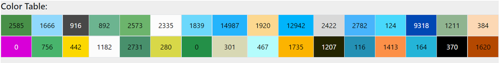

# Graphic Converter MegaDrive / Genesis

Tool to convert images to a suitable format for megadrive.

There are three main options:
* Just get the palette
* Generate sprite data
* Generate plane data

With some useful modifiers like optimize output data (eliminating duplicates), dithering the image, adding blue noise, selecting output colors, etc.

## Work in Progress:

* Option to create planes with 31 colors spliting tiles in plane A/B information.

## Example (sprite):
**Input:**<br/>


**Output:**
<br/>Image converted to Genesis / MegaDrive colors:<br/>

<br/>Information about colors used:<br/>

<br/>Palette used:<br/>


```c
#define kHeroTilesH     (1 * 3)
#define kHeroTilesV     3
#define kHeroTileSizeH  24
#define kHeroTileSizeV  24
#define kHeroDataSize   (kHeroTilesH * kHeroTilesV)

extern const u16 gPalHero[16];
extern const u32 gDataHero[kHeroDataSize * 8];

//--

const u16 gPalHero[16] = {
    0x0e00, 0x046e, 0x068e, 0x0eee, 0x044e, 0x0004, 0x0008, 0x0000,
    0x0888, 0x0088, 0x00cc, 0x00ee, 0x000e, 0x0000, 0x0000, 0x0000,
};

const u32 gDataHero[kHeroDataSize * 8] = {
    0x00000000, 0x00000001, 0x00000013, 0x00000013, 0x00000122, 0x00000122, 0x00005622, 0x00004262,  // Sprite 1 (pos: 1)
    0x00002622, 0x00001222, 0x00000612, 0x00000041, 0x00000886, 0x00008338, 0x00003223, 0x00002221,
    0x00022221, 0x00011219, 0x00001115, 0x0000099a, 0x00000aaa, 0x0000066c, 0x00000ccc, 0x00000333,
    0x01122211, 0x33232222, 0x32222222, 0x22222222, 0x22222222, 0x22222222, 0x27777117, 0x13333113,
    0x13377117, 0x23377227, 0x22222222, 0x22255555, 0x12222222, 0x99666666, 0xabb99449, 0xaabbb99a,
    0xaaab9aab, 0xaa99abbb, 0x57777777, 0xa9aabbba, 0x666aaba6, 0x44c0066c, 0x44c00ccc, 0x33300333,
    0x00000000, 0x21000000, 0x22400000, 0x22100000, 0x22140000, 0x21140000, 0x77140000, 0x33140000,
    0x73440000, 0x73440000, 0x22140000, 0x51400000, 0x14800000, 0x99380000, 0x9a940000, 0xbaa10000,
    0xbba14000, 0xbbb14000, 0x75510000, 0x9bb00000, 0x6ab00000, 0x44c00000, 0x44c00000, 0x33300000,
};
```

## Example (plane):
**Input:** (12.348 colors)<br/>


**Output:** (16 colors)
<br/>Image converted to Genesis / MegaDrive colors:<br/>

<br/>Image converted to Genesis / MegaDrive colors (dithering):<br/>

<br/>Image converted to Genesis / MegaDrive colors (blue noise + dithering):<br/>

<br/>Information about colors used:<br/>

<br/>Palette used:<br/>

<br/>Tiles:<br/>


```c
#define kLuceraTilesH	40
#define kLuceraTilesV	28
#define kLuceraNumTiles	(kLuceraTilesH * kLuceraTilesV)
#define kLuceraDataSize	537

extern const u16 gPalLucera[16];
extern const u16 gTileMapLucera[kLuceraNumTiles];
extern const u32 gDataLucera[kLuceraDataSize * 8];

//--

const u16 gPalLucera[16] = {
	0x0ea0, 0x08ce, 0x0ee8, 0x0ec4, 0x0840, 0x004a, 0x06a4, 0x02ae,
	0x0ea2, 0x0c40, 0x0222, 0x0eee, 0x0482, 0x0ca4, 0x0a40, 0x0aaa,
};

const u16 gTileMapLucera[kLuceraNumTiles] = {
	0x0000, 0x0000, 0x0000, 0x0000, 0x0000, 0x0000, 0x0000, 0x0000, 0x0000, 0x0000, 0x0000, 0x0000, 0x0000, 0x0000, 0x0001, 0x0002, 0x0003, 0x0004, 0x0004, 0x0004, 0x0004, 0x0004, 0x0005, 0x0006, 0x0007, 0x0008, 0x0000, 0x0000, 0x0000, 0x0000, 0x0000, 0x0000, 0x0000, 0x0000, 0x0000, 0x0000, 0x0000, 0x0000, 0x0000, 0x0000,
	0x0000, 0x0000, 0x0000, 0x0000, 0x0000, 0x0000, 0x0000, 0x0000, 0x0000, 0x0000, 0x0000, 0x0000, 0x0009, 0x000a, 0x0004, 0x0004, 0x000b, 0x000c, 0x000d, 0x000e, 0x000e, 0x000f, 0x0010, 0x080b, 0x0004, 0x0004, 0x0011, 0x0012, 0x0000, 0x0000, 0x0000, 0x0000, 0x0000, 0x0000, 0x0000, 0x0000, 0x0000, 0x0000, 0x0000, 0x0000,
	0x0000, 0x0000, 0x0000, 0x0000, 0x0000, 0x0000, 0x0000, 0x0000, 0x0000, 0x0000, 0x0013, 0x0014, 0x0004, 0x0004, 0x0015, 0x0016, 0x0017, 0x0018, 0x0019, 0x001a, 0x001b, 0x001c, 0x001d, 0x001e, 0x001f, 0x0020, 0x0021, 0x0022, 0x0023, 0x0813, 0x0000, 0x0000, 0x0000, 0x0000, 0x0000, 0x0000, 0x0000, 0x0000, 0x0000, 0x0000,
	0x0000, 0x0000, 0x0000, 0x0000, 0x0000, 0x0000, 0x0000, 0x0000, 0x0000, 0x0024, 0x0025, 0x0004, 0x0026, 0x0027, 0x0028, 0x0029, 0x002a, 0x002b, 0x002c, 0x002b, 0x002b, 0x002b, 0x002b, 0x002d, 0x002e, 0x002f, 0x0030, 0x0031, 0x0004, 0x0032, 0x0033, 0x0000, 0x0000, 0x0000, 0x0000, 0x0000, 0x0000, 0x0000, 0x0000, 0x0000,
	0x0000, 0x0000, 0x0000, 0x0000, 0x0000, 0x0000, 0x0000, 0x0000, 0x0034, 0x0035, 0x0004, 0x0036, 0x0037, 0x0038, 0x0039, 0x002b, 0x003a, 0x003b, 0x003c, 0x002b, 0x002b, 0x002b, 0x002b, 0x003d, 0x003e, 0x003f, 0x0040, 0x0041, 0x0042, 0x0004, 0x0043, 0x0044, 0x0000, 0x0000, 0x0000, 0x0000, 0x0000, 0x0000, 0x0000, 0x0000,
	0x0000, 0x0000, 0x0000, 0x0000, 0x0000, 0x0000, 0x0000, 0x0045, 0x0046, 0x0004, 0x0047, 0x0048, 0x0049, 0x004a, 0x004b, 0x002b, 0x004c, 0x004d, 0x004e, 0x002b, 0x002b, 0x002b, 0x004f, 0x0050, 0x0051, 0x0052, 0x0053, 0x0054, 0x0055, 0x0042, 0x0004, 0x0056, 0x0057, 0x0000, 0x0000, 0x0000, 0x0000, 0x0000, 0x0000, 0x0000,
	0x0000, 0x0000, 0x0000, 0x0000, 0x0000, 0x0000, 0x0857, 0x0058, 0x0004, 0x0059, 0x005a, 0x005b, 0x005c, 0x005d, 0x005e, 0x005f, 0x0060, 0x0061, 0x0062, 0x0063, 0x0064, 0x0065, 0x0066, 0x0067, 0x002b, 0x0068, 0x0069, 0x006a, 0x006b, 0x006c, 0x006d, 0x0004, 0x006e, 0x0000, 0x0000, 0x0000, 0x0000, 0x0000, 0x0000, 0x0000,
	0x0000, 0x0000, 0x0000, 0x0000, 0x0000, 0x0000, 0x006f, 0x0805, 0x0004, 0x0070, 0x0071, 0x0072, 0x0073, 0x0074, 0x0075, 0x0076, 0x0077, 0x0078, 0x0079, 0x007a, 0x007b, 0x007c, 0x007d, 0x007e, 0x002b, 0x002b, 0x007f, 0x0069, 0x0080, 0x0081, 0x0082, 0x0004, 0x0005, 0x0083, 0x0000, 0x0000, 0x0000, 0x0000, 0x0000, 0x0000,
	0x0000, 0x0000, 0x0000, 0x0000, 0x0000, 0x0000, 0x0084, 0x0004, 0x0085, 0x0086, 0x0087, 0x0088, 0x0089, 0x008a, 0x008b, 0x008c, 0x008d, 0x008e, 0x008f, 0x0090, 0x0091, 0x0092, 0x0093, 0x0094, 0x0095, 0x002b, 0x0096, 0x0069, 0x0069, 0x0097, 0x0098, 0x0099, 0x0004, 0x009a, 0x0000, 0x0000, 0x0000, 0x0000, 0x0000, 0x0000,
	0x0000, 0x0000, 0x0000, 0x0000, 0x0000, 0x009b, 0x0004, 0x0004, 0x009c, 0x009d, 0x009e, 0x0069, 0x0069, 0x009f, 0x002b, 0x002b, 0x00a0, 0x00a1, 0x00a2, 0x00a3, 0x00a4, 0x00a5, 0x00a6, 0x00a7, 0x00a8, 0x002b, 0x00a9, 0x0069, 0x0069, 0x00aa, 0x00ab, 0x00ac, 0x0004, 0x0005, 0x00ad, 0x0000, 0x0000, 0x0000, 0x0000, 0x0000,
	0x0000, 0x00ae, 0x00af, 0x00b0, 0x00b1, 0x00b2, 0x0004, 0x00b3, 0x00b4, 0x00b5, 0x00b6, 0x0069, 0x0069, 0x00b7, 0x002b, 0x002b, 0x00b8, 0x00b9, 0x00ba, 0x00a4, 0x00a4, 0x00a4, 0x00a4, 0x00bb, 0x002b, 0x00bc, 0x00bd, 0x0069, 0x0069, 0x0069, 0x00be, 0x00bf, 0x00c0, 0x0004, 0x00c1, 0x0000, 0x00c2, 0x00c3, 0x00c4, 0x0000,
	0x00c5, 0x00c6, 0x00c7, 0x00c8, 0x00c9, 0x00ca, 0x0004, 0x00cb, 0x00cc, 0x00cd, 0x0069, 0x0069, 0x0069, 0x00ce, 0x00cf, 0x002b, 0x002b, 0x00d0, 0x00d1, 0x00a4, 0x00a4, 0x00a4, 0x00a4, 0x00d2, 0x002b, 0x00d3, 0x0069, 0x0069, 0x0069, 0x0069, 0x00d4, 0x00d5, 0x00d6, 0x0004, 0x00d7, 0x00d8, 0x00d9, 0x00da, 0x00db, 0x00dc,
	0x0004, 0x0004, 0x0004, 0x0004, 0x0004, 0x0004, 0x0004, 0x00dd, 0x00de, 0x00df, 0x0069, 0x0069, 0x0069, 0x0069, 0x00e0, 0x002b, 0x002b, 0x00e1, 0x00e2, 0x00e3, 0x00a4, 0x00a4, 0x00e4, 0x00e5, 0x002b, 0x00e6, 0x0069, 0x0069, 0x0069, 0x0069, 0x00e7, 0x00e8, 0x00e9, 0x0004, 0x0004, 0x0004, 0x0004, 0x0004, 0x0004, 0x0004,
	0x0004, 0x0004, 0x0004, 0x0004, 0x0004, 0x0004, 0x0004, 0x00ea, 0x00eb, 0x00ec, 0x0069, 0x0069, 0x0069, 0x0069, 0x00ed, 0x002b, 0x002b, 0x002b, 0x00ee, 0x00ef, 0x00f0, 0x00f1, 0x00f2, 0x002b, 0x00f3, 0x00f4, 0x0069, 0x0069, 0x0069, 0x0069, 0x00f5, 0x00f6, 0x00f7, 0x0004, 0x0004, 0x0004, 0x0004, 0x0004, 0x0004, 0x0004,
	0x0004, 0x0004, 0x0004, 0x0004, 0x0004, 0x0004, 0x0004, 0x00ea, 0x00eb, 0x00f8, 0x0069, 0x0069, 0x0069, 0x0069, 0x00f9, 0x00fa, 0x00fb, 0x002b, 0x002b, 0x00fc, 0x00fd, 0x1064, 0x002b, 0x00fe, 0x00ff, 0x0069, 0x0069, 0x0069, 0x0069, 0x0069, 0x0100, 0x00f6, 0x0101, 0x0004, 0x0004, 0x0004, 0x0004, 0x0004, 0x0004, 0x0004,
	0x0004, 0x0004, 0x0004, 0x0004, 0x0004, 0x0004, 0x0004, 0x0102, 0x08f6, 0x0103, 0x0069, 0x0069, 0x0069, 0x0069, 0x0069, 0x0104, 0x0105, 0x0106, 0x0107, 0x083a, 0x002b, 0x0108, 0x0109, 0x010a, 0x010b, 0x0069, 0x0069, 0x0069, 0x0069, 0x0069, 0x010c, 0x010d, 0x010e, 0x0004, 0x0004, 0x0004, 0x0004, 0x0004, 0x0004, 0x0004,
	0x0004, 0x0004, 0x0004, 0x0004, 0x0004, 0x0004, 0x0004, 0x010f, 0x0110, 0x0111, 0x0112, 0x0112, 0x0112, 0x0112, 0x0112, 0x0112, 0x0113, 0x0114, 0x0115, 0x0116, 0x0117, 0x0118, 0x0119, 0x011a, 0x0112, 0x0112, 0x0112, 0x0112, 0x0112, 0x0112, 0x011b, 0x011c, 0x18cb, 0x0004, 0x0004, 0x0004, 0x0004, 0x0004, 0x0004, 0x0004,
	0x0004, 0x0004, 0x0004, 0x0004, 0x0004, 0x0004, 0x0004, 0x011d, 0x011e, 0x011f, 0x0120, 0x0120, 0x0120, 0x0120, 0x0120, 0x0120, 0x0121, 0x0122, 0x0123, 0x0124, 0x0125, 0x0126, 0x00a4, 0x0127, 0x0120, 0x0120, 0x0120, 0x0120, 0x0120, 0x0128, 0x0129, 0x012a, 0x012b, 0x0004, 0x0004, 0x0004, 0x0004, 0x0004, 0x0004, 0x0004,
	0x0004, 0x0004, 0x0004, 0x0004, 0x0004, 0x0004, 0x0004, 0x012c, 0x012d, 0x012e, 0x012f, 0x0120, 0x0130, 0x0131, 0x0132, 0x0133, 0x0134, 0x0135, 0x0136, 0x0137, 0x0069, 0x0138, 0x00a4, 0x0139, 0x013a, 0x013b, 0x013c, 0x0120, 0x0120, 0x013d, 0x013e, 0x013f, 0x0140, 0x0004, 0x0004, 0x0004, 0x0004, 0x0004, 0x0004, 0x0004,
	0x0004, 0x0004, 0x0004, 0x0004, 0x0004, 0x0004, 0x0004, 0x0004, 0x0141, 0x0142, 0x0143, 0x0144, 0x0145, 0x0146, 0x0147, 0x0148, 0x0149, 0x014a, 0x014b, 0x014c, 0x014d, 0x014e, 0x014f, 0x0150, 0x0151, 0x0152, 0x0153, 0x0154, 0x0155, 0x0156, 0x0157, 0x0158, 0x0004, 0x0004, 0x0004, 0x0004, 0x0004, 0x0004, 0x0004, 0x0004,
	0x0004, 0x0004, 0x0004, 0x0159, 0x015a, 0x015b, 0x015c, 0x015d, 0x015e, 0x015f, 0x0160, 0x0161, 0x0145, 0x0162, 0x0163, 0x0164, 0x0165, 0x0166, 0x0167, 0x0168, 0x0169, 0x016a, 0x016b, 0x016c, 0x016d, 0x016e, 0x016f, 0x0170, 0x0171, 0x0172, 0x0173, 0x092c, 0x0004, 0x0004, 0x0004, 0x0004, 0x0004, 0x0004, 0x0004, 0x0004,
	0x0004, 0x0174, 0x0175, 0x0176, 0x0177, 0x0177, 0x0177, 0x0178, 0x0179, 0x0179, 0x017a, 0x017b, 0x017c, 0x017d, 0x017e, 0x017f, 0x0180, 0x0181, 0x0182, 0x0183, 0x0184, 0x0185, 0x0186, 0x0187, 0x0188, 0x0189, 0x018a, 0x018b, 0x018c, 0x018d, 0x018e, 0x0004, 0x0004, 0x0004, 0x0004, 0x0004, 0x0004, 0x0004, 0x0004, 0x0004,
	0x018f, 0x0190, 0x0191, 0x0191, 0x0191, 0x0191, 0x0191, 0x0192, 0x0179, 0x0179, 0x0193, 0x0194, 0x0195, 0x0196, 0x0197, 0x0198, 0x0199, 0x019a, 0x019b, 0x019c, 0x019d, 0x019e, 0x019f, 0x01a0, 0x01a1, 0x01a2, 0x01a3, 0x01a4, 0x01a5, 0x01a6, 0x0004, 0x0004, 0x0004, 0x0004, 0x0004, 0x0004, 0x0004, 0x0004, 0x0004, 0x0004,
	0x01a7, 0x0179, 0x0179, 0x0179, 0x0179, 0x0179, 0x0179, 0x0179, 0x0179, 0x0179, 0x0179, 0x01a8, 0x01a9, 0x01aa, 0x01ab, 0x01ac, 0x01ad, 0x01ae, 0x01af, 0x01b0, 0x01b1, 0x01b2, 0x01b3, 0x01b4, 0x01b5, 0x01b6, 0x01b7, 0x01b8, 0x01b9, 0x01ba, 0x0004, 0x0004, 0x0004, 0x0004, 0x0004, 0x0004, 0x0004, 0x0004, 0x0004, 0x0004,
	0x0177, 0x01bb, 0x01bc, 0x0179, 0x0179, 0x0179, 0x0179, 0x0179, 0x0179, 0x0179, 0x0179, 0x01bd, 0x01be, 0x01bf, 0x01c0, 0x01c1, 0x01c2, 0x01c3, 0x01c4, 0x01c5, 0x01c6, 0x01c7, 0x01c8, 0x01c9, 0x01ca, 0x01cb, 0x01cc, 0x01cd, 0x0179, 0x01ce, 0x01cf, 0x01d0, 0x01d1, 0x01d2, 0x01d3, 0x0004, 0x0004, 0x0004, 0x01d4, 0x01d5,
	0x01d6, 0x01d6, 0x01d7, 0x0179, 0x0179, 0x0179, 0x0179, 0x0179, 0x0179, 0x0179, 0x0179, 0x01d8, 0x01d9, 0x0179, 0x01da, 0x01db, 0x01dc, 0x01dd, 0x01de, 0x01df, 0x01e0, 0x01e1, 0x01e2, 0x01e3, 0x01e4, 0x01e5, 0x01e6, 0x01e7, 0x01e8, 0x0179, 0x01e9, 0x01ea, 0x01ea, 0x01eb, 0x01ec, 0x01ed, 0x01ee, 0x01ef, 0x01f0, 0x01f1,
	0x0179, 0x0179, 0x0179, 0x01f2, 0x01f3, 0x0179, 0x0179, 0x0179, 0x0179, 0x0179, 0x0179, 0x0179, 0x0179, 0x0179, 0x0179, 0x0179, 0x01f4, 0x01f5, 0x01f6, 0x01f7, 0x01f8, 0x01f9, 0x01fa, 0x0179, 0x01fb, 0x01fc, 0x01fd, 0x01fe, 0x01ff, 0x0200, 0x0201, 0x0202, 0x0203, 0x0204, 0x0205, 0x0206, 0x0207, 0x0208, 0x0209, 0x020a,
	0x0179, 0x0179, 0x0179, 0x0179, 0x0179, 0x0179, 0x0179, 0x0179, 0x0179, 0x0179, 0x0179, 0x0179, 0x0179, 0x0179, 0x0179, 0x0179, 0x0179, 0x0179, 0x0179, 0x0179, 0x0179, 0x0179, 0x0179, 0x0179, 0x0179, 0x0179, 0x020b, 0x020c, 0x020d, 0x020e, 0x020f, 0x0210, 0x0211, 0x0212, 0x0213, 0x0214, 0x0215, 0x0216, 0x0217, 0x0218,
};

const u32 gDataLucera[kLuceraDataSize * 8] = {
    0x00000000, 0x00000000, 0x00000000, 0x00000000, 0x00000000, 0x00000000, 0x00000000, 0x00000000,  // Palette: 0 - Tile 0 (0x0000)
    0x00000000, 0x00000000, 0x00000000, 0x00000000, 0x00000000, 0x00000088, 0x00000888, 0x08888888,  // Palette: 0 - Tile 1 (0x0001)
    0x00000000, 0x00000000, 0x00000000, 0x00008888, 0x08888888, 0x88888888, 0x88888888, 0x88888888,  // Palette: 0 - Tile 2 (0x0002)
    0x00000000, 0x00000888, 0x88888888, 0x88888888, 0x88888888, 0x88888888, 0x88888888, 0x88888888,  // Palette: 0 - Tile 3 (0x0003)
    0x88888888, 0x88888888, 0x88888888, 0x88888888, 0x88888888, 0x88888888, 0x88888888, 0x88888888,  // Palette: 0 - Tile 4 (0x0004)
    0x88888880, 0x88888888, 0x88888888, 0x88888888, 0x88888888, 0x88888888, 0x88888888, 0x88888888,  // Palette: 0 - Tile 5 (0x0005)
    0x00000000, 0x88080000, 0x88888808, 0x88888888, 0x88888888, 0x88888888, 0x88888888, 0x88888888,  // Palette: 0 - Tile 6 (0x0006)
    0x00000000, 0x00000000, 0x00000000, 0x88800000, 0x88888800, 0x88888888, 0x88888888, 0x88888888,  // Palette: 0 - Tile 7 (0x0007)
    0x00000000, 0x00000000, 0x00000000, 0x00000000, 0x00000000, 0x00000000, 0x88800000, 0x88888800,  // Palette: 0 - Tile 8 (0x0008)
    0x00000000, 0x00000000, 0x00000000, 0x00000000, 0x00000008, 0x00000888, 0x00088888, 0x08888888,  // Palette: 0 - Tile 9 (0x0009)
    0x00000000, 0x00000888, 0x00088888, 0x00888888, 0x88888888, 0x88888888, 0x88888888, 0x88888888,  // Palette: 0 - Tile 10 (0x000a)
    0x88888888, 0x88888888, 0x88888888, 0x88888888, 0x88888888, 0x88888888, 0x88888888, 0x88888833,  // Palette: 0 - Tile 11 (0x000b)
    0x88888888, 0x88888888, 0x88888888, 0x88888888, 0x88888888, 0x88888883, 0x88333333, 0x33333333,  // Palette: 0 - Tile 12 (0x000c)
    0x88888888, 0x88888888, 0x88888888, 0x88888888, 0x88888833, 0x33333333, 0x33333333, 0x33333333,  // Palette: 0 - Tile 13 (0x000d)
    0x88888888, 0x88888888, 0x88888888, 0x88888888, 0x33333333, 0x33333333, 0x33333333, 0x33333333,  // Palette: 0 - Tile 14 (0x000e)
    0x88888888, 0x88888888, 0x88888888, 0x88888888, 0x38888888, 0x33333333, 0x33333333, 0x33333333,  // Palette: 0 - Tile 15 (0x000f)
    0x88888888, 0x88888888, 0x88888888, 0x88888888, 0x88888888, 0x38888888, 0x33333888, 0x33333333,  // Palette: 0 - Tile 16 (0x0010)
    0x00000000, 0x88800000, 0x88888000, 0x88888880, 0x88888888, 0x88888888, 0x88888888, 0xddd66666,  // Palette: 0 - Tile 17 (0x0011)
    0x00000000, 0x00000000, 0x00000000, 0x00000000, 0x00000000, 0x88000000, 0x88880000, 0x66ddd800,  // Palette: 0 - Tile 18 (0x0012)
    0x00000000, 0x00000000, 0x00000000, 0x00000000, 0x00000000, 0x00000000, 0x00000000, 0x00000088,  // Palette: 0 - Tile 19 (0x0013)
    0x00000000, 0x00000008, 0x00008888, 0x00088888, 0x00888888, 0x88888888, 0x88888888, 0x88888888,  // Palette: 0 - Tile 20 (0x0014)
    0x88888888, 0x88888888, 0x88888888, 0x88888888, 0x88888888, 0x88888833, 0x88883333, 0x88333333,  // Palette: 0 - Tile 21 (0x0015)
    0x88888888, 0x88888888, 0x88888333, 0x88833333, 0x33333333, 0x33333333, 0x33333333, 0x33333333,  // Palette: 0 - Tile 22 (0x0016)
    0x88833333, 0x33333333, 0x33333333, 0x33333333, 0x33333333, 0x33333333, 0x33333332, 0x33322222,  // Palette: 0 - Tile 23 (0x0017)
    0x33333333, 0x33333333, 0x33333333, 0x33333332, 0x333322bb, 0x3322bbbb, 0x22bbbbbb, 0xbbbbbbbb,  // Palette: 0 - Tile 24 (0x0018)
    0x33333333, 0x33333333, 0x33333333, 0x2bbb2222, 0xbbbbbbbb, 0xbbbbbbbb, 0xbbbbbbbb, 0xbbbbbbbb,  // Palette: 0 - Tile 25 (0x0019)
    0x33333333, 0x33333333, 0x33333333, 0x22222222, 0x22222222, 0xbbbb2222, 0xbbbbbbbb, 0xbbbbbbbb,  // Palette: 0 - Tile 26 (0x001a)
    0x33333333, 0x33333333, 0x33333333, 0x22222222, 0x2222222b, 0x22222bbb, 0xbbbbbbbb, 0xbbbbbbbb,  // Palette: 0 - Tile 27 (0x001b)
    0x33333333, 0x33333333, 0x33333333, 0x22bbbbb2, 0xbbbbbbbb, 0xbbbbbbbb, 0xbbbbbbbb, 0xbbbbbbbb,  // Palette: 0 - Tile 28 (0x001c)
    0x33333333, 0x33333333, 0x33333333, 0x23333333, 0xbbb23333, 0xbbbbb233, 0xbbbbbb22, 0xbbbbbbb2,  // Palette: 0 - Tile 29 (0x001d)
    0x33333888, 0x33333333, 0x33333333, 0x33333333, 0x33333333, 0x33333333, 0x23333333, 0x22223333,  // Palette: 0 - Tile 30 (0x001e)
    0x88888888, 0x88888888, 0x33888888, 0x33333888, 0x3333333d, 0x333333d5, 0x33333d55, 0x3333d571,  // Palette: 0 - Tile 31 (0x001f)
    0x88888d65, 0x88865555, 0x8d555555, 0xd5555555, 0x55555555, 0x55577111, 0x77111111, 0x11111111,  // Palette: 0 - Tile 32 (0x0020)
    0x55555555, 0x55555555, 0x55555555, 0x55555777, 0x77111177, 0x11111177, 0x11111777, 0x11111775,  // Palette: 0 - Tile 33 (0x0021)
    0x55555580, 0x55555d88, 0x55556888, 0x75558888, 0x755d8888, 0x55688888, 0x55888888, 0x5d888888,  // Palette: 0 - Tile 34 (0x0022)
    0x00000000, 0x88000000, 0x88800000, 0x88880000, 0x88888000, 0x88888880, 0x88888888, 0x88888888,  // Palette: 0 - Tile 35 (0x0023)
    0x00000000, 0x00000000, 0x00000000, 0x00000000, 0x00000000, 0x00000008, 0x00000088, 0x00008888,  // Palette: 0 - Tile 36 (0x0024)
    0x00000888, 0x00088888, 0x00888888, 0x88888888, 0x88888888, 0x88888888, 0x88888888, 0x88888888,  // Palette: 0 - Tile 37 (0x0025)
    0x88888888, 0x88888888, 0x88888888, 0x88888888, 0x88888888, 0x88888888, 0x88888833, 0x88888333,  // Palette: 0 - Tile 38 (0x0026)
    0x88888888, 0x88888833, 0x88883333, 0x88833333, 0x83333333, 0x33333333, 0x33333333, 0x33333333,  // Palette: 0 - Tile 39 (0x0027)
    0x33333333, 0x33333333, 0x33333333, 0x33333333, 0x33333332, 0x3333322b, 0x333222bb, 0x32222bbb,  // Palette: 0 - Tile 40 (0x0028)
    0x33333333, 0x33333322, 0x33322222, 0x32222222, 0x222222bb, 0xbbbbbbbb, 0xbbbbbbbb, 0xbbbbbbbb,  // Palette: 0 - Tile 41 (0x0029)
    0x2222222b, 0x22222bbb, 0x222bbbbb, 0x2bbbbbbb, 0xbbbbbbbb, 0xbbbbbbbb, 0xbbbbbbbb, 0xbbbbbbbb,  // Palette: 0 - Tile 42 (0x002a)
    0xbbbbbbbb, 0xbbbbbbbb, 0xbbbbbbbb, 0xbbbbbbbb, 0xbbbbbbbb, 0xbbbbbbbb, 0xbbbbbbbb, 0xbbbbbbbb,  // Palette: 0 - Tile 43 (0x002b)
    0xbbbbbbbb, 0xbbbbbbbb, 0xbbbbbbbb, 0xbbbbbbbb, 0xbbbbbbbb, 0xbbbbbbbb, 0xbbbbbbbb, 0xbfbbbbbb,  // Palette: 0 - Tile 44 (0x002c)
    0x22222223, 0xb2222222, 0xbb222222, 0xbbb22222, 0xbbbbb222, 0xbbbbbb22, 0xbbbbbbb1, 0xbbbbbb11,  // Palette: 0 - Tile 45 (0x002d)
    0x333df111, 0x223f1111, 0x22f11111, 0x2f111111, 0x21111111, 0x11111111, 0x11111111, 0x11111111,  // Palette: 0 - Tile 46 (0x002e)
    0x11111111, 0x11111111, 0x11111111, 0x11111111, 0x11111111, 0x11111111, 0x11111117, 0x11111177,  // Palette: 0 - Tile 47 (0x002f)
    0x11117775, 0x11177755, 0x1117755d, 0x117775f8, 0x177755d8, 0x77755d33, 0x7755f333, 0x775f3333,  // Palette: 0 - Tile 48 (0x0030)
    0x68888888, 0xd8888888, 0x88888888, 0x88888888, 0x88888888, 0x88888888, 0x38888888, 0x33388888,  // Palette: 0 - Tile 49 (0x0031)
    0x88800000, 0x88880000, 0x88888000, 0x88888808, 0x88888888, 0x88888888, 0x88888888, 0x88888888,  // Palette: 0 - Tile 50 (0x0032)
    0x00000000, 0x00000000, 0x00000000, 0x00000000, 0x80000000, 0x00000000, 0x88800000, 0x88880000,  // Palette: 0 - Tile 51 (0x0033)
    0x00000000, 0x00000000, 0x00000000, 0x00000000, 0x00000008, 0x00000088, 0x00000888, 0x00000888,  // Palette: 0 - Tile 52 (0x0034)
    0x00008888, 0x00888888, 0x08888888, 0x88888888, 0x88888888, 0x88888888, 0x88888888, 0x88888888,  // Palette: 0 - Tile 53 (0x0035)
    0x88888888, 0x88888888, 0x88888888, 0x88888888, 0x88888833, 0x88888333, 0x88883333, 0x88833333,  // Palette: 0 - Tile 54 (0x0036)
    0x88833333, 0x88333333, 0x83333333, 0x33333333, 0x33333333, 0x33333333, 0x33333332, 0x33333322,  // Palette: 0 - Tile 55 (0x0037)
    0x33333333, 0x33333322, 0x33333222, 0x33322222, 0x33222222, 0x22222222, 0x22222222, 0x22222222,  // Palette: 0 - Tile 56 (0x0038)
    0x2222bbbb, 0x2222bbbb, 0x222bbbbb, 0x222bbbbb, 0x222bbbbb, 0x222bbbbb, 0x222bbbbb, 0x222bbbbb,  // Palette: 0 - Tile 57 (0x0039)
    0xbbbbbbbb, 0xbbbbbbbb, 0xbbbbbbbb, 0xbbbbbbbb, 0xbbbbbbbb, 0xbbbbbbbb, 0xbbbbbbbb, 0xbbbbbbbf,  // Palette: 0 - Tile 58 (0x003a)
    0xbbbbbbbb, 0xbbbbbfff, 0xbbbfffbb, 0xbbffbbbb, 0xbffbbbbb, 0xffbbbbbb, 0xffbbbbbb, 0xfbbbbbbb,  // Palette: 0 - Tile 59 (0x003b)
    0xffbbbbbb, 0xffbbbbbb, 0xbbbbbbbb, 0xbbbbbbbb, 0xbbbbbbbb, 0xbbbbbbbb, 0xbbbbbbbb, 0xbbbbbbbb,  // Palette: 0 - Tile 60 (0x003c)
    0xbbbbb111, 0xbbbbb111, 0xbbbb1777, 0xbbbb7777, 0xbbb55755, 0xbbbf5555, 0xbbbb5555, 0xbbbbf555,  // Palette: 0 - Tile 61 (0x003d)
    0x11111111, 0x11111111, 0x77777777, 0x77777775, 0x55555555, 0x55555555, 0x55555555, 0x55555555,  // Palette: 0 - Tile 62 (0x003e)
    0x11117777, 0x77777775, 0x77777555, 0x55555555, 0x55555552, 0x55555f22, 0x555ffd22, 0x51bb299d,  // Palette: 0 - Tile 63 (0x003f)
    0x75533333, 0x55d33333, 0x5f233333, 0xf2223333, 0x22222233, 0x22222223, 0x22222222, 0x22222222,  // Palette: 0 - Tile 64 (0x0040)
    0x33338888, 0x33333888, 0x33333388, 0x33333333, 0x33333333, 0x33333333, 0x23333333, 0x22333333,  // Palette: 0 - Tile 65 (0x0041)
    0x88888888, 0x88888888, 0x88888888, 0x88888888, 0x38888888, 0x33888888, 0x33388888, 0x33338888,  // Palette: 0 - Tile 66 (0x0042)
    0x88880000, 0x88880800, 0x88888080, 0x88888880, 0x88888888, 0x88888888, 0x88888888, 0x88888888,  // Palette: 0 - Tile 67 (0x0043)
    0x00000000, 0x00000000, 0x00000000, 0x00000000, 0x00000000, 0x80000000, 0x88000000, 0x88800000,  // Palette: 0 - Tile 68 (0x0044)
    0x00000000, 0x00000000, 0x00000000, 0x00000000, 0x00000000, 0x00000000, 0x00000008, 0x00000088,  // Palette: 0 - Tile 69 (0x0045)
    0x00008888, 0x00088888, 0x00888888, 0x08888888, 0x08888888, 0x88888888, 0x88888888, 0x88888888,  // Palette: 0 - Tile 70 (0x0046)
    0x88888888, 0x88888888, 0x88888888, 0x88888883, 0x88888833, 0x88888333, 0x88883333, 0x88833333,  // Palette: 0 - Tile 71 (0x0047)
    0x88333333, 0x83333333, 0x33333333, 0x33333333, 0x33333333, 0x33333332, 0x33333322, 0x33333222,  // Palette: 0 - Tile 72 (0x0048)
    0x33333222, 0x33322222, 0x33222222, 0x32222222, 0x22222222, 0x22222222, 0x22222222, 0x22222ff5,  // Palette: 0 - Tile 73 (0x0049)
    0x22222222, 0x2222222d, 0x222222de, 0x22223d44, 0x222d9444, 0x22de4444, 0x3d444444, 0x5555555a,  // Palette: 0 - Tile 74 (0x004a)
    0x2dfbbbbb, 0x94fbbbbb, 0x44fbbbbb, 0x44bbbbbb, 0x46ffbbbb, 0x4ffbbbbb, 0x4ffbbbbb, 0xfffbbbbb,  // Palette: 0 - Tile 75 (0x004b)
    0xbbbbbbbf, 0xbbbbbbbf, 0xbbbbbbbf, 0xbbbbbbbf, 0xbbbbbbbf, 0xbbbbbbbb, 0xbbbbbbbb, 0xbbbbbbbb,  // Palette: 0 - Tile 76 (0x004c)
    0xfbbbbbbb, 0xfbbbbbbb, 0xfbbbbbbb, 0xfbbbbbbb, 0xfbbbbbbb, 0xfbbbbbbb, 0xffbbbbbb, 0xbffbbbbb,  // Palette: 0 - Tile 77 (0x004d)
    0xbbbbbbbb, 0xbbbbbbbb, 0xbbbbbbbb, 0xbbbfbbbb, 0xbbbfbbbb, 0xbbfffbbb, 0xbbfffbbb, 0xbff1ffbb,  // Palette: 0 - Tile 78 (0x004e)
    0xbbbbbbbb, 0xbbbbbbbb, 0xbbbbbbbb, 0xbbbbbbbb, 0xbbbbbbbb, 0xbbbbbbbb, 0xbbfbbbbb, 0xbbf11111,  // Palette: 0 - Tile 79 (0x004f)
    0xbbbb1555, 0xbbbbb555, 0xbbbbb5f1, 0xbbbbbbbb, 0xbbbbfbbb, 0xbbbf5bbb, 0xbff551bb, 0x17555fbb,  // Palette: 0 - Tile 80 (0x0050)
    0x555557fb, 0x55f1bbbb, 0xbbbbbbbb, 0xbbbbbbbb, 0xbbbbbbbb, 0xbbbbbbbb, 0xbbbbbbbb, 0xbbbbbbbb,  // Palette: 0 - Tile 81 (0x0051)
    0xbbbbb449, 0xbbbbb444, 0xbbbbbd44, 0xbbbbbd44, 0xbbbbbf44, 0xbbbbbf44, 0xbbbbb244, 0xbbbbbb44,  // Palette: 0 - Tile 82 (0x0052)
    0xd2222222, 0xe9d22222, 0x449d2222, 0x444e9d22, 0x4444eed2, 0x444444ed, 0x4444444e, 0x44444444,  // Palette: 0 - Tile 83 (0x0053)
    0x22233333, 0x22223333, 0x22222333, 0x22222233, 0x22222223, 0x22222222, 0x92222222, 0x49222222,  // Palette: 0 - Tile 84 (0x0054)
    0x33333888, 0x33333388, 0x33333333, 0x33333333, 0x33333333, 0x23333333, 0x22333333, 0x22233333,  // Palette: 0 - Tile 85 (0x0055)
    0x88800000, 0x88880000, 0x88888000, 0x88888800, 0x88888880, 0x88888888, 0x88888888, 0x88888888,  // Palette: 0 - Tile 86 (0x0056)
    0x00000000, 0x00000000, 0x00000000, 0x00000000, 0x00000000, 0x00000000, 0x00000000, 0x80000000,  // Palette: 0 - Tile 87 (0x0057)
    0x00000088, 0x00008888, 0x00008888, 0x00008888, 0x00088888, 0x00888888, 0x00888888, 0x08888888,  // Palette: 0 - Tile 88 (0x0058)
    0x88888888, 0x88888888, 0x88888888, 0x88888888, 0x88888883, 0x88888883, 0x88888833, 0x88888333,  // Palette: 0 - Tile 89 (0x0059)
    0x88333333, 0x88333333, 0x83333333, 0x33333333, 0x33333333, 0x33333333, 0x33333332, 0x33333322,  // Palette: 0 - Tile 90 (0x005a)
    0x33332222, 0x33322222, 0x3322222f, 0x32222f55, 0x22226555, 0x22255555, 0x222f5557, 0x2222f555,  // Palette: 0 - Tile 91 (0x005b)
    0x222f5555, 0x2f555555, 0x55555557, 0x55557111, 0x55777111, 0x77777711, 0x77777771, 0x77777777,  // Palette: 0 - Tile 92 (0x005c)
    0x55555555, 0x55f11111, 0x11111111, 0x11111111, 0x11111111, 0x11111111, 0x11111111, 0x11111111,  // Palette: 0 - Tile 93 (0x005d)
    0x555ffbbb, 0x111777f1, 0x11111111, 0x11111111, 0x11111111, 0x11111111, 0x11111111, 0x11111111,  // Palette: 0 - Tile 94 (0x005e)
    0xbbbbbbbb, 0xbbbbbbbb, 0x11bbbbbb, 0x1111bbbb, 0x111111bb, 0x11111111, 0x11111111, 0x11111111,  // Palette: 0 - Tile 95 (0x005f)
    0xbbbbbbbb, 0xbbbbbbbb, 0xbbbbbbbb, 0xbbbbbbb5, 0xbbbb1f55, 0x55555555, 0x15555555, 0x17555555,  // Palette: 0 - Tile 96 (0x0060)
    0xb5ffffbf, 0xf555ffff, 0x55557777, 0x55557777, 0x55577777, 0x55577777, 0x55577777, 0x55577777,  // Palette: 0 - Tile 97 (0x0061)
    0xff71fffb, 0xf7711fff, 0x777111ff, 0x77111111, 0x77111111, 0x77111111, 0x77111111, 0x71111111,  // Palette: 0 - Tile 98 (0x0062)
    0xbbbbfbbb, 0xfffffbbb, 0xfff1fbbb, 0x1111ffbb, 0x11111fbb, 0x11111ffb, 0x111111ff, 0x1111111f,  // Palette: 0 - Tile 99 (0x0063)
    0xbbbbbbbb, 0xbbbbbbbb, 0xbbbbbbbb, 0xbbbbbbbb, 0xbbbbbbbb, 0xbbbbbbbb, 0xbbbbbbbb, 0xffbbbbbb,  // Palette: 0 - Tile 100 (0x0064)
    0xbbbbbbbb, 0xbbbbbbbb, 0xbbbbfbff, 0xbbbb1111, 0xbbbf1111, 0xbbbf1111, 0xbbff1111, 0xbff11111,  // Palette: 0 - Tile 101 (0x0065)
    0xbf111111, 0xf1111111, 0x11111111, 0x11111111, 0x11111111, 0x11111111, 0x11111111, 0x11111111,  // Palette: 0 - Tile 102 (0x0066)
    0x11555fbb, 0x115555bb, 0x11f555bb, 0x111555bb, 0x1115551b, 0x111f55fb, 0x1111557b, 0x1111555b,  // Palette: 0 - Tile 103 (0x0067)
    0xbbbbbb44, 0xbbbbbb44, 0xbbbbbb94, 0xbbbbbbd4, 0xbbbbbbf4, 0xbbbbbbb4, 0xbbbbbbbd, 0xbbbbbbbf,  // Palette: 0 - Tile 104 (0x0068)
    0x44444444, 0x44444444, 0x44444444, 0x44444444, 0x44444444, 0x44444444, 0x44444444, 0x44444444,  // Palette: 0 - Tile 105 (0x0069)
    0x44ed2222, 0x4444d222, 0x44444d22, 0x444444d2, 0x4444444d, 0x44444444, 0x44444444, 0x44444444,  // Palette: 0 - Tile 106 (0x006a)
    0x22233333, 0x22223333, 0x22222333, 0x22222233, 0x22222223, 0x22222222, 0x42222222, 0x44222222,  // Palette: 0 - Tile 107 (0x006b)
    0x33333888, 0x33333388, 0x33333388, 0x33333338, 0x33333333, 0x33333333, 0x23333333, 0x23333333,  // Palette: 0 - Tile 108 (0x006c)
    0x88888888, 0x88888888, 0x88888888, 0x88888888, 0x88888888, 0x38888888, 0x33888888, 0x33888888,  // Palette: 0 - Tile 109 (0x006d)
    0x88000000, 0x88000000, 0x88880000, 0x88800000, 0x88888000, 0x88888000, 0x88888800, 0x88888800,  // Palette: 0 - Tile 110 (0x006e)
    0x00000008, 0x00000008, 0x00000080, 0x00000088, 0x00000808, 0x00000088, 0x00008888, 0x00008888,  // Palette: 0 - Tile 111 (0x006f)
    0x88888333, 0x88883333, 0x88833333, 0x88333333, 0x88333333, 0x83333333, 0x83333333, 0x33333333,  // Palette: 0 - Tile 112 (0x0070)
    0x33333222, 0x33332222, 0x33332222, 0x33322222, 0x33222222, 0x33222222, 0x32222222, 0x22222222,  // Palette: 0 - Tile 113 (0x0071)
    0x22222f55, 0x22222365, 0x22222de4, 0x2222de44, 0x222d9444, 0x223d4444, 0x23d44444, 0x2de44444,  // Palette: 0 - Tile 114 (0x0072)
    0x55777777, 0x55577777, 0x55557777, 0x4a555777, 0x44a55557, 0x44445555, 0x44444f55, 0x44444fff,  // Palette: 0 - Tile 115 (0x0073)
    0x77111111, 0x77711111, 0x77777111, 0x77777777, 0x77777777, 0x57777777, 0x55577777, 0x55555577,  // Palette: 0 - Tile 116 (0x0074)
    0x11111111, 0x11111111, 0x11111111, 0x11111111, 0x77777777, 0x77777777, 0x77777775, 0x77755555,  // Palette: 0 - Tile 117 (0x0075)
    0x11111111, 0x11111117, 0x11111175, 0x11777555, 0x77775555, 0x75555555, 0x55555555, 0x5555555f,  // Palette: 0 - Tile 118 (0x0076)
    0x75555555, 0x55555555, 0x55555555, 0x55555555, 0x55555555, 0x55555555, 0x55fbf555, 0xfbbbbf55,  // Palette: 0 - Tile 119 (0x0077)
    0x55577777, 0x55777777, 0x55777777, 0x55777777, 0x55777775, 0x55777751, 0x5577775b, 0x5577751b,  // Palette: 0 - Tile 120 (0x0078)
    0x71117777, 0x7775f111, 0x75fbbbbb, 0x5bbbbbbb, 0xbbbbbbbb, 0xbbbbbbbb, 0xbbbbbbbb, 0xbbbbbbbb,  // Palette: 0 - Tile 121 (0x0079)
    0xf1111111, 0xf5711111, 0xbb15f111, 0xbbbbff11, 0xbbbbb7f1, 0xbbbbbb51, 0xbbbbbbff, 0xbbbbbbb5,  // Palette: 0 - Tile 122 (0x007a)
    0x1fffffff, 0x111fff11, 0x11111111, 0x11111111, 0x11111111, 0x11111111, 0x11111111, 0x11111111,  // Palette: 0 - Tile 123 (0x007b)
    0xf111111f, 0x1111175f, 0x111f51bb, 0x11ffbbbb, 0x1f5bbbbb, 0x15bbbbbb, 0xffbbbbbb, 0x5bbbbbbb,  // Palette: 0 - Tile 124 (0x007c)
    0xffff1111, 0x111f5f11, 0xbbbbb15f, 0xbbbbbbb5, 0xbbbbbbbb, 0xbbbbbbbb, 0xbbbbbbbb, 0xbbbbbbbb,  // Palette: 0 - Tile 125 (0x007d)
    0x1111755b, 0x1111155b, 0x11111551, 0xf1111551, 0x5111155f, 0x1711175f, 0xb5111757, 0xb1711155,  // Palette: 0 - Tile 126 (0x007e)
    0x44444444, 0xf4444444, 0xb4444444, 0xb9444444, 0xbd444444, 0xbf444444, 0xbf444444, 0xb2444444,  // Palette: 0 - Tile 127 (0x007f)
    0x44922222, 0x444d2222, 0x4444d222, 0x44444222, 0x44444422, 0x444444d2, 0x4444444d, 0x44444444,  // Palette: 0 - Tile 128 (0x0080)
    0x22333333, 0x22233333, 0x22223333, 0x22223333, 0x22222333, 0x22222233, 0x22222233, 0x22222223,  // Palette: 0 - Tile 129 (0x0081)
    0x33388888, 0x33338888, 0x33338888, 0x33333888, 0x33333388, 0x33333388, 0x33333338, 0x33333338,  // Palette: 0 - Tile 130 (0x0082)
    0x00000000, 0x00000000, 0x00000000, 0x80000000, 0x88000000, 0x88000000, 0x88800000, 0x88800000,  // Palette: 0 - Tile 131 (0x0083)
    0x00088888, 0x00088888, 0x00888888, 0x00888888, 0x08888888, 0x08888888, 0x08888888, 0x88888888,  // Palette: 0 - Tile 132 (0x0084)
    0x88888883, 0x88888883, 0x88888833, 0x88888833, 0x88888333, 0x88888333, 0x88883333, 0x88883333,  // Palette: 0 - Tile 133 (0x0085)
    0x33333333, 0x33333332, 0x33333332, 0x33333322, 0x33333222, 0x33333222, 0x33332222, 0x33332222,  // Palette: 0 - Tile 134 (0x0086)
    0x22222222, 0x22222223, 0x2222222d, 0x22222239, 0x222223d4, 0x22222d94, 0x22223d44, 0x2222d944,  // Palette: 0 - Tile 135 (0x0087)
    0x39444444, 0xd4444444, 0xe4444444, 0x44444444, 0x44444444, 0x44444444, 0x44444444, 0x44444444,  // Palette: 0 - Tile 136 (0x0088)
    0x444449ff, 0x444444ff, 0x4444444f, 0x44444444, 0x44444444, 0x44444444, 0x44444444, 0x44444444,  // Palette: 0 - Tile 137 (0x0089)
    0xff555555, 0xffbbf555, 0xfffbbbbf, 0xffffbbbb, 0xdffffbbb, 0x4fffffbb, 0x44fffffb, 0x44fffffb,  // Palette: 0 - Tile 138 (0x008a)
    0x55555555, 0x55555555, 0xffffffff, 0xbbbbbbbb, 0xbbbbbbbb, 0xbbbbbbbb, 0xbbbbbbbb, 0xbbbbbbbb,  // Palette: 0 - Tile 139 (0x008b)
    0x55555fbb, 0x55ffbbbb, 0xbbbbbbbb, 0xbbbbbbbb, 0xbbbbbbbb, 0xbbbbbbbb, 0xbbbbbbbb, 0xbbbbbbbb,  // Palette: 0 - Tile 140 (0x008c)
    0xbbbbbf55, 0xbbbbbf55, 0xbbbbbb55, 0xbbbbbb55, 0xbbbbbb55, 0xbbbbbb55, 0xbbbbbb55, 0xbbbbbb55,  // Palette: 0 - Tile 141 (0x008d)
    0x577775bb, 0x577775bb, 0x577775bb, 0x577775bb, 0x577775bb, 0x577775bb, 0x577775fb, 0x5777775b,  // Palette: 0 - Tile 142 (0x008e)
    0xbbbbbbbb, 0xbbbbbbbb, 0xbbbbbbbb, 0xbbbbbbbb, 0xbbbbbbbb, 0xbbbbbbd9, 0xbbbbb299, 0xbbbbb899,  // Palette: 0 - Tile 143 (0x008f)
    0xbbbbbbb5, 0xbbbbbbbf, 0xbbbbbbbf, 0xbbbbbbbf, 0xbbbbbbbf, 0x992bbbb5, 0x999bbbb5, 0x999dbbf1,  // Palette: 0 - Tile 144 (0x0090)
    0x11111111, 0x11111111, 0xf111111f, 0xf111111f, 0x11111111, 0x11111111, 0x11111111, 0x11111111,  // Palette: 0 - Tile 145 (0x0091)
    0x5bbbbbbb, 0xfbbbbbbb, 0xfbbbbbbb, 0xfbbbbbbb, 0xfbbbbbbb, 0x5bbbbbbb, 0x5bbbbbbb, 0x1fbbbbb2,  // Palette: 0 - Tile 146 (0x0092)
    0xbbbbbbbb, 0xbbbbbbbb, 0xbbbbbbbb, 0xbbbbbbbb, 0xbbbbbbbb, 0x2999dbbb, 0x99999dbb, 0x999999bb,  // Palette: 0 - Tile 147 (0x0093)
    0xbb511155, 0xbb511155, 0xbb511155, 0xbb511155, 0xbb511155, 0xbb511155, 0xbf711155, 0xb5111155,  // Palette: 0 - Tile 148 (0x0094)
    0xbbbbbbbb, 0xbbbbbbbb, 0xbbbbbbbb, 0xbbbbbbbb, 0xbbbbbbbb, 0xbbbbbbbb, 0xbbbbbbbb, 0x1bbbbbbb,  // Palette: 0 - Tile 149 (0x0095)
    0xbf444444, 0xbf444444, 0xbd444444, 0xb9444444, 0x24444444, 0xd4444444, 0x94444444, 0x44444444,  // Palette: 0 - Tile 150 (0x0096)
    0x92222222, 0x4d222222, 0x44222222, 0x44d22222, 0x44422222, 0x44442222, 0x4444d222, 0x44444222,  // Palette: 0 - Tile 151 (0x0097)
    0x33333333, 0x33333333, 0x23333333, 0x23333333, 0x22333333, 0x22333333, 0x22233333, 0x22233333,  // Palette: 0 - Tile 152 (0x0098)
    0x88888888, 0x88888888, 0x38888888, 0x33888888, 0x33888888, 0x33388888, 0x33388888, 0x33338888,  // Palette: 0 - Tile 153 (0x0099)
    0x88880000, 0x88880000, 0x88888000, 0x88888000, 0x88888800, 0x88888800, 0x88888880, 0x88888880,  // Palette: 0 - Tile 154 (0x009a)
    0x00000000, 0x00000000, 0x00000008, 0x00000008, 0x00000088, 0x00000088, 0x00000888, 0x00000888,  // Palette: 0 - Tile 155 (0x009b)
    0x88833333, 0x88833333, 0x88333333, 0x88333333, 0x83333333, 0x83333333, 0x33333333, 0x33333333,  // Palette: 0 - Tile 156 (0x009c)
    0x33322222, 0x33322222, 0x33322222, 0x33222222, 0x33222222, 0x32222222, 0x32222222, 0x22222222,  // Palette: 0 - Tile 157 (0x009d)
    0x2223d444, 0x222d9444, 0x223d4444, 0x22d94444, 0x23d44444, 0x2d944444, 0x3d444444, 0xd9444444,  // Palette: 0 - Tile 158 (0x009e)
    0x444fffff, 0x444fffff, 0x444fffff, 0x444fffff, 0x444fffff, 0x444ffffb, 0x444ffffb, 0x444ffffb,  // Palette: 0 - Tile 159 (0x009f)
    0xbbbbbbf5, 0xbbbbbbf5, 0xbbbbbbf5, 0xbbbbbbf5, 0xbbbbbbf5, 0xbbbbbbf5, 0xbbbbbbf5, 0xbbbbbbf5,  // Palette: 0 - Tile 160 (0x00a0)
    0x5777775f, 0x57777775, 0x57777777, 0x57777777, 0x57777777, 0x57777777, 0x57777777, 0x57777777,  // Palette: 0 - Tile 161 (0x00a1)
    0xbbbbb999, 0x1bbbbd99, 0x51bbb299, 0x75fbbb29, 0x11755fff, 0x11111777, 0x11111111, 0x71111111,  // Palette: 0 - Tile 162 (0x00a2)
    0x999dbb51, 0x999db511, 0x999b5711, 0x9df57111, 0xf5711111, 0x11111111, 0x11111111, 0x11111111,  // Palette: 0 - Tile 163 (0x00a3)
    0x11111111, 0x11111111, 0x11111111, 0x11111111, 0x11111111, 0x11111111, 0x11111111, 0x11111111,  // Palette: 0 - Tile 164 (0x00a4)
    0x171bbbbd, 0x115bbbb2, 0x11f5bbbb, 0x111f5fbb, 0x1111175f, 0x11111111, 0x11111111, 0x11111111,  // Palette: 0 - Tile 165 (0x00a5)
    0x999999bb, 0x999999b1, 0x99999215, 0xbd99ff71, 0xfff55711, 0xf7f11111, 0x11111111, 0x11111111,  // Palette: 0 - Tile 166 (0x00a6)
    0xf7111155, 0x51111155, 0x11111155, 0x11111155, 0x11111155, 0x11111155, 0x11111155, 0x11111755,  // Palette: 0 - Tile 167 (0x00a7)
    0x1bbbbbbb, 0x1bbbbbbb, 0x1bbbbbbb, 0x1bbbbbbb, 0x1bbbbbbb, 0xbbbbbbbb, 0xbbbbbbbb, 0xbbbbbbbb,  // Palette: 0 - Tile 168 (0x00a8)
    0x44444444, 0x44444444, 0xd4444444, 0xf4444444, 0xb4444444, 0xb9444444, 0xbd444444, 0xbd444444,  // Palette: 0 - Tile 169 (0x00a9)
    0x44444d22, 0x44444422, 0x444444d2, 0x44444442, 0x4444444d, 0x44444444, 0x4444444a, 0x44444444,  // Palette: 0 - Tile 170 (0x00aa)
    0x22223333, 0x22223333, 0x22222333, 0x22222333, 0x22222233, 0x22222233, 0x22222233, 0xd2222223,  // Palette: 0 - Tile 171 (0x00ab)
    0x33338888, 0x33333888, 0x33333888, 0x33333888, 0x33333388, 0x33333388, 0x33333338, 0x33333338,  // Palette: 0 - Tile 172 (0x00ac)
    0x00000000, 0x00000000, 0x00000000, 0x80000000, 0x80000000, 0x88000000, 0x88000000, 0x88000000,  // Palette: 0 - Tile 173 (0x00ad)
    0x00000000, 0x00000000, 0x00000000, 0x00000000, 0x00000000, 0x00000000, 0x00000000, 0x00080088,  // Palette: 0 - Tile 174 (0x00ae)
    0x00000000, 0x00000000, 0x00000000, 0x00000000, 0x00000000, 0x00000000, 0x00000000, 0x00800800,  // Palette: 0 - Tile 175 (0x00af)
    0x00000000, 0x00000000, 0x00000000, 0x00000000, 0x00000000, 0x00000000, 0x00000000, 0x00080000,  // Palette: 0 - Tile 176 (0x00b0)
    0x00000000, 0x00000000, 0x00000000, 0x00000000, 0x00000000, 0x00000000, 0x00000000, 0x00080080,  // Palette: 0 - Tile 177 (0x00b1)
    0x00000888, 0x00000888, 0x00080888, 0x00008888, 0x00888888, 0x00088888, 0x00088888, 0x00888888,  // Palette: 0 - Tile 178 (0x00b2)
    0x88888888, 0x88888883, 0x88888883, 0x88888883, 0x88888883, 0x88888833, 0x88888833, 0x88888833,  // Palette: 0 - Tile 179 (0x00b3)
    0x33333333, 0x33333333, 0x33333332, 0x33333332, 0x33333332, 0x33333322, 0x33333322, 0x33333322,  // Palette: 0 - Tile 180 (0x00b4)
    0x22222223, 0x2222222d, 0x2222222d, 0x2222223d, 0x222222d9, 0x222222de, 0x22222dd4, 0x22222d94,  // Palette: 0 - Tile 181 (0x00b5)
    0xde444444, 0x94444444, 0x94444444, 0x44444444, 0x44444444, 0x44444444, 0x44444444, 0x44444444,  // Palette: 0 - Tile 182 (0x00b6)
    0x444ffffb, 0x444ffffb, 0x444fffbb, 0x444fffbb, 0x444fffbb, 0x444fffbb, 0x444fffbb, 0x444fffbb,  // Palette: 0 - Tile 183 (0x00b7)
    0xbbbbbbf5, 0xbbbbbbb5, 0xbbbbbbb5, 0xbbbbbbb5, 0xbbbbbbb5, 0xbbbbbbbf, 0xbbbbbbbf, 0xbbbbbbbb,  // Palette: 0 - Tile 184 (0x00b8)
    0x55777777, 0x55777777, 0x55777777, 0x55777777, 0x55777777, 0x55777777, 0x55577777, 0x55577777,  // Palette: 0 - Tile 185 (0x00b9)
    0x71111111, 0x71111111, 0x71111111, 0x71111111, 0x77111111, 0x77111111, 0x77111111, 0x77111111,  // Palette: 0 - Tile 186 (0x00ba)
    0x11111755, 0x11111755, 0x1111155f, 0x11111551, 0x1111155b, 0x1111155b, 0x1111755b, 0x111155fb,  // Palette: 0 - Tile 187 (0x00bb)
    0xbbbbbbbb, 0xbbbbbbbb, 0xbbbbbbbb, 0xbbbbbbbb, 0xbbbbbbbb, 0xbbbbbbbb, 0xbbbbbbbd, 0xbbbbbff4,  // Palette: 0 - Tile 188 (0x00bc)
    0xbf444444, 0xbf444444, 0xbd444444, 0xb4444444, 0xf4444444, 0x44444444, 0x44444444, 0x44444444,  // Palette: 0 - Tile 189 (0x00bd)
    0x42222223, 0xad222222, 0x44222222, 0x4a222222, 0x4ad22222, 0x44422222, 0x44a22222, 0x44ad2222,  // Palette: 0 - Tile 190 (0x00be)
    0x33333333, 0x33333333, 0x33333333, 0x33333333, 0x23333333, 0x23333333, 0x23333333, 0x22333333,  // Palette: 0 - Tile 191 (0x00bf)
    0x88888888, 0x88888888, 0x88888888, 0x88888888, 0x38888888, 0x38888888, 0x38888888, 0x33888888,  // Palette: 0 - Tile 192 (0x00c0)
    0x88800000, 0x88000000, 0x88800000, 0x88800000, 0x88880000, 0x88808000, 0x88888000, 0x88888000,  // Palette: 0 - Tile 193 (0x00c1)
    0x00000000, 0x00000000, 0x00000000, 0x00000000, 0x00000000, 0x00000000, 0x00000000, 0x00808800,  // Palette: 0 - Tile 194 (0x00c2)
    0x00000000, 0x00000000, 0x00000000, 0x00000000, 0x00000000, 0x00000000, 0x00000000, 0x00000800,  // Palette: 0 - Tile 195 (0x00c3)
    0x00000000, 0x00000000, 0x00000000, 0x00000000, 0x00000000, 0x00000000, 0x00000000, 0x08000000,  // Palette: 0 - Tile 196 (0x00c4)
    0x00880000, 0x00880088, 0x08080880, 0x88088008, 0x00808880, 0x08888088, 0x88888888, 0x88888888,  // Palette: 0 - Tile 197 (0x00c5)
    0x88008800, 0x08008800, 0x08880080, 0x00880080, 0x80008808, 0x80088880, 0x88808808, 0x88888888,  // Palette: 0 - Tile 198 (0x00c6)
    0x80000000, 0x00080008, 0x80008880, 0x00880800, 0x88808008, 0x88088880, 0x00880888, 0x88888888,  // Palette: 0 - Tile 199 (0x00c7)
    0x08008008, 0x08008088, 0x00000880, 0x88008800, 0x88888088, 0x88880888, 0x88888880, 0x88888888,  // Palette: 0 - Tile 200 (0x00c8)
    0x00080000, 0x00000008, 0x08000000, 0x88088008, 0x00888800, 0x88808808, 0x88888888, 0x88888888,  // Palette: 0 - Tile 201 (0x00c9)
    0x00888888, 0x00888888, 0x88888888, 0x88888888, 0x80888888, 0x88888888, 0x88888888, 0x88888888,  // Palette: 0 - Tile 202 (0x00ca)
    0x88888333, 0x88888333, 0x88888333, 0x88883333, 0x88883333, 0x88883333, 0x88883333, 0x88883333,  // Palette: 0 - Tile 203 (0x00cb)
    0x33333222, 0x33333222, 0x33333222, 0x33333222, 0x33332222, 0x33332222, 0x33332222, 0x33332222,  // Palette: 0 - Tile 204 (0x00cc)
    0x22222d94, 0x22223de4, 0x2222dd44, 0x2222d944, 0x2222de44, 0x222dde44, 0x222dd444, 0x222d9444,  // Palette: 0 - Tile 205 (0x00cd)
    0x444fffbb, 0x444fffbb, 0x444fffbb, 0x444ffffb, 0x4444ffff, 0x44444fff, 0x444444ff, 0x4444444f,  // Palette: 0 - Tile 206 (0x00ce)
    0xbbbbbbbb, 0xbbbbbbbb, 0xbbbbbbbb, 0xbbbbbbbb, 0xbbbbbbbb, 0xfbbbbbbb, 0xffbbbbbb, 0xffffbbbb,  // Palette: 0 - Tile 207 (0x00cf)
    0x55577777, 0xf5577777, 0x15557777, 0xb5557777, 0xbf555777, 0xbb555777, 0xbbf55777, 0xbbb55577,  // Palette: 0 - Tile 208 (0x00d0)
    0x77711111, 0x77711111, 0x77771111, 0x77771111, 0x77771111, 0x77777111, 0x77777111, 0x77777711,  // Palette: 0 - Tile 209 (0x00d1)
    0x1111551b, 0x111155bb, 0x11175fbb, 0x111551bb, 0x11155bbb, 0x1175fbbb, 0x1155bbbb, 0x175fbbbb,  // Palette: 0 - Tile 210 (0x00d2)
    0xbbbbffe4, 0xbbbbff44, 0xbbbbfd44, 0xbbbbfd44, 0xbbbbfd44, 0xbbbbff44, 0xbbbbff44, 0xbbbbffe4,  // Palette: 0 - Tile 211 (0x00d3)
    0x44442222, 0x44442222, 0x444a2222, 0x444ad222, 0x44444222, 0x44444222, 0x4444a222, 0x4444ad22,  // Palette: 0 - Tile 212 (0x00d4)
    0x22333333, 0x22333333, 0x22333333, 0x22233333, 0x22233333, 0x22233333, 0x22233333, 0x22223333,  // Palette: 0 - Tile 213 (0x00d5)
    0x33888888, 0x33888888, 0x33388888, 0x33388888, 0x33388888, 0x33388888, 0x33338888, 0x33338888,  // Palette: 0 - Tile 214 (0x00d6)
    0x88888800, 0x88888800, 0x88888808, 0x88888888, 0x88888808, 0x88888888, 0x88888888, 0x88888888,  // Palette: 0 - Tile 215 (0x00d7)
    0x00000000, 0x00080800, 0x88808808, 0x80008008, 0x80880880, 0x00888088, 0x88088880, 0x88888888,  // Palette: 0 - Tile 216 (0x00d8)
    0x00080000, 0x00080088, 0x08808800, 0x08800000, 0x88000800, 0x08808808, 0x88888888, 0x88888888,  // Palette: 0 - Tile 217 (0x00d9)
    0x00800080, 0x80088008, 0x88080800, 0x88808088, 0x88800880, 0x88808800, 0x80808888, 0x88888888,  // Palette: 0 - Tile 218 (0x00da)
    0x00080080, 0x00008000, 0x88080880, 0x88008880, 0x00880088, 0x08088888, 0x88088888, 0x88888888,  // Palette: 0 - Tile 219 (0x00db)
    0x00000008, 0x08000800, 0x80808808, 0x00088088, 0x80088880, 0x80088888, 0x88888088, 0x88888888,  // Palette: 0 - Tile 220 (0x00dc)
    0x88833333, 0x88833333, 0x88833333, 0x88833333, 0x88833333, 0x88833333, 0x88833333, 0x88333333,  // Palette: 0 - Tile 221 (0x00dd)
    0x33332222, 0x33322222, 0x33322222, 0x33322222, 0x33322222, 0x33322222, 0x33322222, 0x33322222,  // Palette: 0 - Tile 222 (0x00de)
    0x222d9444, 0x223de444, 0x22dde444, 0x22dde444, 0x22d94444, 0x22d94444, 0x22d94444, 0x22de4444,  // Palette: 0 - Tile 223 (0x00df)
    0xfffffbbb, 0x4ffffbbb, 0x4ffffbbb, 0x46fffbbb, 0x44fffbbb, 0x44fffbbb, 0x44fffbbb, 0x44fffbbb,  // Palette: 0 - Tile 224 (0x00e0)
    0xbbbf5557, 0xbbbb5557, 0xbbbbf555, 0xbbbbbf55, 0xbbbbbb55, 0xbbbbbbb5, 0xbbbbbbbf, 0xbbbbbbbb,  // Palette: 0 - Tile 225 (0x00e1)
    0x77777771, 0x77777771, 0x77777777, 0x57777777, 0x57777777, 0x55777777, 0x55577777, 0xf5557777,  // Palette: 0 - Tile 226 (0x00e2)
    0x11111111, 0x11111111, 0x11111111, 0x71111111, 0x71111111, 0x77111111, 0x77711111, 0x77771111,  // Palette: 0 - Tile 227 (0x00e3)
    0x11111111, 0x11111111, 0x11111111, 0x11111115, 0x11111175, 0x11111155, 0x11111555, 0x1111555b,  // Palette: 0 - Tile 228 (0x00e4)
    0x155bbbbb, 0x755bbbbb, 0x55bbbbbb, 0x5fbbbbbb, 0x5bbbbbbb, 0xfbbbbbbb, 0xbbbbbbbb, 0xbbbbbbbb,  // Palette: 0 - Tile 229 (0x00e5)
    0xbbbbffd4, 0xbbbbffd4, 0xbbbbbff4, 0xbbbbbff4, 0xbbbbbff4, 0xbbbbbff4, 0xbbbbbfd4, 0xbbbbbfd4,  // Palette: 0 - Tile 230 (0x00e6)
    0x4444ad22, 0x4444a422, 0x44444422, 0x44444a22, 0x44444a22, 0x44444ad2, 0x44444ad2, 0x44444ad2,  // Palette: 0 - Tile 231 (0x00e7)
    0x22223333, 0x22223333, 0x22223333, 0x22223333, 0x22223333, 0x22223333, 0x22222333, 0x22222333,  // Palette: 0 - Tile 232 (0x00e8)
    0x33338888, 0x33338888, 0x33338888, 0x33338888, 0x33333888, 0x33333888, 0x33333888, 0x33333888,  // Palette: 0 - Tile 233 (0x00e9)
    0x88333333, 0x88333333, 0x88333333, 0x88333333, 0x88333333, 0x88333333, 0x88333333, 0x88333333,  // Palette: 0 - Tile 234 (0x00ea)
    0x33222222, 0x33222222, 0x33222222, 0x33222222, 0x33222222, 0x33222222, 0x33222222, 0x33222222,  // Palette: 0 - Tile 235 (0x00eb)
    0x2dde4444, 0x2dde4444, 0x2dde4444, 0x2dde4444, 0x2d9e4444, 0x2d9e4444, 0x2d9e4444, 0x2d944444,  // Palette: 0 - Tile 236 (0x00ec)
    0x44fffbbb, 0x44fffbbb, 0x44fffbbb, 0x44fffbbb, 0x44fffbbb, 0x446ffbbb, 0x446fffbb, 0x444fffbb,  // Palette: 0 - Tile 237 (0x00ed)
    0xbf555777, 0xbbf55577, 0xbbbf5557, 0xbbbbf555, 0xbbbbbb55, 0xbbbbbbbf, 0xbbbbbbbb, 0xbbbbbbbb,  // Palette: 0 - Tile 238 (0x00ee)
    0x77777175, 0x77777775, 0x77777777, 0x57777777, 0x55777777, 0x55557777, 0xbf555577, 0xbb1f5555,  // Palette: 0 - Tile 239 (0x00ef)
    0x57111111, 0x55511115, 0x55557755, 0x77555555, 0x77755551, 0x77775551, 0x77775551, 0x5777555f,  // Palette: 0 - Tile 240 (0x00f0)
    0x55711111, 0x55111111, 0x51111111, 0x11111115, 0x11111755, 0x11115555, 0x115555fb, 0x555ffbbb,  // Palette: 0 - Tile 241 (0x00f1)
    0x1115551b, 0x115551bb, 0x75551bbb, 0x555bbbbb, 0x5fbbbbbb, 0x1bbbbbbb, 0xbbbbbbbb, 0xbbbbbbbb,  // Palette: 0 - Tile 242 (0x00f2)
    0xbbbbbbbb, 0xbbbbbbbb, 0xbbbbbbbb, 0xbbbbbbbb, 0xbbbbbbbb, 0xbbbbbbbf, 0xbbbbbfff, 0xbbbfffff,  // Palette: 0 - Tile 243 (0x00f3)
    0xbbbbbf44, 0xbbbbff44, 0xbbbbf944, 0xbbfff444, 0xbfff9444, 0xfffd4444, 0xfff44444, 0xfd444444,  // Palette: 0 - Tile 244 (0x00f4)
    0x44444a62, 0x44444a42, 0x44444a42, 0x444444a2, 0x444444a2, 0x444444a2, 0x444444a2, 0x444444a2,  // Palette: 0 - Tile 245 (0x00f5)
    0x22222333, 0x22222333, 0x22222333, 0x22222333, 0x22222333, 0x22222333, 0x22222333, 0x22222333,  // Palette: 0 - Tile 246 (0x00f6)
    0x33333888, 0x33333888, 0x33333888, 0x33333888, 0x33333888, 0x33333888, 0x33333888, 0x33333888,  // Palette: 0 - Tile 247 (0x00f7)
    0x2d9e4444, 0x2d9e4444, 0x2d9e4444, 0x2d9e4444, 0x2d9e4444, 0x2d9e4444, 0x2d9e4444, 0x2d9e4444,  // Palette: 0 - Tile 248 (0x00f8)
    0x444ffffb, 0x4446ffff, 0x4444ffff, 0x44446fff, 0x444446ff, 0x44444446, 0x44444444, 0x44444444,  // Palette: 0 - Tile 249 (0x00f9)
    0xbbbbbbbb, 0xbbbbbbbb, 0xfbbbbbbb, 0xffffbbbb, 0xfffffffb, 0xffffffff, 0x46ffffff, 0x444fffff,  // Palette: 0 - Tile 250 (0x00fa)
    0xbbbbbbbb, 0xbbbbbbbb, 0xbbbbbbbb, 0xbbbbbbbb, 0xbbbbbbbb, 0xbbbbbbbb, 0xfbbbbbbb, 0xfbbbbbbb,  // Palette: 0 - Tile 251 (0x00fb)
    0xbbbbbf55, 0xbbbbbbbb, 0xbbbbbbbb, 0xbbbbbbbb, 0xbbbbbbbb, 0xbbbbbbbb, 0xbbbbbbbb, 0xbbbbbbbb,  // Palette: 0 - Tile 252 (0x00fc)
    0x55555555, 0xbbbbbbbb, 0xbbbbbbbb, 0xbbbbbbbb, 0xbbbbbbbb, 0xbbbbbbbb, 0xbbbbbbbb, 0xbbbbbbbb,  // Palette: 0 - Tile 253 (0x00fd)
    0xbbbbbbbb, 0xbbbbbbbb, 0xbbbbbbbb, 0xbbbbbbbb, 0xbbbbbbbf, 0xbbbbbbbf, 0xbbbbbbff, 0xbbbbbbff,  // Palette: 0 - Tile 254 (0x00fe)
    0xbbffffff, 0xbfffff94, 0xbffff944, 0xffffd444, 0xffff4444, 0xfffe4444, 0xffd44444, 0xffe44444,  // Palette: 0 - Tile 255 (0x00ff)
    0x444444a2, 0x444444a2, 0x444444a2, 0x44444aa2, 0x44444aa2, 0x44444aa2, 0x44444a42, 0x44444a62,  // Palette: 0 - Tile 256 (0x0100)
    0x33333888, 0x33333888, 0x33333888, 0x33333388, 0x33333388, 0x33333888, 0x33333888, 0x33333888,  // Palette: 0 - Tile 257 (0x0101)
    0x88333333, 0x88333333, 0x88333333, 0x88333333, 0x88333333, 0x88833333, 0x88833333, 0x88833333,  // Palette: 0 - Tile 258 (0x0102)
    0x2d9e4444, 0x229e4444, 0x229e4444, 0x22994444, 0x22d94444, 0x22d9e444, 0x22d9e444, 0x22d9e444,  // Palette: 0 - Tile 259 (0x0103)
    0x4444ffff, 0x44444fff, 0x444444ff, 0x4444444f, 0x44444446, 0x44444444, 0x44444444, 0x44444444,  // Palette: 0 - Tile 260 (0x0104)
    0xffbbbbbb, 0xffbbbbbb, 0xfffbbbbb, 0xfffbbbbb, 0xffffbbbb, 0xfffffbbb, 0x4fffffff, 0x46ffffff,  // Palette: 0 - Tile 261 (0x0105)
    0xbbbbbbbb, 0xbbbbbbbb, 0xbbbbbbbb, 0xbbbbbbbb, 0xbbbfffff, 0xbfffffff, 0xffffffff, 0xffffffff,  // Palette: 0 - Tile 262 (0x0106)
    0xbbbbbbbb, 0xbbbbbbbb, 0xbbbbbbbb, 0xbbbbbbbb, 0xffbbbbbb, 0xfffffbbb, 0xfffffffb, 0xffffffff,  // Palette: 0 - Tile 263 (0x0107)
    0xbbbbbbbb, 0xbbbbbbbb, 0xbbbbbbbb, 0xbbbbbbbb, 0xbbbbbfff, 0xbbbfffff, 0xbfffffff, 0xffffffff,  // Palette: 0 - Tile 264 (0x0108)
    0xbbbbbbbb, 0xbbbbbbbb, 0xbbbbbbbb, 0xbbbbbbbb, 0xbbbbbbbb, 0xffffbbbb, 0xffffffff, 0xffffffff,  // Palette: 0 - Tile 265 (0x0109)
    0xbbbbbfff, 0xbbbbbfff, 0xbbbbffff, 0xbbbfffff, 0xbbbffff9, 0xbfffffd4, 0xfffff644, 0xfff65444,  // Palette: 0 - Tile 266 (0x010a)
    0xfd444444, 0xfe444444, 0xd4444444, 0x44444444, 0x44444444, 0x44444444, 0x44444444, 0x44444444,  // Palette: 0 - Tile 267 (0x010b)
    0x44444a62, 0x44444ad2, 0x44444ad2, 0x44444a22, 0x44444a22, 0x4444aa22, 0x4444ac22, 0x4444a622,  // Palette: 0 - Tile 268 (0x010c)
    0x22222333, 0x22222333, 0x22222333, 0x22223333, 0x22223333, 0x22223333, 0x22223333, 0x22223333,  // Palette: 0 - Tile 269 (0x010d)
    0x33333888, 0x33333888, 0x33333888, 0x33333888, 0x33333888, 0x33333888, 0x33333888, 0x33338888,  // Palette: 0 - Tile 270 (0x010e)
    0x88833333, 0x88833333, 0x88833333, 0x88883333, 0x88883333, 0x88883333, 0x88883333, 0x88883333,  // Palette: 0 - Tile 271 (0x010f)
    0x33332222, 0x33332222, 0x33332222, 0x33332222, 0x33332222, 0x33333222, 0x33333222, 0x33333222,  // Palette: 0 - Tile 272 (0x0110)
    0x2229e444, 0x2229e444, 0x222d9e44, 0x222d9eee, 0x222d9eee, 0x22229eee, 0x2222deee, 0x2222d9ee,  // Palette: 0 - Tile 273 (0x0111)
    0x44444444, 0x44444444, 0x44444444, 0xeeeeeeee, 0xeeeeeeee, 0xeeeeeeee, 0xeeeeeeee, 0xeeeeeeee,  // Palette: 0 - Tile 274 (0x0112)
    0x4446ffff, 0x4444a56f, 0x4444a555, 0xeeeea555, 0xeeeea555, 0xeeeea557, 0xeeeea557, 0xeeeea557,  // Palette: 0 - Tile 275 (0x0113)
    0xffffffff, 0xff777777, 0x77777777, 0x77777771, 0x77777711, 0x77777111, 0x77771111, 0x77771111,  // Palette: 0 - Tile 276 (0x0114)
    0xffffffff, 0x777fffff, 0x7777777f, 0x11777775, 0x11117775, 0x11111775, 0x11111175, 0x11111115,  // Palette: 0 - Tile 277 (0x0115)
    0xfffbbbbb, 0xffffffbb, 0xffffffff, 0x55ffffff, 0x55ae6fff, 0x55aeeeee, 0x554eeeee, 0x554eeeee,  // Palette: 0 - Tile 278 (0x0116)
    0xbbbbbbff, 0xbbbbffff, 0xffffffff, 0xffffffff, 0xffffff65, 0x999eee45, 0xeeeeeee5, 0xeeeeeee5,  // Palette: 0 - Tile 279 (0x0117)
    0xffffffff, 0xffffff77, 0xfff77777, 0x55777777, 0x55777777, 0x55777771, 0x55777771, 0x55777711,  // Palette: 0 - Tile 280 (0x0118)
    0xffffffff, 0x77777777, 0x77777777, 0x77777777, 0x11111777, 0x11111177, 0x11111117, 0x11111111,  // Palette: 0 - Tile 281 (0x0119)
    0xff555444, 0x77555444, 0x77555444, 0x775554ee, 0x775554ee, 0x775554ee, 0x775554ee, 0x775554ee,  // Palette: 0 - Tile 282 (0x011a)
    0x4444af22, 0x4444a222, 0x444aa222, 0xee4ac222, 0xe44ad222, 0xe44af222, 0xe4aa2222, 0xe4a62222,  // Palette: 0 - Tile 283 (0x011b)
    0x22223333, 0x22223333, 0x22233333, 0x22233333, 0x22233333, 0x22233333, 0x22333333, 0x22333333,  // Palette: 0 - Tile 284 (0x011c)
    0x88883333, 0x88888333, 0x88888333, 0x88888333, 0x88888833, 0x88888833, 0x88888833, 0x88888883,  // Palette: 0 - Tile 285 (0x011d)
    0x33333222, 0x33333322, 0x33333322, 0x33333322, 0x33333332, 0x33333332, 0x33333332, 0x33333333,  // Palette: 0 - Tile 286 (0x011e)
    0x222229ee, 0x222229ee, 0x22222dee, 0x22222dee, 0x2222229e, 0x222222de, 0x222222de, 0x22222229,  // Palette: 0 - Tile 287 (0x011f)
    0xeeeeeeee, 0xeeeeeeee, 0xeeeeeeee, 0xeeeeeeee, 0xeeeeeeee, 0xeeeeeeee, 0xeeeeeeee, 0xeeeeeeee,  // Palette: 0 - Tile 288 (0x0120)
    0xeeeea557, 0xeeeea557, 0xeeeea557, 0xeeeea557, 0xeeeea557, 0xeeeea557, 0xeeeea557, 0xeeeea557,  // Palette: 0 - Tile 289 (0x0121)
    0x77771111, 0x77771111, 0x77771111, 0x77771111, 0x77771111, 0x77771111, 0x77771111, 0x77771111,  // Palette: 0 - Tile 290 (0x0122)
    0x11111115, 0x11111115, 0x11111115, 0x11111115, 0x11111115, 0x11111175, 0x11111175, 0x11111175,  // Palette: 0 - Tile 291 (0x0123)
    0x554eeeee, 0x554eeeee, 0x55eeeeee, 0x55eeeeee, 0x55eeeeee, 0x5aeeeeee, 0x5aeeeeee, 0x5a444444,  // Palette: 0 - Tile 292 (0x0124)
    0xeeeeeeea, 0xeeeeeeea, 0xeeeeeeea, 0xeeeeeeea, 0xeeeeeeea, 0xeeeeeee4, 0xeeeeeee4, 0x44444444,  // Palette: 0 - Tile 293 (0x0125)
    0x55777711, 0x55777711, 0x55777711, 0x55777711, 0x55777711, 0x55577711, 0x55577771, 0x55577771,  // Palette: 0 - Tile 294 (0x0126)
    0x775554ee, 0x175554ee, 0x175554ee, 0x175554ee, 0x175554ee, 0x175554ee, 0x175554ee, 0x115554ee,  // Palette: 0 - Tile 295 (0x0127)
    0xeeeeeeee, 0xeeeeeeee, 0xeeeeeeee, 0xeeeeeeee, 0xeeeeeee4, 0xeeeeeee4, 0xeeeeeee4, 0xeeeeee4a,  // Palette: 0 - Tile 296 (0x0128)
    0xe4ad2222, 0x44a22222, 0x4aa22222, 0x4ad22222, 0x4a222222, 0xaa222222, 0xad222222, 0xa2222222,  // Palette: 0 - Tile 297 (0x0129)
    0x22333333, 0x22333333, 0x23333333, 0x23333333, 0x23333333, 0x33333333, 0x33333333, 0x33333333,  // Palette: 0 - Tile 298 (0x012a)
    0x33388888, 0x33388888, 0x33888888, 0x33888888, 0x33888888, 0x38888888, 0x38888888, 0x38888888,  // Palette: 0 - Tile 299 (0x012b)
    0x88888883, 0x88888883, 0x88888888, 0x88888888, 0x88888888, 0x88888888, 0x88888888, 0x88888888,  // Palette: 0 - Tile 300 (0x012c)
    0x33333333, 0x33333333, 0x33333333, 0x33333333, 0x33333333, 0x83333333, 0x83333333, 0x83333333,  // Palette: 0 - Tile 301 (0x012d)
    0x2222222d, 0x22222222, 0x32222222, 0x32222222, 0x33222222, 0x33222222, 0x33322222, 0x33322222,  // Palette: 0 - Tile 302 (0x012e)
    0xeeeeeeee, 0xeeeeeeee, 0xdeeeeeee, 0x2eeeeeee, 0x29eeeeee, 0x2deeeeee, 0x229eeeee, 0x22deeeee,  // Palette: 0 - Tile 303 (0x012f)
    0xeeeeeeee, 0xeeeeeeee, 0xeeeeeeee, 0xeee444ee, 0xeeaa66a4, 0xe4a1117a, 0x4a717775, 0x4a777775,  // Palette: 0 - Tile 304 (0x0130)
    0xeeeeeeee, 0xeeeeeeee, 0xeeeeeeee, 0xeeeeeeee, 0xeeeeeeee, 0x4eeeeeee, 0xaeeeeeee, 0xaeeeeeee,  // Palette: 0 - Tile 305 (0x0131)
    0xeeeeeeee, 0xeeeeeeee, 0xeeeeeeee, 0xeeeeeee4, 0xeeee4444, 0xeee44444, 0xe4444444, 0x44444444,  // Palette: 0 - Tile 306 (0x0132)
    0xeeeeeeee, 0xeeeeeeee, 0xeee44444, 0x44444444, 0x44444444, 0x44444444, 0x44444444, 0x44444444,  // Palette: 0 - Tile 307 (0x0133)
    0xeeeea557, 0x4444a557, 0x4444a557, 0x4444a557, 0x4444a557, 0x4444a557, 0x4444a557, 0x4444a557,  // Palette: 0 - Tile 308 (0x0134)
    0x77771111, 0x77771111, 0x77771111, 0x77711111, 0x77711111, 0x77711111, 0x77711111, 0x77711111,  // Palette: 0 - Tile 309 (0x0135)
    0x11111175, 0x11111175, 0x11111175, 0x11111175, 0x11111175, 0x11111175, 0x11111175, 0x11111155,  // Palette: 0 - Tile 310 (0x0136)
    0x5a444444, 0x5a444444, 0x5a444444, 0x54444444, 0x54444444, 0x54444444, 0x54444444, 0x54444444,  // Palette: 0 - Tile 311 (0x0137)
    0x55577771, 0x55577771, 0x55577771, 0xa5577771, 0xa5577771, 0xa5577771, 0xa5577771, 0xa5577771,  // Palette: 0 - Tile 312 (0x0138)
    0x11555444, 0x11555444, 0x11755444, 0x11755444, 0x11755444, 0x11755444, 0x11755444, 0x11755444,  // Palette: 0 - Tile 313 (0x0139)
    0xeeeeeeee, 0x4444eeee, 0x44444444, 0x44444444, 0x44444444, 0x44444444, 0x44444444, 0x44444444,  // Palette: 0 - Tile 314 (0x013a)
    0xeeeeeeee, 0xeeeeeeee, 0x4eeeeeee, 0x44444eee, 0x44444444, 0x44444444, 0x44444444, 0x44444444,  // Palette: 0 - Tile 315 (0x013b)
    0xeeeeeeee, 0xeeeeeeee, 0xeeeeeeee, 0xeeeeeeee, 0xeeeeeeee, 0x4eeeeeee, 0x444eeeee, 0x4444eeee,  // Palette: 0 - Tile 316 (0x013c)
    0xeeeeee4a, 0xeeeeee4a, 0xeeeee4aa, 0xeeeee4af, 0xeeee4aa2, 0xeeee4ad2, 0xeee4aa22, 0xeee4ad22,  // Palette: 0 - Tile 317 (0x013d)
    0x62222223, 0x22222223, 0x22222223, 0x22222233, 0x22222233, 0x22222333, 0x22222333, 0x22223333,  // Palette: 0 - Tile 318 (0x013e)
    0x33333333, 0x33333333, 0x33333333, 0x33333333, 0x33333338, 0x33333338, 0x33333388, 0x33333388,  // Palette: 0 - Tile 319 (0x013f)
    0x38888888, 0x88888888, 0x88888888, 0x88888888, 0x88888888, 0x88888888, 0x88888888, 0x88888888,  // Palette: 0 - Tile 320 (0x0140)
    0x88333333, 0x88333333, 0x88833333, 0x88833333, 0x88883333, 0x88883333, 0x88888333, 0x88888333,  // Palette: 0 - Tile 321 (0x0141)
    0x33332222, 0x33332222, 0x33332222, 0x33333222, 0x33333222, 0x33333322, 0x33333322, 0x33333332,  // Palette: 0 - Tile 322 (0x0142)
    0x2229eeee, 0x2222eeee, 0x22229eee, 0x22222eee, 0x22222dee, 0x222222ee, 0x222222d4, 0x22222229,  // Palette: 0 - Tile 323 (0x0143)
    0xeeeeeeee, 0xeeeeeeee, 0xeeeeeeee, 0xeeeeeeee, 0xeeeeeeee, 0xeeeeeeee, 0xeeeeeeee, 0x4eeeeeee,  // Palette: 0 - Tile 324 (0x0144)
    0x4a777775, 0x4a777775, 0x4a777775, 0x4a777775, 0x4a777775, 0x4a777775, 0x4a777775, 0x4a777775,  // Palette: 0 - Tile 325 (0x0145)
    0xaeeeeee4, 0xaeeeeee4, 0xaeeeee44, 0xaeeeee44, 0xaeeeee44, 0xaeeeee44, 0xaeeeee44, 0xaeeeeee4,  // Palette: 0 - Tile 326 (0x0146)
    0x44444444, 0x44444444, 0x44444444, 0x4444444a, 0x444444aa, 0x444444aa, 0x444444aa, 0x444444aa,  // Palette: 0 - Tile 327 (0x0147)
    0x44444444, 0x4aaaa444, 0xaf117a44, 0x617775aa, 0x777775aa, 0x777775aa, 0x777775aa, 0x777775a4,  // Palette: 0 - Tile 328 (0x0148)
    0x4444a557, 0x4444a557, 0x4aaaa557, 0xaaaaa555, 0xaaaaa55a, 0xaaaaa55a, 0xaaaaa55a, 0x44444a5a,  // Palette: 0 - Tile 329 (0x0149)
    0x77711111, 0x75aa5111, 0x5f117511, 0x617775f1, 0x77777551, 0x777775a1, 0x777775af, 0x777775aa,  // Palette: 0 - Tile 330 (0x014a)
    0x11111155, 0x11111f5a, 0x111f5a61, 0x116af117, 0x15a11777, 0x5a177777, 0xa1777777, 0x71777755,  // Palette: 0 - Tile 331 (0x014b)
    0x5aaaaaaa, 0xaaaaaaaa, 0x111176aa, 0x77777775, 0x77777777, 0x77777777, 0x55577777, 0xaaaa5777,  // Palette: 0 - Tile 332 (0x014c)
    0xaaaaaaaa, 0xaaaaaaaa, 0xaaaaaaaa, 0xaaaaaaac, 0x7aaaaa61, 0x77aaa617, 0x75aa6177, 0x75aa1777,  // Palette: 0 - Tile 333 (0x014d)
    0xa5577771, 0xa5aaaaaa, 0xacf11117, 0x11177777, 0x77777777, 0x77777777, 0x77775577, 0x755aaaa5,  // Palette: 0 - Tile 334 (0x014e)
    0x11111111, 0x5f111111, 0x7aaf1111, 0x717a611f, 0x7777551f, 0x7777755f, 0x777777a5, 0x7777775a,  // Palette: 0 - Tile 335 (0x014f)
    0x11755a44, 0x15aaaaaa, 0x5a1117aa, 0xa7177771, 0xa7777777, 0xa7777777, 0xa5777777, 0x5a577777,  // Palette: 0 - Tile 336 (0x0150)
    0x44444444, 0xaaaaaaa4, 0x671117aa, 0x1777775a, 0x7777775a, 0x777775aa, 0x77755aaa, 0x55aaaaaa,  // Palette: 0 - Tile 337 (0x0151)
    0x44444444, 0x444444aa, 0x444aaaf1, 0xaaaa1117, 0xaa611777, 0xa6177777, 0xa1777777, 0x7777775a,  // Palette: 0 - Tile 338 (0x0152)
    0x44444eee, 0xaaaaa4ee, 0x111175a4, 0x77777775, 0x77777777, 0x77777777, 0x55777777, 0xaaa55777,  // Palette: 0 - Tile 339 (0x0153)
    0xeeeeeeee, 0xeeeeeeee, 0xeeeeeeee, 0xa4eeeeee, 0x7a4eeeee, 0x77aeeeee, 0x7754eeee, 0x777a4eee,  // Palette: 0 - Tile 340 (0x0154)
    0xeeeeeeee, 0xeeeeeeee, 0xeeeeeeee, 0xeeeeeeee, 0xeeeeeeee, 0xeeeeeee4, 0xeeeeeee4, 0xeeeeee4a,  // Palette: 0 - Tile 341 (0x0155)
    0xee4aa222, 0xee4af222, 0xe4aa2222, 0xe4a22222, 0x4a622222, 0xaa222222, 0xad222222, 0xa2222222,  // Palette: 0 - Tile 342 (0x0156)
    0x22223333, 0x22233333, 0x22233333, 0x22233333, 0x22333333, 0x23333333, 0x23333333, 0x33333333,  // Palette: 0 - Tile 343 (0x0157)
    0x33333388, 0x33333888, 0x33333888, 0x33338888, 0x33338888, 0x33388888, 0x33388888, 0x33888888,  // Palette: 0 - Tile 344 (0x0158)
    0x88888888, 0x88888888, 0x88888888, 0x88888888, 0x88888888, 0x88888888, 0x8888886c, 0x888dcccc,  // Palette: 0 - Tile 345 (0x0159)
    0x88888888, 0x88888888, 0x88888888, 0x8888888d, 0x8888dccc, 0xd6cccccc, 0xcccccccc, 0xcccccccc,  // Palette: 0 - Tile 346 (0x015a)
    0x88888888, 0x88888888, 0x8888d66c, 0x66cccccc, 0xcccccccc, 0xcccccccc, 0xcccccccc, 0xcccccccc,  // Palette: 0 - Tile 347 (0x015b)
    0x88888888, 0x88dddd66, 0xcccccccc, 0xcccccccc, 0xcccccccc, 0xcccccccc, 0xcccccccc, 0xcccccccc,  // Palette: 0 - Tile 348 (0x015c)
    0x88888888, 0x666c6666, 0xcccccc66, 0xcccccc66, 0xccccccc6, 0xccccccc6, 0xccccccc6, 0xccccccc6,  // Palette: 0 - Tile 349 (0x015d)
    0x88888833, 0x66666666, 0x66666666, 0x66666666, 0x66666666, 0x66666666, 0x66666666, 0x66666666,  // Palette: 0 - Tile 350 (0x015e)
    0x33333333, 0xddddd333, 0x66666fff, 0x666666ff, 0x6666666f, 0x6666666f, 0x66666666, 0x66666666,  // Palette: 0 - Tile 351 (0x015f)
    0x22222222, 0x32222222, 0xff222222, 0xffffff22, 0xffffffff, 0xffffffff, 0xffffffff, 0xffffffff,  // Palette: 0 - Tile 352 (0x0160)
    0xeeeeeeee, 0xd4eeeeee, 0x2d4eeeee, 0x22eeeeee, 0xfff4eeee, 0xfff64eee, 0xffff64ee, 0xfffff444,  // Palette: 0 - Tile 353 (0x0161)
    0xaeeeeeee, 0xaeeeeeee, 0xaeeeeeee, 0xaeeeeeee, 0xaeeeeeee, 0xaeeeeeee, 0xaeeeeeee, 0xaeeeeeee,  // Palette: 0 - Tile 354 (0x0162)
    0x4444444a, 0x4444444a, 0xee44444a, 0xeeee444a, 0xeeeee44a, 0xeeeee44a, 0xeeeeee4a, 0xeeeeee4a,  // Palette: 0 - Tile 355 (0x0163)
    0x777775a4, 0x777775a4, 0x777775a4, 0x777775a4, 0x777775a4, 0x777775a4, 0x577777a4, 0x5777775a,  // Palette: 0 - Tile 356 (0x0164)
    0x44444aaa, 0x444444aa, 0x444444aa, 0x4444444a, 0x4444444a, 0x4444444a, 0xe444444a, 0xeeee44a6,  // Palette: 0 - Tile 357 (0x0165)
    0x777775aa, 0x777775a6, 0x777775a7, 0x777775a7, 0x777775a7, 0x77777aa7, 0x17775aa7, 0x17775aa7,  // Palette: 0 - Tile 358 (0x0166)
    0x177775aa, 0x17775aaa, 0x77775aa4, 0x77775a44, 0x77775a44, 0x77775a44, 0x77775a44, 0x77777aa4,  // Palette: 0 - Tile 359 (0x0167)
    0xaaaaa557, 0xaaaaaaaa, 0x44aaaaaa, 0x44444aaa, 0x44444444, 0x44444444, 0x44444444, 0x44444aa5,  // Palette: 0 - Tile 360 (0x0168)
    0x5aa61777, 0xaaa77777, 0xaaa17777, 0xaa577777, 0x4a577777, 0x4a577777, 0x4aa77777, 0xaaa77777,  // Palette: 0 - Tile 361 (0x0169)
    0x55aaaaaa, 0x7aaaaaaa, 0x77111111, 0x77777777, 0x77777777, 0x77777777, 0x75555555, 0x7aaaaaaa,  // Palette: 0 - Tile 362 (0x016a)
    0xa777777a, 0xa5777775, 0x11777775, 0x77777775, 0x77777775, 0x77777775, 0x5555555a, 0xaaaaaaaa,  // Palette: 0 - Tile 363 (0x016b)
    0x5a777775, 0xaa177755, 0xa677775a, 0xa777775a, 0xa777775a, 0xa777775a, 0xa777775a, 0xa777775a,  // Palette: 0 - Tile 364 (0x016c)
    0xaaaaaaa6, 0xaaa44aa7, 0xa44444a7, 0x44444aa1, 0x44444a57, 0x44444a57, 0x444444a7, 0xeeee44a7,  // Palette: 0 - Tile 365 (0x016d)
    0x177775aa, 0x77775aa4, 0x77775a44, 0x7775a444, 0x7775a4ee, 0x7777a4ee, 0x77775aee, 0x77777a4e,  // Palette: 0 - Tile 366 (0x016e)
    0xaaaaa577, 0x4444aa77, 0x44444a57, 0xeee44aa7, 0xeeee44a7, 0xeeee44a1, 0xeeee4a51, 0xeeee4a77,  // Palette: 0 - Tile 367 (0x016f)
    0x7775aeee, 0x7775aeee, 0x7777a4ee, 0x7777a4ee, 0x777754ee, 0x7777a4ee, 0x7775a4ee, 0x7775aeee,  // Palette: 0 - Tile 368 (0x0170)
    0xeeeee4aa, 0xeeeee4ad, 0xeeee4ac2, 0xeee4aa22, 0xeeeaaf22, 0xee4ad222, 0xe4a62222, 0x4aa22222,  // Palette: 0 - Tile 369 (0x0171)
    0x22222223, 0x22222223, 0x22222233, 0x22222233, 0x22222333, 0x22223333, 0x22233333, 0x22233333,  // Palette: 0 - Tile 370 (0x0172)
    0x33333333, 0x33333333, 0x33333333, 0x33333333, 0x33333338, 0x33333338, 0x33333388, 0x33333888,  // Palette: 0 - Tile 371 (0x0173)
    0x88888888, 0x88888888, 0x88888888, 0x88888888, 0x88888888, 0x88888888, 0x88888886, 0x8888886c,  // Palette: 0 - Tile 372 (0x0174)
    0x88888888, 0x8888888d, 0x88888dcc, 0x888dcccc, 0x886ccccc, 0xdccccccc, 0xcccccccc, 0xcccccccc,  // Palette: 0 - Tile 373 (0x0175)
    0x8dcccccc, 0xcccccccc, 0xcccccccc, 0xcccccccc, 0xcccccccc, 0xcccccccc, 0xcccccccc, 0xcccccccc,  // Palette: 0 - Tile 374 (0x0176)
    0xcccccccc, 0xcccccccc, 0xcccccccc, 0xcccccccc, 0xcccccccc, 0xcccccccc, 0xcccccccc, 0xcccccccc,  // Palette: 0 - Tile 375 (0x0177)
    0xcccccccc, 0xccccccc6, 0xcccccccc, 0xcccccccc, 0xccccccc6, 0xccccccc6, 0xcccccccc, 0xcccccccc,  // Palette: 0 - Tile 376 (0x0178)
    0x66666666, 0x66666666, 0x66666666, 0x66666666, 0x66666666, 0x66666666, 0x66666666, 0x66666666,  // Palette: 0 - Tile 377 (0x0179)
    0x6fffffff, 0x6fffffff, 0x66ffffff, 0x666fffff, 0x666fffff, 0x6666ffff, 0x66666fff, 0x666666ff,  // Palette: 0 - Tile 378 (0x017a)
    0xffffff44, 0xfffffff4, 0xffffffff, 0xffffffff, 0xffffffff, 0xffffffff, 0xffffffff, 0xffffffff,  // Palette: 0 - Tile 379 (0x017b)
    0x4a777775, 0x4a777777, 0x4a777777, 0x6a777777, 0xfa777777, 0xfa777777, 0xf6a55555, 0xffaa5555,  // Palette: 0 - Tile 380 (0x017c)
    0xaeeeeeee, 0xaaaaaaaa, 0x11111111, 0x77777777, 0x77777777, 0x77777777, 0x55555555, 0x55555555,  // Palette: 0 - Tile 381 (0x017d)
    0xeeeeee44, 0xaaaaaa44, 0x1111117a, 0x77777775, 0x77777775, 0x77777755, 0x5555555a, 0x5aaaaaa4,  // Palette: 0 - Tile 382 (0x017e)
    0xa7777775, 0xa7777777, 0xaa777777, 0xaa577777, 0xa4a57777, 0xa44aa577, 0x4e44aaa5, 0xeee444aa,  // Palette: 0 - Tile 383 (0x017f)
    0xa4ee4a61, 0x7aaaaf17, 0x71111177, 0x77777777, 0x77777777, 0x77777775, 0x555555aa, 0xaaaaaaaa,  // Palette: 0 - Tile 384 (0x0180)
    0x77775aa5, 0x77775a4a, 0x77777a4a, 0x777775a4, 0x777775a4, 0x777755ae, 0xa5555a4e, 0xaaaaaaee,  // Palette: 0 - Tile 385 (0x0181)
    0x777777aa, 0x77777777, 0x57777777, 0xa5777777, 0x4a577777, 0x4aaa5777, 0xe44aaa55, 0xee444aaa,  // Palette: 0 - Tile 386 (0x0182)
    0x4444a611, 0xaaaaf177, 0x11111777, 0x77777777, 0x77777775, 0x7777775a, 0x55555aaa, 0xaaaaaaa7,  // Palette: 0 - Tile 387 (0x0183)
    0x75a77777, 0x77a57777, 0x75aa5777, 0x55aaa577, 0x5aa4aa57, 0xaae44aa5, 0xa5a444aa, 0x11754e44,  // Palette: 0 - Tile 388 (0x0184)
    0x75aaaaaa, 0x7775aaaa, 0x77771111, 0x77777777, 0x77777777, 0x57777777, 0xa5555555, 0xaaaaaaaa,  // Palette: 0 - Tile 389 (0x0185)
    0xaaaaaa44, 0xaa444444, 0x77aeeee4, 0x7754eee4, 0x775aeee4, 0x755aeee4, 0x5aa4eee4, 0xaa4eeeee,  // Palette: 0 - Tile 390 (0x0186)
    0xa777775a, 0xa777775a, 0xa777775a, 0xa777775a, 0xa777775a, 0xa77775aa, 0x4a555aa4, 0x4aaaaa4e,  // Palette: 0 - Tile 391 (0x0187)
    0xeeeee4a7, 0xeeeee44a, 0xeeeee44a, 0xeeeeee44, 0xeeeeeee4, 0xeeeeeee4, 0xeeeeeeee, 0xeeeeeeee,  // Palette: 0 - Tile 392 (0x0188)
    0x777777a4, 0x77777776, 0x57777777, 0xa7777777, 0xaa577777, 0x4aa55777, 0x444aa555, 0xee44aaaa,  // Palette: 0 - Tile 393 (0x0189)
    0xeee4a717, 0xaaa61177, 0x11117777, 0x77777777, 0x77777777, 0x77777557, 0x55555aa5, 0xaaaaaaaa,  // Palette: 0 - Tile 394 (0x018a)
    0x7755aee4, 0x777a4e4a, 0x7775a4aa, 0x77775aad, 0x77775ad2, 0x77755a22, 0x5755ad22, 0xaaaa6222,  // Palette: 0 - Tile 395 (0x018b)
    0xaa222222, 0xa2222222, 0xf2222222, 0x22222222, 0x22222223, 0x22222233, 0x22222333, 0x22223333,  // Palette: 0 - Tile 396 (0x018c)
    0x22333333, 0x23333333, 0x23333333, 0x33333333, 0x33333333, 0x33333333, 0x33333333, 0x33333338,  // Palette: 0 - Tile 397 (0x018d)
    0x33333888, 0x33338888, 0x33338888, 0x33388888, 0x33888888, 0x38888888, 0x88888888, 0x88888888,  // Palette: 0 - Tile 398 (0x018e)
    0x88888888, 0x88888888, 0x88888888, 0x88888888, 0x88888888, 0x88888886, 0x88888866, 0x88888666,  // Palette: 0 - Tile 399 (0x018f)
    0x8888dccc, 0x8886cccc, 0x886ccccc, 0x86cccccc, 0x6ccccccc, 0x66666666, 0x66666666, 0x66666666,  // Palette: 0 - Tile 400 (0x0190)
    0xcccccccc, 0xcccccccc, 0xcccccccc, 0xcccccccc, 0xcccccccc, 0x66666666, 0x66666666, 0x66666666,  // Palette: 0 - Tile 401 (0x0191)
    0xccccccc6, 0xccccc666, 0xccccc666, 0xcccccc66, 0xcccc6666, 0x66666666, 0x66666666, 0x66666666,  // Palette: 0 - Tile 402 (0x0192)
    0x666666ff, 0x6666666f, 0x66666666, 0x66666666, 0x66666666, 0x66666666, 0x66666666, 0x66666666,  // Palette: 0 - Tile 403 (0x0193)
    0xffffffff, 0xffffffff, 0xfffffff6, 0x6ffffff6, 0x6ffffffc, 0x66ffff6c, 0x666fff6c, 0x6666ff6c,  // Palette: 0 - Tile 404 (0x0194)
    0xfa667777, 0xaf111777, 0xa1777777, 0x57777777, 0x57777777, 0x57777555, 0x577775aa, 0x577775a6,  // Palette: 0 - Tile 405 (0x0195)
    0x77777777, 0x77777777, 0x77777777, 0x77777777, 0x77777777, 0xaaaaaa55, 0xaaaaaaaa, 0x6fffff64,  // Palette: 0 - Tile 406 (0x0196)
    0x75aaaa4e, 0x71175aee, 0x777777ae, 0x77777774, 0x77777775, 0x55777777, 0xaa577777, 0x4aa77777,  // Palette: 0 - Tile 407 (0x0197)
    0xeeeee444, 0xe99eeeee, 0x99999999, 0x99999999, 0x4999ee99, 0xae4aaaa4, 0x54a1117a, 0x5a717777,  // Palette: 0 - Tile 408 (0x0198)
    0x4aaaa444, 0x4444eeee, 0xeeee9999, 0x99999999, 0x99999999, 0xe4aaaa4e, 0xa6711174, 0x11777775,  // Palette: 0 - Tile 409 (0x0199)
    0x4aaa4eee, 0xe44eeee9, 0xeeee9999, 0x99999999, 0x99999999, 0x9999994a, 0x99994a6f, 0x49e4c117,  // Palette: 0 - Tile 410 (0x019a)
    0xeeee4444, 0x99eeeee4, 0x9999999e, 0x99999999, 0x99999999, 0xaaaaa4e9, 0x111177aa, 0x77777777,  // Palette: 0 - Tile 411 (0x019b)
    0xaaaa4a61, 0x44444a77, 0xeeee4a77, 0x999ee4a5, 0x9999e4aa, 0x99999e4a, 0x49999ea6, 0xa49994a1,  // Palette: 0 - Tile 412 (0x019c)
    0x7777aee4, 0x7775a4ee, 0x7775ae99, 0x555aa999, 0xaaaa4999, 0xaaa49999, 0x117ae999, 0x77754999,  // Palette: 0 - Tile 413 (0x019d)
    0x444aaaaa, 0xee444444, 0x999eeeee, 0x99999999, 0x99999999, 0x999e4aaa, 0x9e4a6111, 0x4af11777,  // Palette: 0 - Tile 414 (0x019e)
    0xa4eeeeee, 0xeeee999e, 0x99999999, 0x99999999, 0x99999999, 0xaaa49999, 0x1176a499, 0x777776a4,  // Palette: 0 - Tile 415 (0x019f)
    0xe44aa4ee, 0xeeeeeee9, 0x99999999, 0x99999999, 0x99999999, 0x99999999, 0x9999999e, 0x9999994a,  // Palette: 0 - Tile 416 (0x01a0)
    0xeeeeeeee, 0x99999999, 0x99999999, 0x99999999, 0x99999999, 0x9e4aaaaa, 0x4a611111, 0xf1177777,  // Palette: 0 - Tile 417 (0x01a1)
    0xeee44444, 0x9eeeeee4, 0x9999999e, 0x99999999, 0x99999999, 0x449999e4, 0x76a49eaf, 0x7775a461,  // Palette: 0 - Tile 418 (0x01a2)
    0xaaaa565a, 0x44af1175, 0xe4a17777, 0xe4577775, 0xe4577775, 0xaa577777, 0x11177777, 0x77777777,  // Palette: 0 - Tile 419 (0x01a3)
    0xaaaf2222, 0xaffff222, 0xafffffff, 0xafffffff, 0xafffffff, 0x5aaaac6f, 0x711117a6, 0x7777775a,  // Palette: 0 - Tile 420 (0x01a4)
    0x22233333, 0x22333333, 0x23333333, 0xfd333333, 0xfffd3333, 0xffffd333, 0xfff66d33, 0xff66666d,  // Palette: 0 - Tile 421 (0x01a5)
    0x33333338, 0x33333388, 0x33333888, 0x33338888, 0x33388888, 0x33888888, 0x38888888, 0x88888888,  // Palette: 0 - Tile 422 (0x01a6)
    0x8888d666, 0x888d6666, 0x88866666, 0x88666666, 0x8d666666, 0x86666666, 0xccc66666, 0xcccccccc,  // Palette: 0 - Tile 423 (0x01a7)
    0x6666666c, 0x6666666c, 0x6666666c, 0x6666666c, 0x6666666c, 0x6666666c, 0x6666666c, 0x6666666c,  // Palette: 0 - Tile 424 (0x01a8)
    0x577775a6, 0x577775af, 0x577775a6, 0x577775a6, 0x577775a6, 0x5777775a, 0x57777771, 0x57777777,  // Palette: 0 - Tile 425 (0x01a9)
    0xffffffff, 0xffffffff, 0xffffffff, 0xffffffff, 0xffffffff, 0xaaaaaaaa, 0x11111111, 0x77777777,  // Palette: 0 - Tile 426 (0x01aa)
    0xaaa57777, 0xf6a57777, 0xff657777, 0xffa77777, 0xfca17775, 0xa6177775, 0x11777755, 0x7777775a,  // Palette: 0 - Tile 427 (0x01ab)
    0x5a177777, 0x5a777777, 0x5a577777, 0x5aa57777, 0x5aa77777, 0xaaa17775, 0xac577775, 0xca777775,  // Palette: 0 - Tile 428 (0x01ac)
    0x77777775, 0x7777775a, 0x777555aa, 0x755aaaaa, 0x5aaaa4ea, 0xaa4999ea, 0xa499994a, 0xa9999945,  // Palette: 0 - Tile 429 (0x01ad)
    0xaeaf1777, 0xaa717777, 0x46177777, 0xa1777755, 0x7777755a, 0x177755a4, 0x77775a49, 0x77775a99,  // Palette: 0 - Tile 430 (0x01ae)
    0x77777777, 0x77777777, 0x55557777, 0xaaaa5577, 0xaaaaaa77, 0xeeee4a57, 0x9999e4a7, 0x99999ea5,  // Palette: 0 - Tile 431 (0x01af)
    0x75499477, 0x7754ea57, 0x777a4a57, 0x7775aa57, 0x7777aa57, 0x77775a57, 0x77775a57, 0x77775a57,  // Palette: 0 - Tile 432 (0x01b0)
    0x7775a994, 0x7775a94a, 0x7775aea1, 0x7775a461, 0x7775aa17, 0x7775a577, 0x7775a777, 0x7775a777,  // Palette: 0 - Tile 433 (0x01b1)
    0xa1177777, 0x11777777, 0x77777755, 0x77775aaa, 0x7775aaaa, 0x7775aaaa, 0x77777111, 0x77777777,  // Palette: 0 - Tile 434 (0x01b2)
    0x7777777a, 0x77777777, 0x57777777, 0xaa577777, 0xaaa57777, 0xaaaa7777, 0x11117777, 0x77777777,  // Palette: 0 - Tile 435 (0x01b3)
    0x499994a1, 0xae994a17, 0x549ea177, 0x7a4a7177, 0x75aa1777, 0x75a67777, 0x75577777, 0x77577775,  // Palette: 0 - Tile 436 (0x01b4)
    0x17777777, 0x77777777, 0x77775557, 0x775aaaaa, 0x75aaaaaa, 0x5aa44aac, 0x5a44afff, 0x5aafffff,  // Palette: 0 - Tile 437 (0x01b5)
    0x77777a77, 0x77777777, 0x777775a5, 0x577775aa, 0xa5555aa6, 0xaaaaaa6f, 0xf6aacfff, 0xffffffff,  // Palette: 0 - Tile 438 (0x01b6)
    0x77777777, 0x77777777, 0x55777777, 0xaa577775, 0xaa577775, 0x6c577775, 0xfc577775, 0xfc577775,  // Palette: 0 - Tile 439 (0x01b7)
    0x7777775a, 0x7777755a, 0x55555aac, 0xaaaaaaa6, 0xaaaac666, 0xa6666666, 0xa6666666, 0xa6666666,  // Palette: 0 - Tile 440 (0x01b8)
    0xf6666666, 0x66666666, 0x66666666, 0x66666666, 0x66666666, 0x66666666, 0x66666666, 0x66666666,  // Palette: 0 - Tile 441 (0x01b9)
    0xd8888888, 0x6d888888, 0x66d88888, 0x66688888, 0x66668888, 0x6666d888, 0x66666d88, 0x66666688,  // Palette: 0 - Tile 442 (0x01ba)
    0xccc66666, 0xccccc666, 0xccccccc6, 0xcccccccc, 0xcccccccc, 0xcccccccc, 0xcccccccc, 0xcccccccc,  // Palette: 0 - Tile 443 (0x01bb)
    0x66666666, 0x66666666, 0x66666666, 0x66666666, 0xcc666666, 0xccc66666, 0xcccc6666, 0xccccc666,  // Palette: 0 - Tile 444 (0x01bc)
    0x6666666c, 0x6666666c, 0x6666666a, 0x6666666a, 0x6666666a, 0x6666666a, 0x6666666a, 0x6666666a,  // Palette: 0 - Tile 445 (0x01bd)
    0x57777777, 0x57777777, 0x57777755, 0x577775aa, 0x577775aa, 0x577775ac, 0x577775a6, 0x577775a6,  // Palette: 0 - Tile 446 (0x01be)
    0x77777777, 0x77777777, 0x55555555, 0xaaaaaaaa, 0xaaaaaaaa, 0x66666666, 0x66666666, 0x66666666,  // Palette: 0 - Tile 447 (0x01bf)
    0x777755aa, 0x77755aa6, 0x55aaaaff, 0xaaaa6fff, 0xac66ffff, 0x66ffffff, 0x6fffffff, 0x6fffffff,  // Palette: 0 - Tile 448 (0x01c0)
    0xfa777775, 0xfa777775, 0xfa777775, 0x6a777775, 0x6a777775, 0x6a777775, 0x6a777775, 0x6a777775,  // Palette: 0 - Tile 449 (0x01c1)
    0xaee999a7, 0xafa4eea5, 0xafff6aa5, 0xafffff6a, 0xaffffffa, 0xaffffffa, 0xaffffff6, 0xafffffff,  // Palette: 0 - Tile 450 (0x01c2)
    0x77775a99, 0x77775a99, 0x77777ae9, 0x777775ae, 0x7777775a, 0x57777777, 0xa7777777, 0xaa777777,  // Palette: 0 - Tile 451 (0x01c3)
    0x99999945, 0x99999945, 0x999999a7, 0x999994a1, 0x4eee4a17, 0x5aaa6177, 0x71111777, 0x77777777,  // Palette: 0 - Tile 452 (0x01c4)
    0x77775a57, 0x77775a57, 0x77775a57, 0x77755a57, 0x7775aa57, 0x7755aa57, 0x775aaa57, 0x75aafa57,  // Palette: 0 - Tile 453 (0x01c5)
    0x7775a777, 0x7775a777, 0x7775a777, 0x7775a577, 0x7775aa77, 0x7775aa77, 0x7775aaa7, 0x7775afa5,  // Palette: 0 - Tile 454 (0x01c6)
    0x77777777, 0x77777777, 0x77755555, 0x7775aaaa, 0x7777aaaa, 0x777777aa, 0x77777711, 0x57777777,  // Palette: 0 - Tile 455 (0x01c7)
    0x77777777, 0x77777777, 0x55555555, 0xaaaaaaaa, 0xaaaaaaac, 0xaaaa6fff, 0x1117a6ff, 0x77777aff,  // Palette: 0 - Tile 456 (0x01c8)
    0x77777775, 0x75577777, 0x5aa77777, 0xaaa57777, 0x66c57777, 0xff6a7777, 0xfffaa777, 0xfff6a577,  // Palette: 0 - Tile 457 (0x01c9)
    0xa6ffffff, 0x56ffffff, 0x5affffff, 0x7a6fffff, 0x77a6fff6, 0x7777aaaa, 0x77771111, 0x77777777,  // Palette: 0 - Tile 458 (0x01ca)
    0xffffffff, 0xffffffff, 0xfff6ffff, 0xfca5a6ff, 0xa61175cf, 0xf17775a6, 0x177775a6, 0x777755a6,  // Palette: 0 - Tile 459 (0x01cb)
    0xfc577775, 0x6c577775, 0x6c577775, 0x6c577775, 0x6ca77777, 0x66a77777, 0x66a57777, 0x66aa7777,  // Palette: 0 - Tile 460 (0x01cc)
    0xa6666666, 0xa6666666, 0xa6666666, 0xa6666666, 0x5c666666, 0x75aaaa66, 0x771117a6, 0x7777775a,  // Palette: 0 - Tile 461 (0x01cd)
    0x66666668, 0x6666666d, 0x66666666, 0x66666666, 0x66666666, 0x66666666, 0x66666666, 0x66666666,  // Palette: 0 - Tile 462 (0x01ce)
    0x88888888, 0x888d66cc, 0x6ccccccc, 0x6ccccccc, 0x6ccccccc, 0x66cccccc, 0x66cccccc, 0x666ccccc,  // Palette: 0 - Tile 463 (0x01cf)
    0x88888888, 0xcccccccc, 0xcccccccc, 0xcccccccc, 0xcccccccc, 0xcccccccc, 0xcccccccc, 0xcccccccc,  // Palette: 0 - Tile 464 (0x01d0)
    0x88888888, 0xcc66d888, 0xccccccc6, 0xcccccccc, 0xcccccccc, 0xcccccccc, 0xcccccccc, 0xcccccccc,  // Palette: 0 - Tile 465 (0x01d1)
    0x88888888, 0x88888888, 0xd8888888, 0xccd88888, 0xcccc6888, 0xccccccd8, 0xccccccc6, 0xcccccccc,  // Palette: 0 - Tile 466 (0x01d2)
    0x88888888, 0x88888888, 0x88888888, 0x88888888, 0x88888888, 0x88888888, 0x88888888, 0xcd888888,  // Palette: 0 - Tile 467 (0x01d3)
    0x88888888, 0x88888888, 0x88888888, 0x88888888, 0x88888888, 0x88888888, 0x88888888, 0x88d6cccc,  // Palette: 0 - Tile 468 (0x01d4)
    0x88888888, 0x88888888, 0x88888888, 0x88888888, 0x88888888, 0x88888888, 0x88888888, 0xcccc6688,  // Palette: 0 - Tile 469 (0x01d5)
    0xcccccccc, 0x66666666, 0x66666666, 0x66666666, 0x66666666, 0x66666666, 0x66666666, 0x66666666,  // Palette: 0 - Tile 470 (0x01d6)
    0xccccc666, 0x66666666, 0x66666666, 0x66666666, 0x66666666, 0x66666666, 0x66666666, 0x66666666,  // Palette: 0 - Tile 471 (0x01d7)
    0x6666666a, 0x6666666c, 0x6666666c, 0x6666666c, 0x66666666, 0x66666666, 0x66666666, 0x66666666,  // Palette: 0 - Tile 472 (0x01d8)
    0x577775a6, 0xa77755a6, 0xa5555aa6, 0xcaaaaa66, 0xccaac666, 0x66666666, 0x66666666, 0x66666666,  // Palette: 0 - Tile 473 (0x01d9)
    0x666ffff6, 0x66666ff6, 0x666666f6, 0x66666666, 0x66666666, 0x66666666, 0x66666666, 0x66666666,  // Palette: 0 - Tile 474 (0x01da)
    0x6a777775, 0x6a57775a, 0x6ca555aa, 0x66aaaaac, 0x6666ac6f, 0x6666666f, 0x666666ff, 0x6666666f,  // Palette: 0 - Tile 475 (0x01db)
    0xafffffff, 0xcfffffff, 0x6fffffff, 0xffffffff, 0xffffffff, 0xffffffff, 0xffffffff, 0xffffffff,  // Palette: 0 - Tile 476 (0x01dc)
    0x6aa57777, 0xf6aa5577, 0xff6aaa55, 0xfff66aaa, 0xfffff666, 0xffffffff, 0xffffffff, 0xffffffff,  // Palette: 0 - Tile 477 (0x01dd)
    0x77777775, 0x77777755, 0x55555aaa, 0xaaaaaaa6, 0xcaaa66ff, 0xffffffff, 0xffffffff, 0xffffffff,  // Palette: 0 - Tile 478 (0x01de)
    0x5aa6fa57, 0xaa6ffa57, 0xaffffa57, 0xfffffa57, 0xffff6a77, 0xff6aaf17, 0xfaf11177, 0xc6177777,  // Palette: 0 - Tile 479 (0x01df)
    0x7775af6a, 0x7775aff6, 0x7775afff, 0x7775afff, 0x7775afff, 0x7755afff, 0x775a6fff, 0x75aaffff,  // Palette: 0 - Tile 480 (0x01e0)
    0x55777777, 0xaa557777, 0x6aaa5555, 0xf66aaaaa, 0xfff66caa, 0xffffff66, 0xffffffff, 0xffffffff,  // Palette: 0 - Tile 481 (0x01e1)
    0x77775aff, 0x77775aff, 0x5555aaff, 0xaaaaa6ff, 0xaaacffff, 0x66ffffff, 0x66ffffff, 0xf6666666,  // Palette: 0 - Tile 482 (0x01e2)
    0xffffca55, 0xffff6aaa, 0xfffff66a, 0xffffff66, 0xffffff66, 0xfffffff6, 0xffffff66, 0x66666666,  // Palette: 0 - Tile 483 (0x01e3)
    0x77777777, 0x57777777, 0xaa555555, 0xaaaaaaaa, 0x666aaaaa, 0x66666666, 0x66666666, 0x66666666,  // Palette: 0 - Tile 484 (0x01e4)
    0x77755aa6, 0x755aaa66, 0x5aaaa666, 0xaaa66666, 0xc6666666, 0x66666666, 0x66666666, 0x6666cccc,  // Palette: 0 - Tile 485 (0x01e5)
    0x66ca5777, 0x666aaa57, 0x6666aaa5, 0x6666caaa, 0x666666ca, 0x6666666c, 0x66666ccc, 0xcccccccc,  // Palette: 0 - Tile 486 (0x01e6)
    0x7777775a, 0x7777755a, 0x55555aaa, 0xaaaaaaa6, 0xaaaaaa66, 0xaaaaaaac, 0xaaaaaaaa, 0xaaaaaaaa,  // Palette: 0 - Tile 487 (0x01e7)
    0x66666666, 0x66666666, 0x66666666, 0x66666666, 0x666cc666, 0xccaac666, 0xaaac6666, 0x66666666,  // Palette: 0 - Tile 488 (0x01e8)
    0x666ccccc, 0x6666cccc, 0x66666666, 0x66666666, 0x66666666, 0x66666666, 0x66666666, 0x66666666,  // Palette: 0 - Tile 489 (0x01e9)
    0xcccccccc, 0xcccccccc, 0x66666666, 0x66666666, 0x66666666, 0x66666666, 0x66666666, 0x66666666,  // Palette: 0 - Tile 490 (0x01ea)
    0xcccccccc, 0xcccccccc, 0x66666666, 0x66666666, 0x66666666, 0x6666666c, 0x666666cc, 0x66666ccc,  // Palette: 0 - Tile 491 (0x01eb)
    0xccd88888, 0xcccd8888, 0x6666d888, 0x66cccccc, 0xcccccccc, 0xcccccccc, 0xcccccccc, 0xcccccccc,  // Palette: 0 - Tile 492 (0x01ec)
    0x88888888, 0x88888888, 0x88888888, 0xc66d8888, 0xccccc6d8, 0xccccccc6, 0xcccccccc, 0xcccccccc,  // Palette: 0 - Tile 493 (0x01ed)
    0x88888888, 0x88888888, 0x88888888, 0x88888888, 0x88888888, 0x88888888, 0xcd888888, 0xccd88888,  // Palette: 0 - Tile 494 (0x01ee)
    0x88888888, 0x8888886c, 0x8888dccc, 0x888dcccc, 0x88dccccc, 0x8dcccccc, 0x86cccccc, 0x66666666,  // Palette: 0 - Tile 495 (0x01ef)
    0x6ccccccc, 0xcccccccc, 0xcccccccc, 0xcccccccc, 0xcccccccc, 0xcccccccc, 0xcccccccc, 0x66666666,  // Palette: 0 - Tile 496 (0x01f0)
    0xcccccccc, 0xcccccccc, 0xcccccccc, 0xcccccccc, 0xcccccccc, 0xcccccccc, 0xcccccccc, 0x66666666,  // Palette: 0 - Tile 497 (0x01f1)
    0x66666666, 0x666ccccc, 0x6666cccc, 0x6666cccc, 0x66666ccc, 0x66666666, 0x66666666, 0x66666666,  // Palette: 0 - Tile 498 (0x01f2)
    0x66666666, 0xcc666666, 0xcccc6666, 0xccccc666, 0xcccccc66, 0x66666666, 0x66666666, 0x66666666,  // Palette: 0 - Tile 499 (0x01f3)
    0x6fffffff, 0x666fffff, 0x66666fff, 0x66666666, 0x66666666, 0x66666666, 0x66666666, 0x66666666,  // Palette: 0 - Tile 500 (0x01f4)
    0xffffffff, 0xffffffff, 0xffffffff, 0xffffffff, 0x66ffffff, 0x6666666f, 0x66666666, 0x66666666,  // Palette: 0 - Tile 501 (0x01f5)
    0xfffffff6, 0xfffffff6, 0xfffffff6, 0xfffffff6, 0xfffffff6, 0xffffffff, 0x666fffff, 0x66666666,  // Palette: 0 - Tile 502 (0x01f6)
    0xa7777777, 0xa7777775, 0xca5555aa, 0x6aaaaaaa, 0x66caac66, 0x6666666f, 0xff666fff, 0x66666666,  // Palette: 0 - Tile 503 (0x01f7)
    0x55a6ffff, 0xaacfffff, 0xacffffff, 0x6fffffff, 0xffffffff, 0xffffffff, 0xffff6666, 0x66666666,  // Palette: 0 - Tile 504 (0x01f8)
    0xffffffff, 0xffffffff, 0xffffffff, 0xffffffff, 0xfffffff6, 0xfff66666, 0x66666666, 0x66666666,  // Palette: 0 - Tile 505 (0x01f9)
    0xfff66666, 0xfffff666, 0xfffff666, 0xff666666, 0x66666666, 0x66666666, 0x66666666, 0x66666666,  // Palette: 0 - Tile 506 (0x01fa)
    0x66666666, 0x66666666, 0x66666ccc, 0x666ccccc, 0x66cccccc, 0x66cccccc, 0x666ccccc, 0x6666666c,  // Palette: 0 - Tile 507 (0x01fb)
    0x66cccccc, 0xcccccccc, 0xcccccccc, 0xcccccccc, 0xccccccaa, 0xccccaaaa, 0xcaaaaaaa, 0xccccccc6,  // Palette: 0 - Tile 508 (0x01fc)
    0xccccccaa, 0xccccaaaa, 0xccaaaaaa, 0xaaaaaaaa, 0xaaaacaaa, 0xaaac6666, 0xac666666, 0x666cccaa,  // Palette: 0 - Tile 509 (0x01fd)
    0xaaaaaaaa, 0xaaaaaaaa, 0xaaaaaaaa, 0xaaaaaaaa, 0xaaaaaaac, 0xccccc666, 0x66666666, 0xcaaacaac,  // Palette: 0 - Tile 510 (0x01fe)
    0xc6666666, 0xa6666666, 0xa6666666, 0xc6666666, 0x66666666, 0x66666666, 0x66666666, 0xaaacaaca,  // Palette: 0 - Tile 511 (0x01ff)
    0x66666666, 0x66666666, 0x66666666, 0x66666666, 0x66666666, 0x6666c666, 0x666afc66, 0xa666baac,  // Palette: 0 - Tile 512 (0x0200)
    0x66666666, 0x66666666, 0x66666666, 0x66666666, 0x66666666, 0x66666666, 0x66666666, 0xcac6caac,  // Palette: 0 - Tile 513 (0x0201)
    0x66666666, 0x66666666, 0x66666666, 0x66666666, 0x66666666, 0x66666666, 0x66666666, 0x6caaccaa,  // Palette: 0 - Tile 514 (0x0202)
    0x66666666, 0x66666666, 0x66666666, 0x66666666, 0x66666666, 0x66666666, 0x66666666, 0xacaaac66,  // Palette: 0 - Tile 515 (0x0203)
    0x6666cccc, 0x666ccccc, 0x66666666, 0x66666666, 0x66666666, 0x66666666, 0x66666666, 0x6aaaaacc,  // Palette: 0 - Tile 516 (0x0204)
    0xcccccccc, 0xcccccccc, 0x66666666, 0x66666666, 0x66666666, 0x66666666, 0x6666666c, 0xaaccaaac,  // Palette: 0 - Tile 517 (0x0205)
    0xcccccccc, 0xcccccccc, 0x66666666, 0x66666666, 0x66666666, 0xcc666666, 0x6fc66666, 0x6fccaaa6,  // Palette: 0 - Tile 518 (0x0206)
    0xcccddddd, 0xcccccccc, 0x6666cccc, 0x66666ccc, 0x666666cc, 0x666666c6, 0x66666a6a, 0xcaaacaba,  // Palette: 0 - Tile 519 (0x0207)
    0x66666666, 0xccc66666, 0xcccc6666, 0xccccc666, 0xcccccc66, 0x66666666, 0x66666666, 0xa66aaaac,  // Palette: 0 - Tile 520 (0x0208)
    0x66666666, 0x66666666, 0x66666666, 0x66666666, 0x66666666, 0x66666666, 0x66666666, 0xcaaacaaa,  // Palette: 0 - Tile 521 (0x0209)
    0x66666666, 0x66666666, 0x66666666, 0x66666666, 0x66666666, 0x66666666, 0x66666666, 0xaaaaa666,  // Palette: 0 - Tile 522 (0x020a)
    0x66cffabf, 0x6666babb, 0x666abffb, 0x666afbff, 0x666cfbaf, 0x6666cacc, 0x66666666, 0x66666666,  // Palette: 0 - Tile 523 (0x020b)
    0xabbbafba, 0xabababbc, 0xfbabfbff, 0xbfcfbffb, 0xba6abfab, 0xac6cacca, 0x66666666, 0x66666666,  // Palette: 0 - Tile 524 (0x020c)
    0xfbbafbaf, 0xbfbabbcb, 0xbabfbffb, 0xfafbffbf, 0xfcabfabf, 0xc6caccac, 0x66666666, 0x66666666,  // Palette: 0 - Tile 525 (0x020d)
    0xfa66babf, 0x6666babf, 0xa666babf, 0xa6a6babf, 0xab66ba6b, 0xcaccacca, 0x66666666, 0x66666666,  // Palette: 0 - Tile 526 (0x020e)
    0xabfcfbbf, 0xabfabccf, 0xabf6baca, 0xabfab6cb, 0xbbfcfbbf, 0xaac6caac, 0x66666666, 0x66666666,  // Palette: 0 - Tile 527 (0x020f)
    0xcfbbfabb, 0xcbccbabb, 0x6bbbbcbf, 0x6b6afabf, 0xcfbbfabf, 0x6caac6ac, 0x66666666, 0x66666666,  // Palette: 0 - Tile 528 (0x0210)
    0xbabbbfc6, 0xcafafbaa, 0xcafbbbcb, 0xcfbafba6, 0xccbbfba6, 0x6caaaac6, 0x66666666, 0x66666666,  // Palette: 0 - Tile 529 (0x0211)
    0x6abbbfa6, 0xaabfabf6, 0xbcb6abf6, 0x6abfabf6, 0x6abbbba6, 0x6ab6aa6c, 0x6abc6666, 0x66a66666,  // Palette: 0 - Tile 530 (0x0212)
    0xbb6fbbfa, 0xbfab6abf, 0xba6bacfb, 0xbaab6abf, 0xbacfbbfa, 0xac6caaaa, 0x666666cf, 0x6666666c,  // Palette: 0 - Tile 531 (0x0213)
    0xfbacbbfc, 0xfbabfabf, 0xfbabbbbf, 0xfbabfafa, 0xfbacbbba, 0xfbacaaa6, 0xb6666666, 0xa6666666,  // Palette: 0 - Tile 532 (0x0214)
    0xcbbbabbb, 0xbfafc6ba, 0xb6cac6ba, 0xbfab66ba, 0xcbbbaabb, 0xcaaa6caa, 0x66666666, 0x66666666,  // Palette: 0 - Tile 533 (0x0215)
    0xa6afbbfa, 0xa6abaafa, 0x6c6bacaa, 0xacab6cba, 0xfbafbbfc, 0xcaccaac6, 0x66666666, 0x66666666,  // Palette: 0 - Tile 534 (0x0216)
    0xabbbcabb, 0xbfafbabf, 0xb666bab6, 0xbfafbab6, 0xcbbbcab6, 0xcaaa6cac, 0x66666666, 0x66666666,  // Palette: 0 - Tile 535 (0x0217)
    0xbfbbfc66, 0x6bcfba66, 0x6bafba66, 0x6bafba66, 0x6bafba66, 0xcacca666, 0x66666666, 0x66666666,  // Palette: 0 - Tile 536 (0x0218)
};
```
